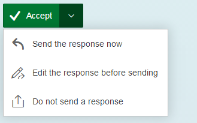
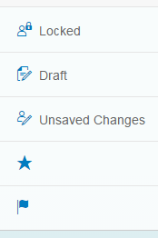
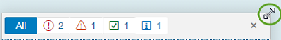

<!-- loiof218918b20e54cadb23e5e0b5bd9f9bb -->

## What's New in OpenUI5 1.38

With this release OpenUI5 is upgraded from version 1.36 to 1.38.

****

<table>
<tr>
<th valign="top">

Version

</th>
<th valign="top">

Type

</th>
<th valign="top">

Category

</th>
<th valign="top">

Title

</th>
<th valign="top">

Description

</th>
<th valign="top">

Action

</th>
<th valign="top">

Available as of

</th>
</tr>
<tr>
<td valign="top">

1.38 

</td>
<td valign="top">

Changed 

</td>
<td valign="top">

User Documentation 

</td>
<td valign="top">

**Improved Documentation** 

</td>
<td valign="top">

**Improved Documentation**

Thanks a lot to all of you who have used the Demo Kit feedback function! We have received lots of comments, many of which regarding our tutorials, and are continuously improving the documentation based on your findings.

Please carry on giving us your feedback: even though we cannot update the documentation straight away, your feedback will be considered in the next version!

New or reworked documentation chapters that are not mentioned in the following sections:

-   Chapter [Routing and Navigation](../04_Essentials/routing-and-navigation-3d18f20.md) is now updated and reworked.

Changed•User Documentation•Info Only•1.38

</td>
<td valign="top">

Info Only

</td>
<td valign="top">

2016-06-29

</td>
</tr>
<tr>
<td valign="top">

1.38 

</td>
<td valign="top">

Deprecated 

</td>
<td valign="top">

Feature 

</td>
<td valign="top">

**Deprecated Themes and Libraries** 

</td>
<td valign="top">

**Deprecated Themes and Libraries**

The following libraries are deprecated as of this version:

-   `sap.ui.commons`

-   `sap.ui.ux3`

-   `sap.makit`

The following themes are also deprecated as of this version:

-   `sap_ux`

-   `sap_platinum`

-   `sap_goldreflection`

For more information, see [Deprecated Themes and Libraries](../02_Read-Me-First/deprecated-themes-and-libraries-a87ca84.md).

Deprecated•Feature•Info Only•1.38

</td>
<td valign="top">

Info Only 

</td>
<td valign="top">

2016-06-29

</td>
</tr>
<tr>
<td valign="top">

1.38 

</td>
<td valign="top">

Changed 

</td>
<td valign="top">

Announcement 

</td>
<td valign="top">

**jQuery Upgraded to Version 2.2.3** 

</td>
<td valign="top">

**jQuery Upgraded to Version 2.2.3**

jQuery has been upgraded to version 2.2.3. This upgrade may have an impact on apps developed with OpenUI5.

Changed•Announcement•Info Only•1.38

</td>
<td valign="top">

Info Only 

</td>
<td valign="top">

2016-06-29

</td>
</tr>
<tr>
<td valign="top">

1.38 

</td>
<td valign="top">

New 

</td>
<td valign="top">

Feature 

</td>
<td valign="top">

**Icon Explorer** 

</td>
<td valign="top">

**Icon Explorer**

We have 46 new icons, and some existing icons have been redesigned - check the [Icon Explorer](https://ui5.sap.com/test-resources/sap/m/demokit/iconExplorer/webapp/index.html) in the Demo Kit for details.

New•Feature•Info Only•1.38

</td>
<td valign="top">

Info Only 

</td>
<td valign="top">

2016-06-29

</td>
</tr>
<tr>
<td valign="top">

1.38 

</td>
<td valign="top">

New 

</td>
<td valign="top">

Feature 

</td>
<td valign="top">

**Multiple preprocessors for XML views** 

</td>
<td valign="top">

**Multiple preprocessors for XML views**

We have enhanced the XML view so that it is now capable of running more than one preprocessor per hook. Additionally, the new hook `viewxml` has been introduced. For more information, see [Preprocessing XML Views](../04_Essentials/preprocessing-xml-views-48b81b9.md).

New•Feature•Info Only•1.38

</td>
<td valign="top">

Info Only 

</td>
<td valign="top">

2016-06-29

</td>
</tr>
<tr>
<td valign="top">

1.38 

</td>
<td valign="top">

New 

</td>
<td valign="top">

Feature 

</td>
<td valign="top">

**OpenUI5 OData V4 model** 

</td>
<td valign="top">

**OpenUI5 OData V4 model**

We are providing an initial version of the OpenUI5 OData V4 Model. This model supports the following:

-   Read access

-   Updating properties of OData entities via two-way-binding

-   Operation \(function and action\) execution

-   Grouping data requests in a batch request

-   Server-side sorting and filtering

> ### Restriction:  
> This is the first version of the OpenUI5 OData V4 model. Due to its limited feature scope, we recommend you do not use this release to develop applications that are to be used in production systems. Please look at the detailed documentation of the features, as certain parts of a feature may be missing which you might expect as given. While our intention was to be compatible with existing controls, existing controls might not work due to small incompatibilities compared to `sap.ui.model.odata.(v2.)ODataModel`, or due to missing features in the model. Up to now, only limited tests with controls have been done with the OpenUI5 OData V4 model. The interface for applications has been changed to make usage of the model easier and more efficient. A summary of these changes is documented in the section [Changes Compared to OData V2 Model](../04_Essentials/changes-compared-to-odata-v2-model-abd4d7c.md).

For more information, see [OData V4 Model](../04_Essentials/odata-v4-model-5de13cf.md), the [API Reference](https://ui5.sap.com/#/api/sap.ui.model.odata.v4), and the [Samples](https://ui5.sap.com/#/entity/sap.ui.model.odata.v4.ODataModel).

New•Feature•Info Only•1.38

</td>
<td valign="top">

Info Only 

</td>
<td valign="top">

2016-06-29

</td>
</tr>
<tr>
<td valign="top">

1.38 

</td>
<td valign="top">

New 

</td>
<td valign="top">

Control 

</td>
<td valign="top">

**`sap.m.FormattedText`** 

</td>
<td valign="top">

**`sap.m.FormattedText`**

You can use this control to display formatted texts in HTML format.

For more information, see the [API Reference](https://ui5.sap.com/#/api/sap.m.FormattedText) and the [Samples](https://ui5.sap.com/#/entity/sap.m.FormattedText).

New•Control•Info Only•1.38

</td>
<td valign="top">

Info Only 

</td>
<td valign="top">

2016-06-29

</td>
</tr>
<tr>
<td valign="top">

1.38 

</td>
<td valign="top">

New 

</td>
<td valign="top">

Control 

</td>
<td valign="top">

**`sap.m.MenuButton`** 

</td>
<td valign="top">

**`sap.m.MenuButton`**

The control opens a hierarchical menu and enables quick triggering of the last action of the menu item selected. In `Regular` mode it always opens the menu, whereas in `Split` mode it can be also used directly as a button to trigger the currently displayed menu item’s action. In `Split` mode it can display either the default menu item or the last selected one.

-   Regular Mode

    

-   Split Mode

    

For more information, see the [API Reference](https://ui5.sap.com/#/api/sap.m.MenuButton) and the [Sample](https://ui5.sap.com/#/entity/sap.m.MenuButton/sample/sap.m.sample.MenuButton).

New•Control•Info Only•1.38

</td>
<td valign="top">

Info Only 

</td>
<td valign="top">

2016-06-29

</td>
</tr>
<tr>
<td valign="top">

1.38 

</td>
<td valign="top">

New 

</td>
<td valign="top">

Control 

</td>
<td valign="top">

**`sap.m.ObjectMarker`** 

</td>
<td valign="top">

**`sap.m.ObjectMarker`**

The `ObjectMarker` control represents the status of an object with icon and/or text. It can be interactive \(as a link\) or non-interactive. It has the following predefined types:

-   `Flagged`

-   `Favorite`

-   `Draft`

-   `Locked`

-   `Unsaved`

An object might have multiple `ObjectMarker`s at the same time but the editing states \(`Locked`, `Draft`, and `Unsaved`\) are mutually exclusive.

For more information, see the [API Reference](https://ui5.sap.com/#/api/sap.m.ObjectMarker) and the [Samples](https://ui5.sap.com/#/entity/sap.m.ObjectMarker).

New•Control•Info Only•1.38

</td>
<td valign="top">

Info Only 

</td>
<td valign="top">

2016-06-29

</td>
</tr>
<tr>
<td valign="top">

1.38 

</td>
<td valign="top">

New 

</td>
<td valign="top">

Control 

</td>
<td valign="top">

**`sap.m.RangeSlider`** 

</td>
<td valign="top">

**`sap.m.RangeSlider`**

**`sap.m.RangeSlider`** is a new input control that is used to select a range of values. The `RangeSlider` has two slider handles that can be moved along a predefined numerical range scale. This control extends the `sap.m.Slider` and introduces additional functionality.

New•Control•Info Only•1.38

</td>
<td valign="top">

Info Only 

</td>
<td valign="top">

2016-06-29

</td>
</tr>
<tr>
<td valign="top">

1.38 

</td>
<td valign="top">

New 

</td>
<td valign="top">

Control 

</td>
<td valign="top">

**`sap.m.StepInput`** 

</td>
<td valign="top">

**`sap.m.StepInput`**

The `StepInput` control allows the user to change the input value with a predefined step. The value can be changed using the increment/decrement buttons or keys on the keyboard. On the desktop, when using the keyboard [PgUp\] and [PgDn\] keys, the value increases/decreases two steps at a time.

For more information, see the [API Reference](https://ui5.sap.com/#/api/sap.m.StepInput) and the [Samples](https://ui5.sap.com/#/entity/sap.m.StepInput).

New•Control•Info Only•1.38

</td>
<td valign="top">

Info Only 

</td>
<td valign="top">

2016-06-29

</td>
</tr>
<tr>
<td valign="top">

1.38 

</td>
<td valign="top">

New 

</td>
<td valign="top">

Control 

</td>
<td valign="top">

**`sap.ui.layout.ResponsiveSplitter`** 

</td>
<td valign="top">

**`sap.ui.layout.ResponsiveSplitter`**

**`sap.ui.layout.ResponsiveSplitter`** is a layout control that is used to visually divide the content of its parent. The control is responsive and can adjust its contents to any screen size. On smaller screens, pagination is used to allow navigation to all splitter panes.

For more information, see the [API Reference](https://ui5.sap.com/#/api/sap.ui.layout.ResponsiveSplitter) and the [Samples](https://ui5.sap.com/#/entity/sap.ui.layout.ResponsiveSplitter).

New•Control•Info Only•1.38

</td>
<td valign="top">

Info Only 

</td>
<td valign="top">

2016-06-29

</td>
</tr>
<tr>
<td valign="top">

1.38 

</td>
<td valign="top">

Changed 

</td>
<td valign="top">

Feature 

</td>
<td valign="top">

**One page acceptance test \(OPA\)** 

</td>
<td valign="top">

**One page acceptance test \(OPA\)**

The `Press` and `EnterText` actions now support a larger number of controls and can now be executed on embedded controls by specifying the control suffix. For more information, see the API Reference for [`Press`](https://ui5.sap.com/#/api/sap.ui.test.actions.Press) and [`EnterText`](https://ui5.sap.com/#/api/sap.ui.test.actions.EnterText) and the [Sample](https://ui5.sap.com/#/entity/sap.ui.test.Opa5/sample/sap.ui.core.sample.OpaAction).

Changed•Feature•Info Only•1.38

</td>
<td valign="top">

Info Only 

</td>
<td valign="top">

2016-06-29

</td>
</tr>
<tr>
<td valign="top">

1.38 

</td>
<td valign="top">

Changed 

</td>
<td valign="top">

Control 

</td>
<td valign="top">

**`sap.m.ComboBox`** 

</td>
<td valign="top">

**`sap.m.ComboBox`**

-   Is now supported on mobile phones. The list of available values will open as a full-screen dialog on small devices.

-   The new `loadItem` event makes it possible to defer initialization of items in the `ComboBox` dropdown list control to a point in time when the items are required. This helps to improve performance.

    For more information, see the [Samples](https://ui5.sap.com/#/entity/sap.m.ComboBox).

Changed•Control•Info Only•1.38

</td>
<td valign="top">

Info Only 

</td>
<td valign="top">

2016-06-29

</td>
</tr>
<tr>
<td valign="top">

1.38 

</td>
<td valign="top">

Changed 

</td>
<td valign="top">

Control 

</td>
<td valign="top">

**`sap.m.DatePicker / sap.m.DateTimePicker / sap.m.PlanningCalendar / sap.ui.unified.Calendar`** 

</td>
<td valign="top">

**`sap.m.DatePicker / sap.m.DateTimePicker / sap.m.PlanningCalendar / sap.ui.unified.Calendar`**

You can now set minimum and maximum dates to limit the range of available dates.

For more information, see the API Reference for [`sap.m.DatePicker`](https://ui5.sap.com/#/api/sap.m.DatePicker), [`sap.m.DateTimePicker`](https://ui5.sap.com/#/api/sap.m.DateTimePicker), [`sap.m.PlanningCalendar`](https://ui5.sap.com/#/api/sap.m.PlanningCalendar), and [`sap.ui.unified.Calendar`](https://ui5.sap.com/#/api/sap.ui.unified.Calendar), and the samples for [`sap.m.DatePicker`](https://ui5.sap.com/#/entity/sap.m.DatePicker/sample/sap.m.sample.DatePicker), [`sap.m.PlanningCalendar`](https://ui5.sap.com/#/entity/sap.m.PlanningCalendar/sample/sap.m.sample.PlanningCalendarMinMax), and [`sap.ui.unified.Calendar`](https://ui5.sap.com/#/entity/sap.ui.unified.Calendar/sample/sap.ui.unified.sample.CalendarMinMax).

Changed•Control•Info Only•1.38

</td>
<td valign="top">

Info Only 

</td>
<td valign="top">

2016-06-29

</td>
</tr>
<tr>
<td valign="top">

1.38 

</td>
<td valign="top">

Changed 

</td>
<td valign="top">

Control 

</td>
<td valign="top">

**`sap.m.GenericTile`** 

</td>
<td valign="top">

**`sap.m.GenericTile`** 

The `GenericTile` control has a new responsive design that significantly improves the user experience, it has also been optimized for larger smartphones. The `GenericTile` adjusts its size to fit all the different display sizes of the current devices supported by OpenUI5 \(see [Browser and Platform Support](../02_Read-Me-First/browser-and-platform-support-74b59ef.md)\). The main changes are the tile size, font size, padding, the new `ImageContent` control, and new samples showing the variety of use cases for the `GenericTile`.

The `sap.m.ImageContent` control can be used to include images in a tile. It can be embedded in the content area of the `GenericTile` control.

For more information, see [Generic Tile](../08_More_About_Controls/generic-tile-a1998ec.md), the API Reference for [`sap.m.GenericTile`](https://ui5.sap.com/#/api/sap.m.GenericTile) and [`sap.m.ImageContent`](https://ui5.sap.com/#/api/sap.m.ImageContent), and the samples for [`GenericTile`](https://ui5.sap.com/#/entity/sap.m.GenericTile) and [`ImageContent`](https://ui5.sap.com/#/entity/sap.m.ImageContent).

Changed•Control•Info Only•1.38

</td>
<td valign="top">

Info Only 

</td>
<td valign="top">

2016-06-29

</td>
</tr>
<tr>
<td valign="top">

1.38 

</td>
<td valign="top">

Changed 

</td>
<td valign="top">

Control 

</td>
<td valign="top">

**`sap.m.List / sap.m.Table`** 

</td>
<td valign="top">

**`sap.m.List / sap.m.Table`**

The new `keyboardMode` property for the `List` and `Table` controls determines the keyboard handling for these controls. The `Navigation` value of the property enables a mode that allows you to navigate within a large number of items, for example, table cells, using the tab key, whereas the `Edit` mode can be used to edit a limited number of items.

Changed•Control•Info Only•1.38

</td>
<td valign="top">

Info Only 

</td>
<td valign="top">

2016-06-29

</td>
</tr>
<tr>
<td valign="top">

1.38 

</td>
<td valign="top">

Changed 

</td>
<td valign="top">

Control 

</td>
<td valign="top">

**`sap.m.MaskInput`** 

</td>
<td valign="top">

**`sap.m.MaskInput`**

You can now use escape characters in the `MaskInput` definition to be able to use the predefined rule characters as immutable ones.

Changed•Control•Info Only•1.38

</td>
<td valign="top">

Info Only 

</td>
<td valign="top">

2016-06-29

</td>
</tr>
<tr>
<td valign="top">

1.38 

</td>
<td valign="top">

Changed 

</td>
<td valign="top">

Control 

</td>
<td valign="top">

**`sap.m.MessagePopover`** 

</td>
<td valign="top">

**`sap.m.MessagePopover`**

**`sap.m.MessagePopover`** has been improved and can now be resized. Resizing is only possible when the `MessagePopover` is opened from the footer on a desktop.

Changed•Control•Info Only•1.38

</td>
<td valign="top">

Info Only 

</td>
<td valign="top">

2016-06-29

</td>
</tr>
<tr>
<td valign="top">

1.38 

</td>
<td valign="top">

Changed 

</td>
<td valign="top">

Control 

</td>
<td valign="top">

**`sap.m.NotificationListItem`** 

</td>
<td valign="top">

**`sap.m.NotificationListItem`**

The control has two improvements:

-   The control responsiveness is updated for better usability on large screens \(more than 640 pixels width\) – the buttons are now located on the right side of the text.

-   The *Show More* button for toggling expand/collapse mode can now be hidden with the use of the new property `hideShowMoreButton`.

For more information, see the [API Reference](https://ui5.sap.com/#/api/sap.m.NotificationListItem) and the [Samples](https://ui5.sap.com/#/entity/sap.m.NotificationListItem).

Changed•Control•Info Only•1.38

</td>
<td valign="top">

Info Only 

</td>
<td valign="top">

2016-06-29

</td>
</tr>
<tr>
<td valign="top">

1.38 

</td>
<td valign="top">

Changed 

</td>
<td valign="top">

Control 

</td>
<td valign="top">

**`sap.m.Popover`** 

</td>
<td valign="top">

**`sap.m.Popover`**

**`sap.m.Popover`** has four new values for its `PlacementType`:

-   `PreferredBottomOrFlip`

-   `PreferredLeftOrFlip`

-   `PreferredRightOrFlip`

-   `PreferredTopOrFlip`

They determine the preferred position of the `Popover` and how it behaves when there is insufficient space for it on the screen. These properties allow the `Popover` to flip over and cover some of the content below it.

For more information, see the [API Reference](https://ui5.sap.com/#/api/sap.m.PlacementType) and the [Samples](https://ui5.sap.com/#/entity/sap.m.PlacementType).

Changed•Control•Info Only•1.38

</td>
<td valign="top">

Info Only 

</td>
<td valign="top">

2016-06-29

</td>
</tr>
<tr>
<td valign="top">

1.38 

</td>
<td valign="top">

Changed 

</td>
<td valign="top">

Control 

</td>
<td valign="top">

**`sap.m.TextArea`** 

</td>
<td valign="top">

**`sap.m.TextArea`**

**`sap.m.TextArea`** can now grow and shrink to adapt to the entered text.

For more information, see the [API Reference](https://ui5.sap.com/#/api/sap.m.TextArea) and the [Sample](https://ui5.sap.com/#/entity/sap.m.TextArea/sample/sap.m.sample.TextAreaGrowing).

Changed•Control•Info Only•1.38

</td>
<td valign="top">

Info Only 

</td>
<td valign="top">

2016-06-29

</td>
</tr>
<tr>
<td valign="top">

1.38 

</td>
<td valign="top">

Changed 

</td>
<td valign="top">

Control 

</td>
<td valign="top">

**`sap.m.UploadCollection`** 

</td>
<td valign="top">

**`sap.m.UploadCollection`**

To upload a new version of a file to the `UploadCollection` list, the `openFileDialog` method is available. You can provide a pushbutton in the header area and if one entry in the `UploadCollection` list is selected, the API method will be called.

For more information, see the [API Reference](https://ui5.sap.com/#/api/sap.m.UploadCollection) and the [Sample](https://ui5.sap.com/#/entity/sap.m.UploadCollection).

Changed•Control•Info Only•1.38

</td>
<td valign="top">

Info Only 

</td>
<td valign="top">

2016-06-29

</td>
</tr>
<tr>
<td valign="top">

1.38 

</td>
<td valign="top">

Changed 

</td>
<td valign="top">

Control 

</td>
<td valign="top">

**`sap.m.ViewSettingsDialog`** 

</td>
<td valign="top">

**`sap.m.ViewSettingsDialog`**

The `ViewSettingsDialog` control now gives you the opportunity to modify filter detail page items on the fly with the help of the new event `filterDetailPageOpened`. This event is fired each time after the filter detail page is accessed, notifying the outside world that the page is loaded along with the information for which filter the respective details are displayed. This allows a handler to be attached that alters the filter detail items aggregation.

For more information, see the [API Reference](https://ui5.sap.com/#/api/sap.m.ViewSettingsDialog).

Changed•Control•Info Only•1.38

</td>
<td valign="top">

Info Only 

</td>
<td valign="top">

2016-06-29

</td>
</tr>
<tr>
<td valign="top">

1.38 

</td>
<td valign="top">

Changed 

</td>
<td valign="top">

Control 

</td>
<td valign="top">

**`sap.tnt.SideNavigation`** 

</td>
<td valign="top">

**`sap.tnt.SideNavigation`**

Root items with no children can now be opened with a single click when the `SideNavigation` control is in collapsed mode.

Changed•Control•Info Only•1.38

</td>
<td valign="top">

Info Only 

</td>
<td valign="top">

2016-06-29

</td>
</tr>
<tr>
<td valign="top">

1.38 

</td>
<td valign="top">

Changed 

</td>
<td valign="top">

Control 

</td>
<td valign="top">

**`sap.tnt.ToolPage`** 

</td>
<td valign="top">

**`sap.tnt.ToolPage`**

Animation is now added when expanding and collapsing the `SideNavigation` control within the `ToolPage`.

For more information, see the [Sample](https://ui5.sap.com/#/entity/sap.tnt.ToolPage/sample/sap.tnt.sample.ToolPage).

Changed•Control•Info Only•1.38

</td>
<td valign="top">

Info Only 

</td>
<td valign="top">

2016-06-29

</td>
</tr>
<tr>
<td valign="top">

1.38 

</td>
<td valign="top">

Changed 

</td>
<td valign="top">

Control 

</td>
<td valign="top">

**`sap.ui.commons.ColorPicker`** 

</td>
<td valign="top">

**`sap.ui.commons.ColorPicker`**

**`sap.ui.commons.ColorPicker`** supports HSL \(Hue Saturation and Lightness\) mode. This mode works better with modern browsers and it does not require intermediate conversion back to RGB. Additionally, there is a new input field for the `alpha` \(transparency\) value for more precise color definition.

Changed•Control•Info Only•1.38

</td>
<td valign="top">

Info Only 

</td>
<td valign="top">

2016-06-29

</td>
</tr>
<tr>
<td valign="top">

1.38 

</td>
<td valign="top">

Changed 

</td>
<td valign="top">

Control 

</td>
<td valign="top">

**`sap.ui.layout.Form / sap.ui.layout.SimpleForm`** 

</td>
<td valign="top">

**`sap.ui.layout.Form / sap.ui.layout.SimpleForm`**

You can now add a toolbar to a form container or the form itself.

For more information, see the [Sample](https://ui5.sap.com/#/entity/sap.ui.layout.form.Form/sample/sap.ui.layout.sample.FormToolbar).

Changed•Control•Info Only•1.38

</td>
<td valign="top">

Info Only 

</td>
<td valign="top">

2016-06-29

</td>
</tr>
<tr>
<td valign="top">

1.38 

</td>
<td valign="top">

Deleted 

</td>
<td valign="top">

Control 

</td>
<td valign="top">

**`sap.ui.table.DataTable`** 

</td>
<td valign="top">

**`sap.ui.table.DataTable`**

**`sap.ui.table.DataTable`** has been deleted.

Deleted•Control•Info Only•1.38

</td>
<td valign="top">

Info Only 

</td>
<td valign="top">

2016-06-29

</td>
</tr>
<tr>
<td valign="top">

1.38 

</td>
<td valign="top">

Changed 

</td>
<td valign="top">

Control 

</td>
<td valign="top">

**`sap.ui.table.TreeTable`** 

</td>
<td valign="top">

**`sap.ui.table.TreeTable`**

**`sap.ui.table.TreeTable`** now supports `AutoExpand` paging if it is bound to an OData model.

By setting `numberOfExpandedLevels` as a binding parameter \(e.g. in the `bindRows` call of the `TreeTable`\), you now can specify the initial expansion depth. This feature is only available for OData services exposing a property marked with the annotation `hierarchy-node-descendant-count-for`. This also means the service has to respect a `$filter` statement on the annotated `Level` property, and returns the entries sorted. You can find the specification for this and all other hierarchy annotations in the SAP Community Network under [SAP Annotations for OData Version 2.0](http://scn.sap.com/docs/DOC-44986).

Changed•Control•Info Only•1.38

</td>
<td valign="top">

Info Only 

</td>
<td valign="top">

2016-06-29

</td>
</tr>
<tr>
<td valign="top">

1.38 

</td>
<td valign="top">

Changed 

</td>
<td valign="top">

Control 

</td>
<td valign="top">

**`sap.ui.unified.Menu`** 

</td>
<td valign="top">

**`sap.ui.unified.Menu`**

To significantly increase the usability of `sap.ui.unified.Menu`, a delay has been added to the closing of submenus.

For more information, see the [Sample](https://ui5.sap.com/#/entity/sap.ui.unified.Menu/sample/sap.ui.unified.sample.MenuItemEventing).

Changed•Control•Info Only•1.38

</td>
<td valign="top">

Info Only 

</td>
<td valign="top">

2016-06-29

</td>
</tr>
<tr>
<td valign="top">

1.38 

</td>
<td valign="top">

Changed 

</td>
<td valign="top">

Control 

</td>
<td valign="top">

**`sap.uxap.ObjectPageHeader`** 

</td>
<td valign="top">

**`sap.uxap.ObjectPageHeader`**

`ObjectPageHeader` can be integrated with the `SideContent` scenario. A new `sideContentButton` aggregation has been added. This aggregation has a new button, which appears after the actions buttons and triggers opening the side content for additional information.

For more information, see the [Sample](https://ui5.sap.com/#/entity/sap.uxap.ObjectPageHeader/sample/sap.uxap.sample.ObjectPageDynamicSideContentBtn).

Changed•Control•Info Only•1.38

</td>
<td valign="top">

Info Only 

</td>
<td valign="top">

2016-06-29

</td>
</tr>
<tr>
<td valign="top">

1.38 

</td>
<td valign="top">

Changed 

</td>
<td valign="top">

Control 

</td>
<td valign="top">

**`sap.uxap.ObjectPageLayout`** 

</td>
<td valign="top">

**`sap.uxap.ObjectPageLayout`**

-   It supports scrolling to a particular section, based on its ID. This allows easier access to all parts of the application and consistent navigation back to a previous position within the `ObjectPage`.

    For more information, see the [Sample](https://ui5.sap.com/#/entity/sap.uxap.ObjectPageLayout/sample/sap.uxap.sample.ObjectPageLazyLoadingWithoutBlocks).

-   Performance is improved for the use case with no `Blocks`. The `ObjectPage` now supports lazy loading with the stashed property of the `ObjectPageLazyLoader`. As a result, you avoid the additional creation of XML views for each `Block`.

    For more information, see [Object Page Scrolling](../08_More_About_Controls/object-page-scrolling-bc410e9.md) and the [Sample](https://ui5.sap.com/#/entity/sap.uxap.ObjectPageLayout/sample/sap.uxap.sample.ObjectPageState).

Changed•Control•Info Only•1.38

</td>
<td valign="top">

Info Only 

</td>
<td valign="top">

2016-06-29

</td>
</tr>
</table>

**Related Information**  

[What's New in OpenUI5 1.135](what-s-new-in-openui5-1-135-93d7630.md "With this release OpenUI5 is upgraded from version 1.134 to 1.135.")

[What's New in OpenUI5 1.134](what-s-new-in-openui5-1-134-c512d71.md "With this release OpenUI5 is upgraded from version 1.133 to 1.134.")

[What's New in OpenUI5 1.133](what-s-new-in-openui5-1-133-86d7605.md "With this release OpenUI5 is upgraded from version 1.132 to 1.133.")

[What's New in OpenUI5 1.132](what-s-new-in-openui5-1-132-bd2e61f.md "With this release OpenUI5 is upgraded from version 1.131 to 1.132.")

[What's New in OpenUI5 1.131](what-s-new-in-openui5-1-131-7d24d94.md "With this release OpenUI5 is upgraded from version 1.130 to 1.131.")

[What's New in OpenUI5 1.130](what-s-new-in-openui5-1-130-85609d4.md "With this release OpenUI5 is upgraded from version 1.129 to 1.130.")

[What's New in OpenUI5 1.129](what-s-new-in-openui5-1-129-d22b8af.md "With this release OpenUI5 is upgraded from version 1.128 to 1.129.")

[What's New in OpenUI5 1.128](what-s-new-in-openui5-1-128-1f76220.md "With this release OpenUI5 is upgraded from version 1.127 to 1.128.")

[What's New in OpenUI5 1.127](what-s-new-in-openui5-1-127-e5e1317.md "With this release OpenUI5 is upgraded from version 1.126 to 1.127.")

[What's New in OpenUI5 1.126](what-s-new-in-openui5-1-126-1d98116.md "With this release OpenUI5 is upgraded from version 1.125 to 1.126.")

[What's New in OpenUI5 1.125](what-s-new-in-openui5-1-125-9d87044.md "With this release OpenUI5 is upgraded from version 1.124 to 1.125.")

[What's New in OpenUI5 1.124](what-s-new-in-openui5-1-124-7f77c3f.md "With this release OpenUI5 is upgraded from version 1.123 to 1.124.")

[What's New in OpenUI5 1.123](what-s-new-in-openui5-1-123-9d00ac7.md "With this release OpenUI5 is upgraded from version 1.122 to 1.123.")

[What's New in OpenUI5 1.122](what-s-new-in-openui5-1-122-5d078da.md "With this release OpenUI5 is upgraded from version 1.121 to 1.122.")

[What's New in OpenUI5 1.121](what-s-new-in-openui5-1-121-91a4a2f.md "With this release OpenUI5 is upgraded from version 1.120 to 1.121.")

[What's New in OpenUI5 1.120](what-s-new-in-openui5-1-120-2359b63.md "With this release OpenUI5 is upgraded from version 1.119 to 1.120.")

[What's New in OpenUI5 1.119](what-s-new-in-openui5-1-119-0b1903a.md "With this release OpenUI5 is upgraded from version 1.118 to 1.119.")

[What's New in OpenUI5 1.118](what-s-new-in-openui5-1-118-3eecbde.md "With this release OpenUI5 is upgraded from version 1.117 to 1.118.")

[What's New in OpenUI5 1.117](what-s-new-in-openui5-1-117-029d3b4.md "With this release OpenUI5 is upgraded from version 1.116 to 1.117.")

[What's New in OpenUI5 1.116](what-s-new-in-openui5-1-116-ebd6f34.md "With this release OpenUI5 is upgraded from version 1.115 to 1.116.")

[What's New in OpenUI5 1.115](what-s-new-in-openui5-1-115-409fde8.md "With this release OpenUI5 is upgraded from version 1.114 to 1.115.")

[What's New in OpenUI5 1.114](what-s-new-in-openui5-1-114-890fce1.md "With this release OpenUI5 is upgraded from version 1.113 to 1.114.")

[What's New in OpenUI5 1.113](what-s-new-in-openui5-1-113-a9553fe.md "With this release OpenUI5 is upgraded from version 1.112 to 1.113.")

[What's New in OpenUI5 1.112](what-s-new-in-openui5-1-112-34afc69.md "With this release OpenUI5 is upgraded from version 1.111 to 1.112.")

[What's New in OpenUI5 1.111](what-s-new-in-openui5-1-111-7a67837.md "With this release OpenUI5 is upgraded from version 1.110 to 1.111.")

[What's New in OpenUI5 1.110](what-s-new-in-openui5-1-110-71a855c.md "With this release OpenUI5 is upgraded from version 1.109 to 1.110.")

[What's New in OpenUI5 1.109](what-s-new-in-openui5-1-109-3264bd2.md "With this release OpenUI5 is upgraded from version 1.108 to 1.109.")

[What's New in OpenUI5 1.108](what-s-new-in-openui5-1-108-66e33f0.md "With this release OpenUI5 is upgraded from version 1.107 to 1.108.")

[What's New in OpenUI5 1.107](what-s-new-in-openui5-1-107-d4ff916.md "With this release OpenUI5 is upgraded from version 1.106 to 1.107.")

[What's New in OpenUI5 1.106](what-s-new-in-openui5-1-106-5b497b0.md "With this release OpenUI5 is upgraded from version 1.105 to 1.106.")

[What's New in OpenUI5 1.105](what-s-new-in-openui5-1-105-4d6c00e.md "With this release OpenUI5 is upgraded from version 1.104 to 1.105.")

[What's New in OpenUI5 1.104](what-s-new-in-openui5-1-104-69e567c.md "With this release OpenUI5 is upgraded from version 1.103 to 1.104.")

[What's New in OpenUI5 1.103](what-s-new-in-openui5-1-103-0e98c76.md "With this release OpenUI5 is upgraded from version 1.102 to 1.103.")

[What's New in OpenUI5 1.102](what-s-new-in-openui5-1-102-f038c99.md "With this release OpenUI5 is upgraded from version 1.101 to 1.102.")

[What's New in OpenUI5 1.101](what-s-new-in-openui5-1-101-7733b00.md "With this release OpenUI5 is upgraded from version 1.100 to 1.101.")

[What's New in OpenUI5 1.100](what-s-new-in-openui5-1-100-27dec1d.md "With this release OpenUI5 is upgraded from version 1.99 to 1.100.")

[What's New in OpenUI5 1.99](what-s-new-in-openui5-1-99-4f35848.md "With this release OpenUI5 is upgraded from version 1.98 to 1.99.")

[What's New in OpenUI5 1.98](what-s-new-in-openui5-1-98-d9f16f2.md "With this release OpenUI5 is upgraded from version 1.97 to 1.98.")

[What's New in OpenUI5 1.97](what-s-new-in-openui5-1-97-fa0e282.md "With this release OpenUI5 is upgraded from version 1.96 to 1.97.")

[What's New in OpenUI5 1.96](what-s-new-in-openui5-1-96-7a9269f.md "With this release OpenUI5 is upgraded from version 1.95 to 1.96.")

[What's New in OpenUI5 1.95](what-s-new-in-openui5-1-95-a1aea67.md "With this release OpenUI5 is upgraded from version 1.94 to 1.95.")

[What's New in OpenUI5 1.94](what-s-new-in-openui5-1-94-c40f1e6.md "With this release OpenUI5 is upgraded from version 1.93 to 1.94.")

[What's New in OpenUI5 1.93](what-s-new-in-openui5-1-93-f273340.md "With this release OpenUI5 is upgraded from version 1.92 to 1.93.")

[What's New in OpenUI5 1.92](what-s-new-in-openui5-1-92-1ef345d.md "With this release OpenUI5 is upgraded from version 1.91 to 1.92.")

[What's New in OpenUI5 1.91](what-s-new-in-openui5-1-91-0a2bd79.md "With this release OpenUI5 is upgraded from version 1.90 to 1.91.")

[What's New in OpenUI5 1.90](what-s-new-in-openui5-1-90-91c10c2.md "With this release OpenUI5 is upgraded from version 1.89 to 1.90.")

[What's New in OpenUI5 1.89](what-s-new-in-openui5-1-89-e56cddc.md "With this release OpenUI5 is upgraded from version 1.88 to 1.89.")

[What's New in OpenUI5 1.88](what-s-new-in-openui5-1-88-e15a206.md "With this release OpenUI5 is upgraded from version 1.87 to 1.88.")

[What's New in OpenUI5 1.87](what-s-new-in-openui5-1-87-b506da7.md "With this release OpenUI5 is upgraded from version 1.86 to 1.87.")

[What's New in OpenUI5 1.86](what-s-new-in-openui5-1-86-4c1c959.md "With this release OpenUI5 is upgraded from version 1.85 to 1.86.")

[What's New in OpenUI5 1.85](what-s-new-in-openui5-1-85-1d18eb5.md "With this release OpenUI5 is upgraded from version 1.84 to 1.85.")

[What's New in OpenUI5 1.84](what-s-new-in-openui5-1-84-dc76640.md "With this release OpenUI5 is upgraded from version 1.82 to 1.84.")

[What's New in OpenUI5 1.82](what-s-new-in-openui5-1-82-3a8dd13.md "With this release OpenUI5 is upgraded from version 1.81 to 1.82.")

[What's New in OpenUI5 1.81](what-s-new-in-openui5-1-81-f5e2a21.md "With this release OpenUI5 is upgraded from version 1.80 to 1.81.")

[What's New in OpenUI5 1.80](what-s-new-in-openui5-1-80-8cee506.md "With this release OpenUI5 is upgraded from version 1.79 to 1.80.")

[What's New in OpenUI5 1.79](what-s-new-in-openui5-1-79-99c4cdc.md "With this release OpenUI5 is upgraded from version 1.78 to 1.79.")

[What's New in OpenUI5 1.78](what-s-new-in-openui5-1-78-f09b63e.md "With this release OpenUI5 is upgraded from version 1.77 to 1.78.")

[What's New in OpenUI5 1.77](what-s-new-in-openui5-1-77-c46b439.md "With this release OpenUI5 is upgraded from version 1.76 to 1.77.")

[What's New in OpenUI5 1.76](what-s-new-in-openui5-1-76-aad03b5.md "With this release OpenUI5 is upgraded from version 1.75 to 1.76.")

[What's New in OpenUI5 1.75](what-s-new-in-openui5-1-75-5cbb62d.md "With this release OpenUI5 is upgraded from version 1.74 to 1.75.")

[What's New in OpenUI5 1.74](what-s-new-in-openui5-1-74-c22208a.md "With this release OpenUI5 is upgraded from version 1.73 to 1.74.")

[What's New in OpenUI5 1.73](what-s-new-in-openui5-1-73-231dd13.md "With this release OpenUI5 is upgraded from version 1.72 to 1.73.")

[What's New in OpenUI5 1.72](what-s-new-in-openui5-1-72-521cad9.md "With this release OpenUI5 is upgraded from version 1.71 to 1.72.")

[What's New in OpenUI5 1.71](what-s-new-in-openui5-1-71-a93a6a3.md "With this release OpenUI5 is upgraded from version 1.70 to 1.71.")

[What's New in OpenUI5 1.70](what-s-new-in-openui5-1-70-f073d69.md "With this release OpenUI5 is upgraded from version 1.69 to 1.70.")

[What's New in OpenUI5 1.69](what-s-new-in-openui5-1-69-89a18bd.md "With this release OpenUI5 is upgraded from version 1.68 to 1.69.")

[What's New in OpenUI5 1.68](what-s-new-in-openui5-1-68-f94bf93.md "With this release OpenUI5 is upgraded from version 1.67 to 1.68.")

[What's New in OpenUI5 1.67](what-s-new-in-openui5-1-67-a6b1472.md "With this release OpenUI5 is upgraded from version 1.66 to 1.67.")

[What's New in OpenUI5 1.66](what-s-new-in-openui5-1-66-c9896e9.md "With this release OpenUI5 is upgraded from version 1.65 to 1.66.")

[What's New in OpenUI5 1.65](what-s-new-in-openui5-1-65-0f5acfd.md "With this release OpenUI5 is upgraded from version 1.64 to 1.65.")

[What's New in OpenUI5 1.64](what-s-new-in-openui5-1-64-0e30822.md "With this release OpenUI5 is upgraded from version 1.63 to 1.64.")

[What's New in OpenUI5 1.63](what-s-new-in-openui5-1-63-e8d9da7.md "With this release OpenUI5 is upgraded from version 1.62 to 1.63.")

[What's New in OpenUI5 1.62](what-s-new-in-openui5-1-62-771f4d5.md "With this release OpenUI5 is upgraded from version 1.61 to 1.62.")

[What's New in OpenUI5 1.61](what-s-new-in-openui5-1-61-d991552.md "With this release OpenUI5 is upgraded from version 1.60 to 1.61.")

[What's New in OpenUI5 1.60](what-s-new-in-openui5-1-60-5a0e1f7.md "With this release OpenUI5 is upgraded from version 1.58 to 1.60.")

[What's New in OpenUI5 1.58](what-s-new-in-openui5-1-58-7c927aa.md "With this release OpenUI5 is upgraded from version 1.56 to 1.58.")

[What's New in OpenUI5 1.56](what-s-new-in-openui5-1-56-108b7fd.md "With this release OpenUI5 is upgraded from version 1.54 to 1.56.")

[What's New in OpenUI5 1.54](what-s-new-in-openui5-1-54-c838330.md "With this release OpenUI5 is upgraded from version 1.52 to 1.54.")

[What's New in OpenUI5 1.52](what-s-new-in-openui5-1-52-849e1b6.md "With this release OpenUI5 is upgraded from version 1.50 to 1.52.")

[What's New in OpenUI5 1.50](what-s-new-in-openui5-1-50-759e9f3.md "With this release OpenUI5 is upgraded from version 1.48 to 1.50.")

[What's New in OpenUI5 1.48](what-s-new-in-openui5-1-48-fa1efac.md "With this release OpenUI5 is upgraded from version 1.46 to 1.48.")

[What's New in OpenUI5 1.46](what-s-new-in-openui5-1-46-6307539.md "With this release OpenUI5 is upgraded from version 1.44 to 1.46.")

[What's New in OpenUI5 1.44](what-s-new-in-openui5-1-44-a0cb7a0.md "With this release OpenUI5 is upgraded from version 1.42 to 1.44.")

[What's New in OpenUI5 1.42](what-s-new-in-openui5-1-42-468b05d.md "With this release OpenUI5 is upgraded from version 1.40 to 1.42.")

[What's New in OpenUI5 1.40](what-s-new-in-openui5-1-40-fbab50e.md "With this release OpenUI5 is upgraded from version 1.38 to 1.40.")

