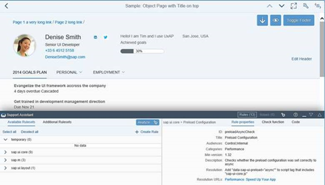

<!-- loiofa1efaca7d674995a0dc3a95ba0a4d08 -->

## What's New in OpenUI5 1.48

With this release OpenUI5 is upgraded from version 1.46 to 1.48.

****


<table>
<tr>
<th valign="top">

Version

</th>
<th valign="top">

Type

</th>
<th valign="top">

Category

</th>
<th valign="top">

Title

</th>
<th valign="top">

Description

</th>
<th valign="top">

Action

</th>
<th valign="top">

Available as of

</th>
</tr>
<tr>
<td valign="top">

1.48 

</td>
<td valign="top">

Changed 

</td>
<td valign="top">

Announcement 

</td>
<td valign="top">

**Third-Party Library Upgrades** 

</td>
<td valign="top">

**Third-Party Library Upgrades**

-   The `Handlebars.js` library has been upgraded from version 3.0.3 to 4.0.5. If you access the parent contexts in your Handlebars templates, make sure that you pass the `compat` flag when compiling:

    ```
    Handlebars.compile(source, {
    	compat: true
    });
    
    ```

    This change has also been applied to the OpenUI5 versions that are still in maintenance \(1.28, 1.38., 1.44\).

-   **QUnit** version 2.3.2 has been added \(module `sap.ui.thirdparty.qunit-2`, resources `sap/ui/thirdparty/qunit-2.js`\).


<sub>Changed•Announcement•Info Only•1.48</sub>

</td>
<td valign="top">

Info Only 

</td>
<td valign="top">

2017-08-02

</td>
</tr>
<tr>
<td valign="top">

1.48 

</td>
<td valign="top">

New 

</td>
<td valign="top">

Feature 

</td>
<td valign="top">

**Support Assistant and Other Support Tools** 

</td>
<td valign="top">

**Support Assistant and Other Support Tools**

The new Support Assistant tool enables application developers to check whether they have built their applications in accordance with the best practices for building OpenUI5 apps. The tool uses a set of predefined rules to check all aspects of an application, for example, accessibility, performance, data-binding, and more. Support Assistant is integrated into One Page Acceptance Tests \(OPA5\) and can be used as part of OPA tests.

The main features of the tool are:

-   Creation and management of support rules

-   Application analysis

-   Results reporting




For more information, see [Support Assistant](../04_Essentials/support-assistant-57ccd7d.md).

We have also redesigned the other support tools, *Technical Information Dialog* and *Diagnostics*, reworked the [Troubleshooting](../04_Essentials/troubleshooting-615d9e4.md) documentation section under *Essentials*, and created a [Troubleshooting Tutorial](../03_Get-Started/troubleshooting-tutorial-5661952.md) tutorial.

<sub>New•Feature•Info Only•1.48</sub>

</td>
<td valign="top">

Info Only 

</td>
<td valign="top">

2017-08-02

</td>
</tr>
<tr>
<td valign="top">

1.48 

</td>
<td valign="top">

New 

</td>
<td valign="top">

Feature 

</td>
<td valign="top">

**Reuse Components** 

</td>
<td valign="top">

**Reuse Components**

You now declare reuse components in the descriptor for applications \(`manifest.json`\). A new factory function has been introduced for creating reuse component instances within the context of the current component. You can extend apps easily on the component level by replacing the usage of a reuse component with a variant that modifies the `manifest.json` values for the reuse component.

You don't have to migrate old applications to the new logic to keep them working. But if you want to benefit from further improvements with regards to component loading and performance, as well as component extensibility \(replace reuse component\), you should consider updating the component usage accordingly.

For more information, see [Using and Nesting Components](../04_Essentials/using-and-nesting-components-346599f.md) and [Manifest \(Descriptor for Applications, Components, and Libraries\)](../04_Essentials/manifest-descriptor-for-applications-components-and-libraries-be0cf40.md).

<sub>New•Feature•Info Only•1.48</sub>

</td>
<td valign="top">

Info Only 

</td>
<td valign="top">

2017-08-02

</td>
</tr>
<tr>
<td valign="top">

1.48 

</td>
<td valign="top">

New 

</td>
<td valign="top">

Feature 

</td>
<td valign="top">

**Theme Parameter Tool** 

</td>
<td valign="top">

**Theme Parameter Tool**

There is a new theme parameter tool for finding the best-fitting semantic LESS parameter for a new control. With this tool you can easily search, filter, and preview theme parameters.

With the tool, you can also preview all supported SAP themes and find information about the semantic parameter structure.


To find the tool, see [Demo Apps](https://ui5.sap.com/#/demoapps).

<sub>New•Feature•Info Only•1.48</sub>

</td>
<td valign="top">

Info Only 

</td>
<td valign="top">

2017-08-02

</td>
</tr>
<tr>
<td valign="top">

1.48 

</td>
<td valign="top">

New 

</td>
<td valign="top">

Control 

</td>
<td valign="top">

**`sap.m.MessageView`** 

</td>
<td valign="top">

**`sap.m.MessageView`**

Displays a summarized list of different types of messages. The `MessageView` is used to show the contents of `sap.m.MessagePopover`, but it can also be used in other container controls like `sap.m.Dialog`.

`sap.m.MessageView` also allows grouping of messages by setting the property `groupItems` and defining a `groupName` for each item. For more information, see the [API Reference](https://ui5.sap.com/#/api/sap.m.MessageView) and the [samples](https://ui5.sap.com/#/sample/sap.m.sample.MessageViewWithGrouping/preview).


<sub>New•Control•Info Only•1.48</sub>

</td>
<td valign="top">

Info Only 

</td>
<td valign="top">

2017-08-02

</td>
</tr>
<tr>
<td valign="top">

1.48 

</td>
<td valign="top">

New 

</td>
<td valign="top">

Control 

</td>
<td valign="top">

**`sap.m.CustomTreeItem`** 

</td>
<td valign="top">

**`sap.m.CustomTreeItem`**

Similar to `sap.m.CustomListItem` for the `sap.m.List` control, the `sap.m.CustomTreeItem` control allows you to define custom item content for `sap.m.Tree`. For more information, see the [API Reference](https://ui5.sap.com/#/api/sap.m.CustomTreeItem) and the [sample](https://ui5.sap.com/#/sample/sap.m.sample.CustomTreeItem/preview).

<sub>New•Control•Info Only•1.48</sub>

</td>
<td valign="top">

Info Only 

</td>
<td valign="top">

2017-08-02

</td>
</tr>
<tr>
<td valign="top">

1.48 

</td>
<td valign="top">

New 

</td>
<td valign="top">

Control 

</td>
<td valign="top">

**`sap.m.PDFViewer`** 

</td>
<td valign="top">

**`sap.m.PDFViewer`**

**`sap.m.PDFViewer`** enables SAP Fiori developers to display PDF files in a consistent way across all browsers and devices. It encapsulates browser-specific PDF viewer plugins and provides a simple API to embed a PDF file into a page or to open it in a dialog box. For more information, see [PDF Viewer](../08_More_About_Controls/pdf-viewer-cd80a8b.md), the [API Reference](https://ui5.sap.com/#/api/sap.m.PDFViewer), and the [sample](https://ui5.sap.com/#/entity/sap.m.PDFViewer). 


<sub>New•Control•Info Only•1.48</sub>

</td>
<td valign="top">

Info Only 

</td>
<td valign="top">

2017-08-02

</td>
</tr>
<tr>
<td valign="top">

1.48 

</td>
<td valign="top">

Changed 

</td>
<td valign="top">

Feature 

</td>
<td valign="top">

**Improved Script Loading** 

</td>
<td valign="top">

**Improved Script Loading**

If loading a resource fails, a second retry is done.

<sub>Changed•Feature•Info Only•1.48</sub>

</td>
<td valign="top">

Info Only 

</td>
<td valign="top">

2017-08-02

</td>
</tr>
<tr>
<td valign="top">

1.48 

</td>
<td valign="top">

Changed 

</td>
<td valign="top">

Feature 

</td>
<td valign="top">

**Date Intervals** 

</td>
<td valign="top">

**Date Intervals**

The `DateFormat` can format two dates as an interval. For more information, see [Date Format](../04_Essentials/date-format-91f2eba.md).

<sub>Changed•Feature•Info Only•1.48</sub>

</td>
<td valign="top">

Info Only 

</td>
<td valign="top">

2017-08-02

</td>
</tr>
<tr>
<td valign="top">

1.48 

</td>
<td valign="top">

Changed 

</td>
<td valign="top">

Feature 

</td>
<td valign="top">

**OpenUI5 OData V4 Model** 

</td>
<td valign="top">

**OpenUI5 OData V4 Model**

The new version of the OpenUI5 OData V4 model introduces the following features:

-   Automatic determination of `$select` and `$expand` parameters for OData V4 requests by setting `autoExpandSelect` in the model settings to `true`.

-   Automatic loading of "cross-service references" \(a service that references metadata from other documents\) by the OData V4 model when metadata from the referenced document is needed.

-   Support of the V4-specific `lambda` operators `any` and `all` on collections with new filter operators `FilterOperator.All` and `FilterOperator.Any` and it is possible to create entities on relative bindings


> ### Caution:  
> **Incompatibility Due to Bug Fix**
> 
> The following bug has been reported: If you call the [sap.ui.model.odata.v4.Context\#getObject\(\)](https://ui5.sap.com/#/api/sap.ui.model.odata.v4.Context/methods/getObject) or the [sap.ui.model.odata.v4.Context\#requestObject\(\)](https://ui5.sap.com/#/api/sap.ui.model.odata.v4.Context/methods/requestObject) methods without a parameter, the expected and documented behavior is that the same result is returned as if the parameter `sPath=""` had been specified. Due to the bug, however, the return value wraps the expected output that can then only be accessed via `.value[0]`, for example `oContext.getObject().value[0]`.
> 
> **If you have used this workaround, your application will break starting with OpenUI5 version 1.44.6.**
> 
> **Solution**: If your application needs to run with both the fixed and unfixed versions of OpenUI5, specify the `sPath=""` parameter, for `sPath` parameter. In both cases, you **must not** use the workaround with `.value[0]`.

> ### Restriction:  
> Due to the limited feature scope of this version of the OpenUI5 OData V4 model, check that all required features are in place before developing applications. Check the detailed documentation of the features, as certain parts of a feature may be missing. While we aim to be compatible with existing controls, some controls might not work due to small incompatibilities compared to `sap.ui.model.odata.(v2.)ODataModel`, or due to missing features in the model \(such as tree binding\). This also applies to controls such as `TreeTable` and `AnalyticalTable`, which are not supported together with the OpenUI5 OData V4 model. The interface for applications has been changed for easier and more efficient use of the model. For a summary of these changes, see [Changes Compared to OData V2 Model](../04_Essentials/changes-compared-to-odata-v2-model-abd4d7c.md).

For more information, see [OData V4 Model](../04_Essentials/odata-v4-model-5de13cf.md), the [API Reference](https://ui5.sap.com/#/api/sap.ui.model.odata.v4), and the [sample](https://ui5.sap.com/#/entity/sap.ui.model.odata.v4.ODataModel) in the Demo Kit.

<sub>Changed•Feature•Info Only•1.48</sub>

</td>
<td valign="top">

Info Only 

</td>
<td valign="top">

2017-08-02

</td>
</tr>
<tr>
<td valign="top">

1.48 

</td>
<td valign="top">

Changed 

</td>
<td valign="top">

Feature 

</td>
<td valign="top">

**One Page Acceptance Tests \(OPA5\)** 

</td>
<td valign="top">

**One Page Acceptance Tests \(OPA5\)**

-   You can now provide OPA test and application parameters in the URL. This allows you to override the default values for individual test executions. For more information, see [Cookbook for OPA5](../04_Essentials/cookbook-for-opa5-ce4b180.md) and the API Reference for [sap.ui.test.Opa.extendConfig](https://ui5.sap.com/#/api/sap.ui.test.Opa/methods/extendConfig) and [sap.ui.test.Opa5.extendConfig](https://ui5.sap.com/#/api/sap.ui.test.Opa5/methods/sap.ui.test.Opa5.extendConfig). 

-   You can now extend the testing capabilities of OPA with your own extensions. For more information, see [Extensions for OPA5](../04_Essentials/extensions-for-opa5-9c22d2a.md) and the [API Reference](https://ui5.sap.com/#/api/sap.ui.test.OpaExtension). 


<sub>Changed•Feature•Info Only•1.48</sub>

</td>
<td valign="top">

Info Only 

</td>
<td valign="top">

2017-08-02

</td>
</tr>
<tr>
<td valign="top">

1.48 

</td>
<td valign="top">

Changed 

</td>
<td valign="top">

Control 

</td>
<td valign="top">

**`sap.f.Avatar`** 

</td>
<td valign="top">

**`sap.f.Avatar`**

With the use of the new `detailBox` aggregation, you can automatically open a `sap.m.LightBox` instance on user interaction with the `sap.f.Avatar`.

<sub>Changed•Control•Info Only•1.48</sub>

</td>
<td valign="top">

Info Only 

</td>
<td valign="top">

2017-08-02

</td>
</tr>
<tr>
<td valign="top">

1.48 

</td>
<td valign="top">

Changed 

</td>
<td valign="top">

Control 

</td>
<td valign="top">

**`sap.f.DynamicPage`** 

</td>
<td valign="top">

**`sap.f.DynamicPage`**

It is now possible to initialize the control with collapsed header. To enable the feature, set property `headerExpanded` to false.

<sub>Changed•Control•Info Only•1.48</sub>

</td>
<td valign="top">

Info Only 

</td>
<td valign="top">

2017-08-02

</td>
</tr>
<tr>
<td valign="top">

1.48 

</td>
<td valign="top">

Changed 

</td>
<td valign="top">

Control 

</td>
<td valign="top">

**`sap.m.ComboBox`** 

</td>
<td valign="top">

**`sap.m.ComboBox`**

**`sap.m.ComboBox`** now highlights matching characters in the dropdown list. This behaviour is now aligned with all select controls.

<sub>Changed•Control•Info Only•1.48</sub>

</td>
<td valign="top">

Info Only 

</td>
<td valign="top">

2017-08-02

</td>
</tr>
<tr>
<td valign="top">

1.48 

</td>
<td valign="top">

Changed 

</td>
<td valign="top">

Control 

</td>
<td valign="top">

**`sap.m.DatePicker`** 

</td>
<td valign="top">

**`sap.m.DatePicker`**

You can now set specific date or date ranges as non-working days by using the new type of the `sap.ui.unified.DateTypeRange` class, `sap.ui.unified.CalendarDayType.NonWorking`.

For more information, see the [sample](https://ui5.sap.com/#/sample/sap.m.sample.DatePicker/preview).

<sub>Changed•Control•Info Only•1.48</sub>

</td>
<td valign="top">

Info Only 

</td>
<td valign="top">

2017-08-02

</td>
</tr>
<tr>
<td valign="top">

1.48 

</td>
<td valign="top">

Changed 

</td>
<td valign="top">

Control 

</td>
<td valign="top">

**`sap.m.GenericTile`** 

</td>
<td valign="top">

**`sap.m.GenericTile`**

With a new overflow concept that allows more flexibility in the layout of the tile designs, generic tiles are displayed in `LineMode` like list items when the screen width is less than 450px. With a screen width greater than 450px, the tiles are no longer truncated and the complete text is shown in a wrapped in-line design.

`Compact` and `Cozy` content densities are available for small \(< 450px\) and large \(\> 450px\) screens. For more information, see the [API Reference](https://ui5.sap.com/#/api/sap.m.GenericTile) and the [samples](https://ui5.sap.com/#/entity/sap.m.GenericTile). 

<sub>Changed•Control•Info Only•1.48</sub>

</td>
<td valign="top">

Info Only 

</td>
<td valign="top">

2017-08-02

</td>
</tr>
<tr>
<td valign="top">

1.48 

</td>
<td valign="top">

Changed 

</td>
<td valign="top">

Control 

</td>
<td valign="top">

**`sap.m.PlanningCalendar`** 

</td>
<td valign="top">

**`sap.m.PlanningCalendar`**

-   You can now set specific date or date ranges as non-working days by using the new type of the `sap.ui.unified.DateTypeRange` class, `sap.ui.unified.CalendarDayType.NonWorking`.

-   You can now expand the grouping of overlapping appointments in the months view of the `sap.m.PlanningCalendar`. You can do this by setting the new property `groupAppointmentsMode` to `sap.ui.unified.GroupAppointmentsMode.Expanded`.

    For more information, see the [API Reference](https://ui5.sap.com/#/api/sap.m.PlanningCalendar/methods/getGroupAppointmentsMode) and the [samples](https://ui5.sap.com/#/sample/sap.m.sample.PlanningCalendarViews/preview).


<sub>Changed•Control•Info Only•1.48</sub>

</td>
<td valign="top">

Info Only 

</td>
<td valign="top">

2017-08-02

</td>
</tr>
<tr>
<td valign="top">

1.48 

</td>
<td valign="top">

Changed 

</td>
<td valign="top">

Control 

</td>
<td valign="top">

**`sap.m.TextArea`** 

</td>
<td valign="top">

**`sap.m.TextArea`**

**`sap.m.TextArea`** controls with a limited text length can determine how to handle text that exceeds that length. By setting `showExceededText=true`, you can decide if those characters are visible or cut. The text area changes its value state and shows a counter of the extra characters when the threshold is reached. For more information, see the [API Reference](https://ui5.sap.com/#/api/sap.m.TextArea/methods/setShowExceededText) and the [sample](https://ui5.sap.com/#/sample/sap.m.sample.TextAreaMaxLength/preview).

<sub>Changed•Control•Info Only•1.48</sub>

</td>
<td valign="top">

Info Only 

</td>
<td valign="top">

2017-08-02

</td>
</tr>
<tr>
<td valign="top">

1.48 

</td>
<td valign="top">

Changed 

</td>
<td valign="top">

Control 

</td>
<td valign="top">

**`sap.m.UploadCollection`** 

</td>
<td valign="top">

**`sap.m.UploadCollection`**

When grouping of `UploadCollectionItems` you can now provide the grouping feature for `UploadCollection`. After you have selected the grouping criteria, the grouping information is displayed as group header in the upload collection list. For more information, see the [API Reference](https://ui5.sap.com/#/api/sap.m.UploadCollectionItem) and the [samples](https://ui5.sap.com/#/sample/sap.m.sample.UploadCollectionSortingFiltering/preview).

<sub>Changed•Control•Info Only•1.48</sub>

</td>
<td valign="top">

Info Only 

</td>
<td valign="top">

2017-08-02

</td>
</tr>
<tr>
<td valign="top">

1.48 

</td>
<td valign="top">

Changed 

</td>
<td valign="top">

Control 

</td>
<td valign="top">

**`sap.m.Wizard`** 

</td>
<td valign="top">

**`sap.m.Wizard`**

**`sap.m.Wizard`** now allows editing of any step in the sequence. By using the association `currentStep` and the method `setCurrentStep`, you can programmatically reach and then edit any step in the sequence. For more information, see the [API Reference](https://ui5.sap.com/#/api/sap.m.Wizard/methods/setCurrentStep) and the [samples](https://ui5.sap.com/#/sample/sap.m.sample.WizardCurrentStep/preview).

<sub>Changed•Control•Info Only•1.48</sub>

</td>
<td valign="top">

Info Only 

</td>
<td valign="top">

2017-08-02

</td>
</tr>
<tr>
<td valign="top">

1.48 

</td>
<td valign="top">

Changed 

</td>
<td valign="top">

Control 

</td>
<td valign="top">

**`sap.ui.layout.BlockLayout`** 

</td>
<td valign="top">

**`sap.ui.layout.BlockLayout`**

-   New options for coloring individual cells have been added. For each `BlockLayoutCell`, you can set `backgroundColorSet` and `backgroundColorShade`. There are 11 predefined color sets, each with 4 color shades. The sets and shades can be easily customized in UI theme designer. You can also set an image as the background of a cell.

-   An additional breaking point for M-sized displays has been added.


For more information, see the [API Reference](https://ui5.sap.com/#/api/sap.ui.layout.BlockLayoutCell) and the [samples](https://ui5.sap.com/#/sample/sap.ui.layout.sample.BlockLayoutCustomBackground/preview).


<sub>Changed•Control•Info Only•1.48</sub>

</td>
<td valign="top">

Info Only 

</td>
<td valign="top">

2017-08-02

</td>
</tr>
<tr>
<td valign="top">

1.48 

</td>
<td valign="top">

Changed 

</td>
<td valign="top">

Control 

</td>
<td valign="top">

**`sap.tnt.ToolPage`** 

</td>
<td valign="top">

**`sap.tnt.ToolPage`**

`IconTabBar` can now be used in `sap.tnt.ToolPage` button in the chart container. The `ToolHeader` is enhanced to allow `IconTabBar` elements. When inside the `ToolHeader`, the `IconTabBar` can use only labels and no icons.

-   You can now have no tab selected by setting the `selectedKey` property to a non-existing key value.

-   When `IconTabHeader` is used on smartphones and tablets, only completely visible tabs are displayed \(no truncation\). The rest of the tabs will overflow.


For more information, see the [sample](https://ui5.sap.com/#/sample/sap.tnt.sample.ToolHeaderIconTabHeader/preview). 

<sub>Changed•Control•Info Only•1.48</sub>

</td>
<td valign="top">

Info Only 

</td>
<td valign="top">

2017-08-02

</td>
</tr>
<tr>
<td valign="top">

1.48 

</td>
<td valign="top">

Changed 

</td>
<td valign="top">

Control 

</td>
<td valign="top">

**`sap.ui.table`** 

</td>
<td valign="top">

**`sap.ui.table`**

You can now highlight items in the tables of the `sap.ui.table` library \(`sap.ui.table.Table`, `sap.ui.table.TreeTable`, `sap.ui.table.AnalyticalTable`\), for example to indicate an error. For more information, see the API Reference for [sap.ui.table.RowSettings](https://ui5.sap.com/#/api/sap.ui.table.RowSettings) and [sap.ui.table.Table.setRowSettingsTemplate](https://ui5.sap.com/#/api/sap.ui.table.Table/methods/setRowSettingsTemplate), and the [sample](https://ui5.sap.com/#/sample/sap.ui.table.sample.RowHighlights/preview).

<sub>Changed•Control•Info Only•1.48</sub>

</td>
<td valign="top">

Info Only 

</td>
<td valign="top">

2017-08-02

</td>
</tr>
<tr>
<td valign="top">

1.48 

</td>
<td valign="top">

Changed 

</td>
<td valign="top">

Control 

</td>
<td valign="top">

**`sap.ui.unified.Calendar`** 

</td>
<td valign="top">

**`sap.ui.unified.Calendar`**

-   You can now show and hide week numbers with the use of a new property `showWeekNumbers`. This feature is disabled for the Islamic calendar.

    For more information, see the [API Reference](https://ui5.sap.com/#/api/sap.ui.unified.Calendar/methods/setShowWeekNumbers) and the [samples](https://ui5.sap.com/#/sample/sap.ui.unified.sample.CalendarMinMax/preview).

-   You can now set specific dates or date ranges to be displayed as non-working by using the `specialDates` aggregation and `sap.ui.unified.CalendarDayType.NonWorking` enumeration type.

    For more information, see the [sample](https://ui5.sap.com/#/sample/sap.ui.unified.sample.CalendarSpecialDaysLegend/preview).


<sub>Changed•Control•Info Only•1.48</sub>

</td>
<td valign="top">

Info Only 

</td>
<td valign="top">

2017-08-02

</td>
</tr>
<tr>
<td valign="top">

1.48 

</td>
<td valign="top">

Changed 

</td>
<td valign="top">

Control 

</td>
<td valign="top">

**`sap.ui.unified.ColorPicker`** 

</td>
<td valign="top">

**`sap.ui.unified.ColorPicker`**

A responsive variant of the color picker control is now available in the `sap.ui.unified` library that is compatible for use with controls from the other responsive OpenUI5 libraries.

For more information, see the [API Reference](https://ui5.sap.com/#/api/sap.ui.unified.ColorPicker) and the [samples](https://ui5.sap.com/#/sample/sap.ui.unified.sample.ColorPicker/preview).

<sub>Changed•Control•Info Only•1.48</sub>

</td>
<td valign="top">

Info Only 

</td>
<td valign="top">

2017-08-02

</td>
</tr>
<tr>
<td valign="top">

1.48 

</td>
<td valign="top">

Changed 

</td>
<td valign="top">

User Documentation 

</td>
<td valign="top">

**Documentation Updates** 

</td>
<td valign="top">

**Documentation Updates**

In addition to the documentation for new features, the following changes have been applied to the documentation:

-   New tutorial: [Troubleshooting Tutorial](../03_Get-Started/troubleshooting-tutorial-5661952.md)

-   Reworked [Troubleshooting](../04_Essentials/troubleshooting-615d9e4.md) section


<sub>Changed•User Documentation•Info Only•1.48</sub>

</td>
<td valign="top">

Info Only 

</td>
<td valign="top">

2017-08-02

</td>
</tr>
</table>

**Related Information**  


[What's New in OpenUI5 1.135](what-s-new-in-openui5-1-135-93d7630.md "With this release OpenUI5 is upgraded from version 1.134 to 1.135.")

[What's New in OpenUI5 1.134](what-s-new-in-openui5-1-134-c512d71.md "With this release OpenUI5 is upgraded from version 1.133 to 1.134.")

[What's New in OpenUI5 1.133](what-s-new-in-openui5-1-133-86d7605.md "With this release OpenUI5 is upgraded from version 1.132 to 1.133.")

[What's New in OpenUI5 1.132](what-s-new-in-openui5-1-132-bd2e61f.md "With this release OpenUI5 is upgraded from version 1.131 to 1.132.")

[What's New in OpenUI5 1.131](what-s-new-in-openui5-1-131-7d24d94.md "With this release OpenUI5 is upgraded from version 1.130 to 1.131.")

[What's New in OpenUI5 1.130](what-s-new-in-openui5-1-130-85609d4.md "With this release OpenUI5 is upgraded from version 1.129 to 1.130.")

[What's New in OpenUI5 1.129](what-s-new-in-openui5-1-129-d22b8af.md "With this release OpenUI5 is upgraded from version 1.128 to 1.129.")

[What's New in OpenUI5 1.128](what-s-new-in-openui5-1-128-1f76220.md "With this release OpenUI5 is upgraded from version 1.127 to 1.128.")

[What's New in OpenUI5 1.127](what-s-new-in-openui5-1-127-e5e1317.md "With this release OpenUI5 is upgraded from version 1.126 to 1.127.")

[What's New in OpenUI5 1.126](what-s-new-in-openui5-1-126-1d98116.md "With this release OpenUI5 is upgraded from version 1.125 to 1.126.")

[What's New in OpenUI5 1.125](what-s-new-in-openui5-1-125-9d87044.md "With this release OpenUI5 is upgraded from version 1.124 to 1.125.")

[What's New in OpenUI5 1.124](what-s-new-in-openui5-1-124-7f77c3f.md "With this release OpenUI5 is upgraded from version 1.123 to 1.124.")

[What's New in OpenUI5 1.123](what-s-new-in-openui5-1-123-9d00ac7.md "With this release OpenUI5 is upgraded from version 1.122 to 1.123.")

[What's New in OpenUI5 1.122](what-s-new-in-openui5-1-122-5d078da.md "With this release OpenUI5 is upgraded from version 1.121 to 1.122.")

[What's New in OpenUI5 1.121](what-s-new-in-openui5-1-121-91a4a2f.md "With this release OpenUI5 is upgraded from version 1.120 to 1.121.")

[What's New in OpenUI5 1.120](what-s-new-in-openui5-1-120-2359b63.md "With this release OpenUI5 is upgraded from version 1.119 to 1.120.")

[What's New in OpenUI5 1.119](what-s-new-in-openui5-1-119-0b1903a.md "With this release OpenUI5 is upgraded from version 1.118 to 1.119.")

[What's New in OpenUI5 1.118](what-s-new-in-openui5-1-118-3eecbde.md "With this release OpenUI5 is upgraded from version 1.117 to 1.118.")

[What's New in OpenUI5 1.117](what-s-new-in-openui5-1-117-029d3b4.md "With this release OpenUI5 is upgraded from version 1.116 to 1.117.")

[What's New in OpenUI5 1.116](what-s-new-in-openui5-1-116-ebd6f34.md "With this release OpenUI5 is upgraded from version 1.115 to 1.116.")

[What's New in OpenUI5 1.115](what-s-new-in-openui5-1-115-409fde8.md "With this release OpenUI5 is upgraded from version 1.114 to 1.115.")

[What's New in OpenUI5 1.114](what-s-new-in-openui5-1-114-890fce1.md "With this release OpenUI5 is upgraded from version 1.113 to 1.114.")

[What's New in OpenUI5 1.113](what-s-new-in-openui5-1-113-a9553fe.md "With this release OpenUI5 is upgraded from version 1.112 to 1.113.")

[What's New in OpenUI5 1.112](what-s-new-in-openui5-1-112-34afc69.md "With this release OpenUI5 is upgraded from version 1.111 to 1.112.")

[What's New in OpenUI5 1.111](what-s-new-in-openui5-1-111-7a67837.md "With this release OpenUI5 is upgraded from version 1.110 to 1.111.")

[What's New in OpenUI5 1.110](what-s-new-in-openui5-1-110-71a855c.md "With this release OpenUI5 is upgraded from version 1.109 to 1.110.")

[What's New in OpenUI5 1.109](what-s-new-in-openui5-1-109-3264bd2.md "With this release OpenUI5 is upgraded from version 1.108 to 1.109.")

[What's New in OpenUI5 1.108](what-s-new-in-openui5-1-108-66e33f0.md "With this release OpenUI5 is upgraded from version 1.107 to 1.108.")

[What's New in OpenUI5 1.107](what-s-new-in-openui5-1-107-d4ff916.md "With this release OpenUI5 is upgraded from version 1.106 to 1.107.")

[What's New in OpenUI5 1.106](what-s-new-in-openui5-1-106-5b497b0.md "With this release OpenUI5 is upgraded from version 1.105 to 1.106.")

[What's New in OpenUI5 1.105](what-s-new-in-openui5-1-105-4d6c00e.md "With this release OpenUI5 is upgraded from version 1.104 to 1.105.")

[What's New in OpenUI5 1.104](what-s-new-in-openui5-1-104-69e567c.md "With this release OpenUI5 is upgraded from version 1.103 to 1.104.")

[What's New in OpenUI5 1.103](what-s-new-in-openui5-1-103-0e98c76.md "With this release OpenUI5 is upgraded from version 1.102 to 1.103.")

[What's New in OpenUI5 1.102](what-s-new-in-openui5-1-102-f038c99.md "With this release OpenUI5 is upgraded from version 1.101 to 1.102.")

[What's New in OpenUI5 1.101](what-s-new-in-openui5-1-101-7733b00.md "With this release OpenUI5 is upgraded from version 1.100 to 1.101.")

[What's New in OpenUI5 1.100](what-s-new-in-openui5-1-100-27dec1d.md "With this release OpenUI5 is upgraded from version 1.99 to 1.100.")

[What's New in OpenUI5 1.99](what-s-new-in-openui5-1-99-4f35848.md "With this release OpenUI5 is upgraded from version 1.98 to 1.99.")

[What's New in OpenUI5 1.98](what-s-new-in-openui5-1-98-d9f16f2.md "With this release OpenUI5 is upgraded from version 1.97 to 1.98.")

[What's New in OpenUI5 1.97](what-s-new-in-openui5-1-97-fa0e282.md "With this release OpenUI5 is upgraded from version 1.96 to 1.97.")

[What's New in OpenUI5 1.96](what-s-new-in-openui5-1-96-7a9269f.md "With this release OpenUI5 is upgraded from version 1.95 to 1.96.")

[What's New in OpenUI5 1.95](what-s-new-in-openui5-1-95-a1aea67.md "With this release OpenUI5 is upgraded from version 1.94 to 1.95.")

[What's New in OpenUI5 1.94](what-s-new-in-openui5-1-94-c40f1e6.md "With this release OpenUI5 is upgraded from version 1.93 to 1.94.")

[What's New in OpenUI5 1.93](what-s-new-in-openui5-1-93-f273340.md "With this release OpenUI5 is upgraded from version 1.92 to 1.93.")

[What's New in OpenUI5 1.92](what-s-new-in-openui5-1-92-1ef345d.md "With this release OpenUI5 is upgraded from version 1.91 to 1.92.")

[What's New in OpenUI5 1.91](what-s-new-in-openui5-1-91-0a2bd79.md "With this release OpenUI5 is upgraded from version 1.90 to 1.91.")

[What's New in OpenUI5 1.90](what-s-new-in-openui5-1-90-91c10c2.md "With this release OpenUI5 is upgraded from version 1.89 to 1.90.")

[What's New in OpenUI5 1.89](what-s-new-in-openui5-1-89-e56cddc.md "With this release OpenUI5 is upgraded from version 1.88 to 1.89.")

[What's New in OpenUI5 1.88](what-s-new-in-openui5-1-88-e15a206.md "With this release OpenUI5 is upgraded from version 1.87 to 1.88.")

[What's New in OpenUI5 1.87](what-s-new-in-openui5-1-87-b506da7.md "With this release OpenUI5 is upgraded from version 1.86 to 1.87.")

[What's New in OpenUI5 1.86](what-s-new-in-openui5-1-86-4c1c959.md "With this release OpenUI5 is upgraded from version 1.85 to 1.86.")

[What's New in OpenUI5 1.85](what-s-new-in-openui5-1-85-1d18eb5.md "With this release OpenUI5 is upgraded from version 1.84 to 1.85.")

[What's New in OpenUI5 1.84](what-s-new-in-openui5-1-84-dc76640.md "With this release OpenUI5 is upgraded from version 1.82 to 1.84.")

[What's New in OpenUI5 1.82](what-s-new-in-openui5-1-82-3a8dd13.md "With this release OpenUI5 is upgraded from version 1.81 to 1.82.")

[What's New in OpenUI5 1.81](what-s-new-in-openui5-1-81-f5e2a21.md "With this release OpenUI5 is upgraded from version 1.80 to 1.81.")

[What's New in OpenUI5 1.80](what-s-new-in-openui5-1-80-8cee506.md "With this release OpenUI5 is upgraded from version 1.79 to 1.80.")

[What's New in OpenUI5 1.79](what-s-new-in-openui5-1-79-99c4cdc.md "With this release OpenUI5 is upgraded from version 1.78 to 1.79.")

[What's New in OpenUI5 1.78](what-s-new-in-openui5-1-78-f09b63e.md "With this release OpenUI5 is upgraded from version 1.77 to 1.78.")

[What's New in OpenUI5 1.77](what-s-new-in-openui5-1-77-c46b439.md "With this release OpenUI5 is upgraded from version 1.76 to 1.77.")

[What's New in OpenUI5 1.76](what-s-new-in-openui5-1-76-aad03b5.md "With this release OpenUI5 is upgraded from version 1.75 to 1.76.")

[What's New in OpenUI5 1.75](what-s-new-in-openui5-1-75-5cbb62d.md "With this release OpenUI5 is upgraded from version 1.74 to 1.75.")

[What's New in OpenUI5 1.74](what-s-new-in-openui5-1-74-c22208a.md "With this release OpenUI5 is upgraded from version 1.73 to 1.74.")

[What's New in OpenUI5 1.73](what-s-new-in-openui5-1-73-231dd13.md "With this release OpenUI5 is upgraded from version 1.72 to 1.73.")

[What's New in OpenUI5 1.72](what-s-new-in-openui5-1-72-521cad9.md "With this release OpenUI5 is upgraded from version 1.71 to 1.72.")

[What's New in OpenUI5 1.71](what-s-new-in-openui5-1-71-a93a6a3.md "With this release OpenUI5 is upgraded from version 1.70 to 1.71.")

[What's New in OpenUI5 1.70](what-s-new-in-openui5-1-70-f073d69.md "With this release OpenUI5 is upgraded from version 1.69 to 1.70.")

[What's New in OpenUI5 1.69](what-s-new-in-openui5-1-69-89a18bd.md "With this release OpenUI5 is upgraded from version 1.68 to 1.69.")

[What's New in OpenUI5 1.68](what-s-new-in-openui5-1-68-f94bf93.md "With this release OpenUI5 is upgraded from version 1.67 to 1.68.")

[What's New in OpenUI5 1.67](what-s-new-in-openui5-1-67-a6b1472.md "With this release OpenUI5 is upgraded from version 1.66 to 1.67.")

[What's New in OpenUI5 1.66](what-s-new-in-openui5-1-66-c9896e9.md "With this release OpenUI5 is upgraded from version 1.65 to 1.66.")

[What's New in OpenUI5 1.65](what-s-new-in-openui5-1-65-0f5acfd.md "With this release OpenUI5 is upgraded from version 1.64 to 1.65.")

[What's New in OpenUI5 1.64](what-s-new-in-openui5-1-64-0e30822.md "With this release OpenUI5 is upgraded from version 1.63 to 1.64.")

[What's New in OpenUI5 1.63](what-s-new-in-openui5-1-63-e8d9da7.md "With this release OpenUI5 is upgraded from version 1.62 to 1.63.")

[What's New in OpenUI5 1.62](what-s-new-in-openui5-1-62-771f4d5.md "With this release OpenUI5 is upgraded from version 1.61 to 1.62.")

[What's New in OpenUI5 1.61](what-s-new-in-openui5-1-61-d991552.md "With this release OpenUI5 is upgraded from version 1.60 to 1.61.")

[What's New in OpenUI5 1.60](what-s-new-in-openui5-1-60-5a0e1f7.md "With this release OpenUI5 is upgraded from version 1.58 to 1.60.")

[What's New in OpenUI5 1.58](what-s-new-in-openui5-1-58-7c927aa.md "With this release OpenUI5 is upgraded from version 1.56 to 1.58.")

[What's New in OpenUI5 1.56](what-s-new-in-openui5-1-56-108b7fd.md "With this release OpenUI5 is upgraded from version 1.54 to 1.56.")

[What's New in OpenUI5 1.54](what-s-new-in-openui5-1-54-c838330.md "With this release OpenUI5 is upgraded from version 1.52 to 1.54.")

[What's New in OpenUI5 1.52](what-s-new-in-openui5-1-52-849e1b6.md "With this release OpenUI5 is upgraded from version 1.50 to 1.52.")

[What's New in OpenUI5 1.50](what-s-new-in-openui5-1-50-759e9f3.md "With this release OpenUI5 is upgraded from version 1.48 to 1.50.")

[What's New in OpenUI5 1.46](what-s-new-in-openui5-1-46-6307539.md "With this release OpenUI5 is upgraded from version 1.44 to 1.46.")

[What's New in OpenUI5 1.44](what-s-new-in-openui5-1-44-a0cb7a0.md "With this release OpenUI5 is upgraded from version 1.42 to 1.44.")

[What's New in OpenUI5 1.42](what-s-new-in-openui5-1-42-468b05d.md "With this release OpenUI5 is upgraded from version 1.40 to 1.42.")

[What's New in OpenUI5 1.40](what-s-new-in-openui5-1-40-fbab50e.md "With this release OpenUI5 is upgraded from version 1.38 to 1.40.")

[What's New in OpenUI5 1.38](what-s-new-in-openui5-1-38-f218918.md "With this release OpenUI5 is upgraded from version 1.36 to 1.38.")

