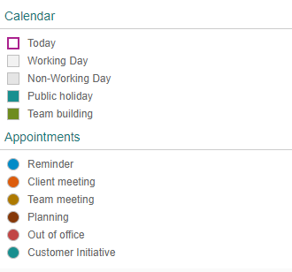

<!-- loio759e9f3aa50d4fd08538655f373b0038 -->

# What's New in OpenUI5 1.50

With this release OpenUI5 is upgraded from version 1.48 to 1.50.

****

<table>
<tr>
<th valign="top">

Version

</th>
<th valign="top">

Type

</th>
<th valign="top">

Category

</th>
<th valign="top">

Title

</th>
<th valign="top">

Description

</th>
<th valign="top">

Action

</th>
<th valign="top">

Available as of

</th>
</tr>
<tr>
<td valign="top">

1.50 

</td>
<td valign="top">

New 

</td>
<td valign="top">

Feature 

</td>
<td valign="top">

**New Demo Kit \(already available as of version 1.48.5\)** 

</td>
<td valign="top">

**New Demo Kit \(already available as of version 1.48.5\)**

The Demo Kit app has a new modern design that is intuitive and can be used on both desktop and mobile devices.

The global search has been improved and the results are now displayed in categories. They also include results from the *Samples* section, which was not possible with the old Demo Kit since the *Explored* app was a decoupled app.

The new Demo Kit contains the following sections:

-   Landing page with getting started information

-   *Documentation* with detailed information

-   *API Reference* with JavaScript documentation about the framework and the UI controls, including details for the corresponding properties, aggregations, associations, events, and methods

-   *Samples*, showcasing almost all controls with ability to download the sample code

-   *Demo Apps*, showcasing real-life scenarios that can easily be downloaded

New•Feature•Info Only•1.50

</td>
<td valign="top">

Info Only

</td>
<td valign="top">

2017-11-09

</td>
</tr>
<tr>
<td valign="top">

1.50

</td>
<td valign="top">

New 

</td>
<td valign="top">

Feature 

</td>
<td valign="top">

**Unicode Common Locale Data Repository \(CLDR\)** 

</td>
<td valign="top">

**Unicode Common Locale Data Repository \(CLDR\)**

The Unicode Common Locale Data Repository \(CLDR\) has been updated to version 31.

The correct plural category for a given number is now handled by the locale-specific plural rules offered by CLDR. Different languages use different plural forms, some languages have only singular and plural, others require additional forms, for example, dual \(two\), paucal \(few\), or many.

New•Feature•Info Only•1.50

</td>
<td valign="top">

Info Only 

</td>
<td valign="top">

2017-11-09

</td>
</tr>
<tr>
<td valign="top">

1.50

</td>
<td valign="top">

New 

</td>
<td valign="top">

Feature 

</td>
<td valign="top">

**Date Interval Types** 

</td>
<td valign="top">

**Date Interval Types**

Date interval types are introduced to format two date-related properties from a model for displaying in the UI. Additionally they are used to parse and validate the values in UI controls before they are saved back to the model. The new interval types are:

-   `sap.ui.model.type.DateInterval` - a date interval \(without time\)

-   `sap.ui.model.type.DateTimeInterval` - a date interval with the exact point of time

-   `sap.ui.model.type.TimeInterval` - a time interval \(without date\)

For more information, see [sap.ui.model.type.DateTimeInterval](../04_Essentials/sap-ui-model-type-datetimeinterval-94658aa.md) and the [API Reference](https://ui5.sap.com/#/api/sap.ui.model.type). 

New•Feature•Info Only•1.50

</td>
<td valign="top">

Info Only 

</td>
<td valign="top">

2017-11-09

</td>
</tr>
<tr>
<td valign="top">

1.50

</td>
<td valign="top">

New 

</td>
<td valign="top">

Feature 

</td>
<td valign="top">

**`animationMode`** 

</td>
<td valign="top">

**`animationMode`**

The configuration option `animationMode` replaces `animation`, which is now deprecated. The new option supports several states \(`full`, `basic`, `minimal`, `none`\), which allow controls to extend support for animations in a more granular way instead of a binary `on`/`off` state. For more information, see [Configuration Options and URL Parameters](../04_Essentials/configuration-options-and-url-parameters-91f2d03.md), [Implementing Animation Modes](../07_Developing_Controls/implementing-animation-modes-76b7d50.md), and the [API Reference](https://ui5.sap.com/#/api/sap.ui.core.Configuration.AnimationMode). 

New•Feature•Info Only•1.50

</td>
<td valign="top">

Info Only 

</td>
<td valign="top">

2017-11-09

</td>
</tr>
<tr>
<td valign="top">

1.50

</td>
<td valign="top">

New 

</td>
<td valign="top">

Control 

</td>
<td valign="top">

**`sap.m.PlanningCalendarLegend`** 

</td>
<td valign="top">

**`sap.m.PlanningCalendarLegend`**

`sap.m.PlanningCalendarLegend` enables two types of items to be displayed in the `sap.m.PlanningCalendar` as a legend - types of days \(for example, special dates and holidays\) and appointments.For more information, see the [API Reference](https://ui5.sap.com/#/api/sap.m.PlanningCalendarLegend).

New•Control•Info Only•1.50

</td>
<td valign="top">

Info Only 

</td>
<td valign="top">

2017-11-09

</td>
</tr>
<tr>
<td valign="top">

1.50

</td>
<td valign="top">

Changed 

</td>
<td valign="top">

Feature 

</td>
<td valign="top">

**OpenUI5 OData V4 Model** 

</td>
<td valign="top">

**OpenUI5 OData V4 Model**

The new version of the OpenUI5 OData V4 model introduces an adapter that allows you to use an OData V2 service together with the OData V4 model in read scenarios. The adapter offers the following features:

-   Metadata is converted, including some V2 annotations.

-   Data in the response is converted.

-   Literals in the request URI are converted, except for `Edm.DateTime`, `Edm.DateTimeOffset`, `Edm.Time`, and `Edm.Binary`.

-   `$select`, `$expand`, and `$orderby` are handled. Cases that are not supported by OData V2, like `$orderby` in `$expand`, lead to an error.

-   All unsupported query options lead to an error.

> ### Caution:  
> **Incompatibility Due to a Bug Fix**
> 
> The following bug has been reported: If you call the [sap.ui.model.odata.v4.Context\#getObject\(\)](https://ui5.sap.com/#/api/sap.ui.model.odata.v4.Context/methods/getObject) or the [sap.ui.model.odata.v4.Context\#requestObject\(\)](https://ui5.sap.com/#/api/sap.ui.model.odata.v4.Context/methods/requestObject) methods without a parameter, the expected and documented behavior is that the same result is returned as if the parameter `sPath=""` had been specified. However, due to the bug, the return value wraps the expected output that can then only be accessed via `.value[0]`, for example `oContext.getObject().value[0]`.
> 
> **If you have used this workaround, your application will break starting with OpenUI5 version 1.44.6.**
> 
> **Solution**: If your application needs to run with both the fixed and unfixed versions of OpenUI5, specify the `sPath=""` parameter, for the `sPath` parameter. In both cases, you **must not** use the workaround with `.value[0]` any longer.

> ### Restriction:  
> Due to the limited feature scope of this version of the OpenUI5 OData V4 model, check that all required features are in place before developing applications. Check the detailed documentation of the features, as certain parts of a feature may be missing. While we aim to be compatible with existing controls, some controls might not work due to small incompatibilities compared to `sap.ui.model.odata.(v2.)ODataModel`, or due to missing features in the model \(such as tree binding\). This also applies to controls such as `TreeTable` and `AnalyticalTable`, which are not supported together with the OpenUI5 OData V4 model. The interface for applications has been changed for easier and more efficient use of the model. For a summary of these changes, see [Changes Compared to OData V2 Model](../04_Essentials/changes-compared-to-odata-v2-model-abd4d7c.md).

For more information, see [OData V4 Model](../04_Essentials/odata-v4-model-5de13cf.md), the [API Reference](https://ui5.sap.com/#/api/sap.ui.model.odata.v4), and the [sample](https://ui5.sap.com/#/entity/sap.ui.model.odata.v4.ODataModel) in the Demo Kit.

Changed•Feature•Info Only•1.50

</td>
<td valign="top">

Info Only 

</td>
<td valign="top">

2017-11-09

</td>
</tr>
<tr>
<td valign="top">

1.50

</td>
<td valign="top">

Changed 

</td>
<td valign="top">

Feature 

</td>
<td valign="top">

**Support Assistant: OPA Test Sample Added** 

</td>
<td valign="top">

**Support Assistant: OPA Test Sample Added**

With the roll-out of Support Assistant in version 1.48, we introduced the possibility to use the tool in OPA tests to check if there are issues in the different states of an application. This is possible by enabling the available OPA extension.

As of this version, there is now a sample of the OPA integration in the Demo Kit. It demonstrates how you can extend existing OPA tests by making calls to the assertions in the Support Assistant extension. These assertions may have different severity, execution scope and subset of rules which are taken into consideration. The sample also shows how to execute rule checks and how to get reports.

As of this version, there is now a sample of the OPA integration in the Demo Kit. For more information, see [Integrating the Rules in OPA Tests](../04_Essentials/integrating-the-rules-in-opa-tests-cfabbd4.md) and the [Sample](https://ui5.sap.com/#/sample/sap.ui.core.sample.OpaWithSupportAssistant/preview).

Changed•Feature•Info Only•1.50

</td>
<td valign="top">

Info Only 

</td>
<td valign="top">

2017-11-09

</td>
</tr>
<tr>
<td valign="top">

1.50

</td>
<td valign="top">

Changed 

</td>
<td valign="top">

Control 

</td>
<td valign="top">

**`sap.f.DynamicPage`** 

</td>
<td valign="top">

**`sap.f.DynamicPage`**

**`sap.f.DynamicPage`** has the following new features:

-   You can now define the priority of the `DynamicPageTitle` areas with the use of the new `primaryArea` property. The primary area shrinks at a slower rate, remaining visible as long as possible.

-   With the new content aggregation of the `DynamicPageTitle`, you can add content in the middle area of the title. This content is displayed both in the expanded and collapsed states of the `DynamicPageHeader`.

For more information, see the [API Reference](https://ui5.sap.com/#/api/sap.f.DynamicPageTitle). 

Changed•Control•Info Only•1.50

</td>
<td valign="top">

Info Only 

</td>
<td valign="top">

2017-11-09

</td>
</tr>
<tr>
<td valign="top">

1.50

</td>
<td valign="top">

Changed 

</td>
<td valign="top">

Control 

</td>
<td valign="top">

**`sap.f.semantic.SemanticPage`** 

</td>
<td valign="top">

**`sap.f.semantic.SemanticPage`**

To align with the latest SAP Fiori design guidelines, the following changes were implemented:

-   The position of the draft indicator is changed to be the first one before the finalizing actions in the footer toolbar of the page.

-   A new *Edit* button was added as the main action and the order of the actions changed to *Edit*, *Delete*, *Copy*, and *Add*.

For more information, see [Semantic Page \(sap.f\)](../08_More_About_Controls/semantic-page-sap-f-47dc868.md), the [API Reference](https://ui5.sap.com/#/api/sap.f.semantic), and the [sample](https://ui5.sap.com/#/sample/sap.f.sample.SemanticPage/preview). 

Changed•Control•Info Only•1.50

</td>
<td valign="top">

Info Only 

</td>
<td valign="top">

2017-11-09

</td>
</tr>
<tr>
<td valign="top">

1.50

</td>
<td valign="top">

Changed 

</td>
<td valign="top">

Control 

</td>
<td valign="top">

**`sap.m.Label`** 

</td>
<td valign="top">

**`sap.m.Label`**

**`sap.m.Label`** has the following new properties:

-   `wrapping`: Determines whether text within a label is wrapped. The default value is `false`. If set to `false`, the label text only uses one line and any exceeding text is truncated and replaced with an ellipsis. When you use the `Label` within a `sap.m.Form` the label text is automatically displayed as wrapped.

    

-   `displayOnly`: Determines whether the label is in `displayOnly` mode. Controls in this mode are non-interactive, non-focusable, cannot be edited, and do not form part of the tab chain. The `displayOnly` property is used in `Form` controls when they are in preview mode.

For more information, see the [API Reference](https://ui5.sap.com/#/api/sap.m.Label) and the [Samples](https://ui5.sap.com/#/entity/sap.m.Label). 

Changed•Control•Info Only•1.50

</td>
<td valign="top">

Info Only 

</td>
<td valign="top">

2017-11-09

</td>
</tr>
<tr>
<td valign="top">

1.50

</td>
<td valign="top">

Changed 

</td>
<td valign="top">

Control 

</td>
<td valign="top">

**`sap.m.MessageStrip`** 

</td>
<td valign="top">

**`sap.m.MessageStrip`**

**`sap.m.MessageStrip`** now supports a limited set of formatting tags for the text. The available tags are `<a>`, `<em>`, `<strong>`, and `<u>`. To enable the additional formatting tags, you have to set the `enableFormattedText` property to `true`. For more information, see the [API Reference](https://ui5.sap.com/#/api/sap.m.MessageStrip) and the [Samples](https://ui5.sap.com/#/sample/sap.m.sample.MessageStripWithEnableFormattedText/preview).

Changed•Control•Info Only•1.50

</td>
<td valign="top">

Info Only 

</td>
<td valign="top">

2017-11-09

</td>
</tr>
<tr>
<td valign="top">

1.50

</td>
<td valign="top">

Changed 

</td>
<td valign="top">

Control 

</td>
<td valign="top">

**`sap.m.Panel`** 

</td>
<td valign="top">

**`sap.m.Panel`**

**`sap.m.Panel`** has a new parameter for the `expand` event that identifies whether the user or the application is expanding or collapsing the `Panel` control. The parameter is called `triggeredByInteraction` and is `true` when the panel is expanded as a result of a user action. For more information, see the [API Reference](https://ui5.sap.com/#/api/sap.m.Panel) and the [Samples](https://ui5.sap.com/#/sample/sap.m.sample.PanelExpanded/preview).

Changed•Control•Info Only•1.50

</td>
<td valign="top">

Info Only 

</td>
<td valign="top">

2017-11-09

</td>
</tr>
<tr>
<td valign="top">

1.50

</td>
<td valign="top">

Changed 

</td>
<td valign="top">

Control 

</td>
<td valign="top">

**`sap.m.PlanningCalendar`** 

</td>
<td valign="top">

**`sap.m.PlanningCalendar`**

-   You can now directly navigate to a date with fewer clicks.

-   With the use of the new `builtInViews` property the app developer can now define which of the built-in views are displayed. For more information, see the [API Reference](https://ui5.sap.com/#/api/sap.m.PlanningCalendar) and the [sample](https://ui5.sap.com/#/sample/sap.m.sample.PlanningCalendarViews/preview).

-   To save space, the days are now displayed on the same line as the dates. If you want to display the day names on a separate line, set the `showDayNamesLine` property to `true`.For more information, see the [API Reference](https://ui5.sap.com/#/api/sap.m.PlanningCalendar) and the [sample](https://ui5.sap.com/#/sample/sap.m.sample.PlanningCalendarSingle/preview).

Changed•Control•Info Only•1.50

</td>
<td valign="top">

Info Only 

</td>
<td valign="top">

2017-11-09

</td>
</tr>
<tr>
<td valign="top">

1.50

</td>
<td valign="top">

Changed 

</td>
<td valign="top">

Control 

</td>
<td valign="top">

**`sap.m.ProgressIndicator`** 

</td>
<td valign="top">

**`sap.m.ProgressIndicator`**

You can now set the control in a display-only state using the new `displayOnly` property. When set to `true`, the control has different visualization and is not active, not editable, and cannot be focused. For more information, see the [API Reference](https://ui5.sap.com/#/api/sap.m.ProgressIndicator) and the [Samples](https://ui5.sap.com/#/sample/sap.m.sample.ProgressIndicator/preview).

Changed•Control•Info Only•1.50

</td>
<td valign="top">

Info Only 

</td>
<td valign="top">

2017-11-09

</td>
</tr>
<tr>
<td valign="top">

1.50

</td>
<td valign="top">

Changed 

</td>
<td valign="top">

Control 

</td>
<td valign="top">

**`sap.m.RatingIndicator`** 

</td>
<td valign="top">

**`sap.m.RatingIndicator`**

A new state can be set using the `displayOnly` property. It enables visually distinguishable rendering of the `RatingIndicator` \(gray color\), denoting it as non-interactive in forms. All controls in this mode are also non-focusable and not part of the tab chain. For more information, see the [API Reference](https://ui5.sap.com/#/api/sap.m.RatingIndicator) and the [Sample](https://ui5.sap.com/#/sample/sap.m.sample.RatingIndicator/preview).

Changed•Control•Info Only•1.50

</td>
<td valign="top">

Info Only 

</td>
<td valign="top">

2017-11-09

</td>
</tr>
<tr>
<td valign="top">

1.50

</td>
<td valign="top">

Changed 

</td>
<td valign="top">

Control 

</td>
<td valign="top">

**`sap.m.semantic.SemanticPage`** 

</td>
<td valign="top">

**`sap.m.semantic.SemanticPage`**

You can now set the background color of the page using the new `backgroundDesign` property. For more information, see [Semantic Page \(sap.m\)](../08_More_About_Controls/semantic-page-sap-m-4a97a07.md) and the [API Reference](https://ui5.sap.com/#/api/sap.m.semantic.SemanticPage).

Changed•Control•Info Only•1.50

</td>
<td valign="top">

Info Only 

</td>
<td valign="top">

2017-11-09

</td>
</tr>
<tr>
<td valign="top">

1.50

</td>
<td valign="top">

Changed 

</td>
<td valign="top">

Control 

</td>
<td valign="top">

**`sap.m.UploadCollection`** 

</td>
<td valign="top">

**`sap.m.UploadCollection`**

`UploadCollectionItem` has been extended to display folders in the `UploadCollection` control. When you click the file name or item thumbnail, you can perform custom actions by adding an event handler to the `press` event. With the `deletePress` event, you can control the deletion of an item. For more information, see the [API Reference](https://ui5.sap.com/#/api/sap.m.UploadCollectionItem) and the [sample](https://ui5.sap.com/#/sample/sap.m.sample.UploadCollectionFolderHierarchy/preview).

Changed•Control•Info Only•1.50

</td>
<td valign="top">

Info Only 

</td>
<td valign="top">

2017-11-09

</td>
</tr>
<tr>
<td valign="top">

1.50

</td>
<td valign="top">

Changed 

</td>
<td valign="top">

Control 

</td>
<td valign="top">

**`sap.m.Tree`** 

</td>
<td valign="top">

**`sap.m.Tree`**

The `toggleOpenState` event has been added. For more information, see the [API Reference](https://ui5.sap.com/#/api/sap.m.Tree) and the [sample](https://ui5.sap.com/#/sample/sap.m.sample.TreeJSONLazyLoading/preview).

Changed•Control•Info Only•1.50

</td>
<td valign="top">

Info Only 

</td>
<td valign="top">

2017-11-09

</td>
</tr>
<tr>
<td valign="top">

1.50

</td>
<td valign="top">

Changed 

</td>
<td valign="top">

Control 

</td>
<td valign="top">

**`sap.ui.unified.Calendar`** 

</td>
<td valign="top">

**`sap.ui.unified.Calendar`**

The days of the previous/next month are no longer visible whenever the `sap.ui.unified.Calendar` displays multiple months. For more information, see the [API Reference](https://ui5.sap.com/#/api/sap.ui.unified.Calendar) and the [sample](https://ui5.sap.com/#/sample/sap.ui.unified.sample.CalendarMultipleMonth/preview).

Changed•Control•Info Only•1.50

</td>
<td valign="top">

Info Only 

</td>
<td valign="top">

2017-11-09

</td>
</tr>
<tr>
<td valign="top">

1.50

</td>
<td valign="top">

Changed 

</td>
<td valign="top">

Control 

</td>
<td valign="top">

**`sap.ui.layout.form.Form/sap.ui.layout.form.SimpleForm`** 

</td>
<td valign="top">

**`sap.ui.layout.form.Form/sap.ui.layout.form.SimpleForm`**

The samples, including the descriptions, have been simplified and are now more consistent. For more information, see the [Form](https://ui5.sap.com/#/entity/sap.ui.layout.form.Form) and the [SimpleForm](https://ui5.sap.com/#/entity/sap.ui.layout.form.SimpleForm) samples.

Changed•Control•Info Only•1.50

</td>
<td valign="top">

Info Only 

</td>
<td valign="top">

2017-11-09

</td>
</tr>
</table>

**Related Information**  

[What's New in OpenUI5 1.133](what-s-new-in-openui5-1-133-86d7605.md "With this release OpenUI5 is upgraded from version 1.132 to 1.133.")

[What's New in OpenUI5 1.132](what-s-new-in-openui5-1-132-bd2e61f.md "With this release OpenUI5 is upgraded from version 1.131 to 1.132.")

[What's New in OpenUI5 1.131](what-s-new-in-openui5-1-131-7d24d94.md "With this release OpenUI5 is upgraded from version 1.130 to 1.131.")

[What's New in OpenUI5 1.130](what-s-new-in-openui5-1-130-85609d4.md "With this release OpenUI5 is upgraded from version 1.129 to 1.130.")

[What's New in OpenUI5 1.129](what-s-new-in-openui5-1-129-d22b8af.md "With this release OpenUI5 is upgraded from version 1.128 to 1.129.")

[What's New in OpenUI5 1.128](what-s-new-in-openui5-1-128-1f76220.md "With this release OpenUI5 is upgraded from version 1.127 to 1.128.")

[What's New in OpenUI5 1.127](what-s-new-in-openui5-1-127-e5e1317.md "With this release OpenUI5 is upgraded from version 1.126 to 1.127.")

[What's New in OpenUI5 1.126](what-s-new-in-openui5-1-126-1d98116.md "With this release OpenUI5 is upgraded from version 1.125 to 1.126.")

[What's New in OpenUI5 1.125](what-s-new-in-openui5-1-125-9d87044.md "With this release OpenUI5 is upgraded from version 1.124 to 1.125.")

[What's New in OpenUI5 1.124](what-s-new-in-openui5-1-124-7f77c3f.md "With this release OpenUI5 is upgraded from version 1.123 to 1.124.")

[What's New in OpenUI5 1.123](what-s-new-in-openui5-1-123-9d00ac7.md "With this release OpenUI5 is upgraded from version 1.122 to 1.123.")

[What's New in OpenUI5 1.122](what-s-new-in-openui5-1-122-5d078da.md "With this release OpenUI5 is upgraded from version 1.121 to 1.122.")

[What's New in OpenUI5 1.121](what-s-new-in-openui5-1-121-91a4a2f.md "With this release OpenUI5 is upgraded from version 1.120 to 1.121.")

[What's New in OpenUI5 1.120](what-s-new-in-openui5-1-120-2359b63.md "With this release OpenUI5 is upgraded from version 1.119 to 1.120.")

[What's New in OpenUI5 1.119](what-s-new-in-openui5-1-119-0b1903a.md "With this release OpenUI5 is upgraded from version 1.118 to 1.119.")

[What's New in OpenUI5 1.118](what-s-new-in-openui5-1-118-3eecbde.md "With this release OpenUI5 is upgraded from version 1.117 to 1.118.")

[What's New in OpenUI5 1.117](what-s-new-in-openui5-1-117-029d3b4.md "With this release OpenUI5 is upgraded from version 1.116 to 1.117.")

[What's New in OpenUI5 1.116](what-s-new-in-openui5-1-116-ebd6f34.md "With this release OpenUI5 is upgraded from version 1.115 to 1.116.")

[What's New in OpenUI5 1.115](what-s-new-in-openui5-1-115-409fde8.md "With this release OpenUI5 is upgraded from version 1.114 to 1.115.")

[What's New in OpenUI5 1.114](what-s-new-in-openui5-1-114-890fce1.md "With this release OpenUI5 is upgraded from version 1.113 to 1.114.")

[What's New in OpenUI5 1.113](what-s-new-in-openui5-1-113-a9553fe.md "With this release OpenUI5 is upgraded from version 1.112 to 1.113.")

[What's New in OpenUI5 1.112](what-s-new-in-openui5-1-112-34afc69.md "With this release OpenUI5 is upgraded from version 1.111 to 1.112.")

[What's New in OpenUI5 1.111](what-s-new-in-openui5-1-111-7a67837.md "With this release OpenUI5 is upgraded from version 1.110 to 1.111.")

[What's New in OpenUI5 1.110](what-s-new-in-openui5-1-110-71a855c.md "With this release OpenUI5 is upgraded from version 1.109 to 1.110.")

[What's New in OpenUI5 1.109](what-s-new-in-openui5-1-109-3264bd2.md "With this release OpenUI5 is upgraded from version 1.108 to 1.109.")

[What's New in OpenUI5 1.108](what-s-new-in-openui5-1-108-66e33f0.md "With this release OpenUI5 is upgraded from version 1.107 to 1.108.")

[What's New in OpenUI5 1.107](what-s-new-in-openui5-1-107-d4ff916.md "With this release OpenUI5 is upgraded from version 1.106 to 1.107.")

[What's New in OpenUI5 1.106](what-s-new-in-openui5-1-106-5b497b0.md "With this release OpenUI5 is upgraded from version 1.105 to 1.106.")

[What's New in OpenUI5 1.105](what-s-new-in-openui5-1-105-4d6c00e.md "With this release OpenUI5 is upgraded from version 1.104 to 1.105.")

[What's New in OpenUI5 1.104](what-s-new-in-openui5-1-104-69e567c.md "With this release OpenUI5 is upgraded from version 1.103 to 1.104.")

[What's New in OpenUI5 1.103](what-s-new-in-openui5-1-103-0e98c76.md "With this release OpenUI5 is upgraded from version 1.102 to 1.103.")

[What's New in OpenUI5 1.102](what-s-new-in-openui5-1-102-f038c99.md "With this release OpenUI5 is upgraded from version 1.101 to 1.102.")

[What's New in OpenUI5 1.101](what-s-new-in-openui5-1-101-7733b00.md "With this release OpenUI5 is upgraded from version 1.100 to 1.101.")

[What's New in OpenUI5 1.100](what-s-new-in-openui5-1-100-27dec1d.md "With this release OpenUI5 is upgraded from version 1.99 to 1.100.")

[What's New in OpenUI5 1.99](what-s-new-in-openui5-1-99-4f35848.md "With this release OpenUI5 is upgraded from version 1.98 to 1.99.")

[What's New in OpenUI5 1.98](what-s-new-in-openui5-1-98-d9f16f2.md "With this release OpenUI5 is upgraded from version 1.97 to 1.98.")

[What's New in OpenUI5 1.97](what-s-new-in-openui5-1-97-fa0e282.md "With this release OpenUI5 is upgraded from version 1.96 to 1.97.")

[What's New in OpenUI5 1.96](what-s-new-in-openui5-1-96-7a9269f.md "With this release OpenUI5 is upgraded from version 1.95 to 1.96.")

[What's New in OpenUI5 1.95](what-s-new-in-openui5-1-95-a1aea67.md "With this release OpenUI5 is upgraded from version 1.94 to 1.95.")

[What's New in OpenUI5 1.94](what-s-new-in-openui5-1-94-c40f1e6.md "With this release OpenUI5 is upgraded from version 1.93 to 1.94.")

[What's New in OpenUI5 1.93](what-s-new-in-openui5-1-93-f273340.md "With this release OpenUI5 is upgraded from version 1.92 to 1.93.")

[What's New in OpenUI5 1.92](what-s-new-in-openui5-1-92-1ef345d.md "With this release OpenUI5 is upgraded from version 1.91 to 1.92.")

[What's New in OpenUI5 1.91](what-s-new-in-openui5-1-91-0a2bd79.md "With this release OpenUI5 is upgraded from version 1.90 to 1.91.")

[What's New in OpenUI5 1.90](what-s-new-in-openui5-1-90-91c10c2.md "With this release OpenUI5 is upgraded from version 1.89 to 1.90.")

[What's New in OpenUI5 1.89](what-s-new-in-openui5-1-89-e56cddc.md "With this release OpenUI5 is upgraded from version 1.88 to 1.89.")

[What's New in OpenUI5 1.88](what-s-new-in-openui5-1-88-e15a206.md "With this release OpenUI5 is upgraded from version 1.87 to 1.88.")

[What's New in OpenUI5 1.87](what-s-new-in-openui5-1-87-b506da7.md "With this release OpenUI5 is upgraded from version 1.86 to 1.87.")

[What's New in OpenUI5 1.86](what-s-new-in-openui5-1-86-4c1c959.md "With this release OpenUI5 is upgraded from version 1.85 to 1.86.")

[What's New in OpenUI5 1.85](what-s-new-in-openui5-1-85-1d18eb5.md "With this release OpenUI5 is upgraded from version 1.84 to 1.85.")

[What's New in OpenUI5 1.84](what-s-new-in-openui5-1-84-dc76640.md "With this release OpenUI5 is upgraded from version 1.82 to 1.84.")

[What's New in OpenUI5 1.82](what-s-new-in-openui5-1-82-3a8dd13.md "With this release OpenUI5 is upgraded from version 1.81 to 1.82.")

[What's New in OpenUI5 1.81](what-s-new-in-openui5-1-81-f5e2a21.md "With this release OpenUI5 is upgraded from version 1.80 to 1.81.")

[What's New in OpenUI5 1.80](what-s-new-in-openui5-1-80-8cee506.md "With this release OpenUI5 is upgraded from version 1.79 to 1.80.")

[What's New in OpenUI5 1.79](what-s-new-in-openui5-1-79-99c4cdc.md "With this release OpenUI5 is upgraded from version 1.78 to 1.79.")

[What's New in OpenUI5 1.78](what-s-new-in-openui5-1-78-f09b63e.md "With this release OpenUI5 is upgraded from version 1.77 to 1.78.")

[What's New in OpenUI5 1.77](what-s-new-in-openui5-1-77-c46b439.md "With this release OpenUI5 is upgraded from version 1.76 to 1.77.")

[What's New in OpenUI5 1.76](what-s-new-in-openui5-1-76-aad03b5.md "With this release OpenUI5 is upgraded from version 1.75 to 1.76.")

[What's New in OpenUI5 1.75](what-s-new-in-openui5-1-75-5cbb62d.md "With this release OpenUI5 is upgraded from version 1.74 to 1.75.")

[What's New in OpenUI5 1.74](what-s-new-in-openui5-1-74-c22208a.md "With this release OpenUI5 is upgraded from version 1.73 to 1.74.")

[What's New in OpenUI5 1.73](what-s-new-in-openui5-1-73-231dd13.md "With this release OpenUI5 is upgraded from version 1.72 to 1.73.")

[What's New in OpenUI5 1.72](what-s-new-in-openui5-1-72-521cad9.md "With this release OpenUI5 is upgraded from version 1.71 to 1.72.")

[What's New in OpenUI5 1.71](what-s-new-in-openui5-1-71-a93a6a3.md "With this release OpenUI5 is upgraded from version 1.70 to 1.71.")

[What's New in OpenUI5 1.70](what-s-new-in-openui5-1-70-f073d69.md "With this release OpenUI5 is upgraded from version 1.69 to 1.70.")

[What's New in OpenUI5 1.69](what-s-new-in-openui5-1-69-89a18bd.md "With this release OpenUI5 is upgraded from version 1.68 to 1.69.")

[What's New in OpenUI5 1.68](what-s-new-in-openui5-1-68-f94bf93.md "With this release OpenUI5 is upgraded from version 1.67 to 1.68.")

[What's New in OpenUI5 1.67](what-s-new-in-openui5-1-67-a6b1472.md "With this release OpenUI5 is upgraded from version 1.66 to 1.67.")

[What's New in OpenUI5 1.66](what-s-new-in-openui5-1-66-c9896e9.md "With this release OpenUI5 is upgraded from version 1.65 to 1.66.")

[What's New in OpenUI5 1.65](what-s-new-in-openui5-1-65-0f5acfd.md "With this release OpenUI5 is upgraded from version 1.64 to 1.65.")

[What's New in OpenUI5 1.64](what-s-new-in-openui5-1-64-0e30822.md "With this release OpenUI5 is upgraded from version 1.63 to 1.64.")

[What's New in OpenUI5 1.63](what-s-new-in-openui5-1-63-e8d9da7.md "With this release OpenUI5 is upgraded from version 1.62 to 1.63.")

[What's New in OpenUI5 1.62](what-s-new-in-openui5-1-62-771f4d5.md "With this release OpenUI5 is upgraded from version 1.61 to 1.62.")

[What's New in OpenUI5 1.61](what-s-new-in-openui5-1-61-d991552.md "With this release OpenUI5 is upgraded from version 1.60 to 1.61.")

[What's New in OpenUI5 1.60](what-s-new-in-openui5-1-60-5a0e1f7.md "With this release OpenUI5 is upgraded from version 1.58 to 1.60.")

[What's New in OpenUI5 1.58](what-s-new-in-openui5-1-58-7c927aa.md "With this release OpenUI5 is upgraded from version 1.56 to 1.58.")

[What's New in OpenUI5 1.56](what-s-new-in-openui5-1-56-108b7fd.md "With this release OpenUI5 is upgraded from version 1.54 to 1.56.")

[What's New in OpenUI5 1.54](what-s-new-in-openui5-1-54-c838330.md "With this release OpenUI5 is upgraded from version 1.52 to 1.54.")

[What's New in OpenUI5 1.52](what-s-new-in-openui5-1-52-849e1b6.md "With this release OpenUI5 is upgraded from version 1.50 to 1.52.")

[What's New in OpenUI5 1.48](what-s-new-in-openui5-1-48-fa1efac.md "With this release OpenUI5 is upgraded from version 1.46 to 1.48.")

[What's New in OpenUI5 1.46](what-s-new-in-openui5-1-46-6307539.md "With this release OpenUI5 is upgraded from version 1.44 to 1.46.")

[What's New in OpenUI5 1.44](what-s-new-in-openui5-1-44-a0cb7a0.md "With this release OpenUI5 is upgraded from version 1.42 to 1.44.")

[What's New in OpenUI5 1.42](what-s-new-in-openui5-1-42-468b05d.md "With this release OpenUI5 is upgraded from version 1.40 to 1.42.")

[What's New in OpenUI5 1.40](what-s-new-in-openui5-1-40-fbab50e.md "With this release OpenUI5 is upgraded from version 1.38 to 1.40.")

[What's New in OpenUI5 1.38](what-s-new-in-openui5-1-38-f218918.md "With this release OpenUI5 is upgraded from version 1.36 to 1.38.")

