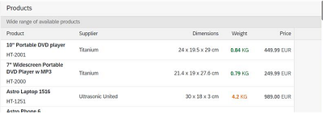

<!-- loio1d18eb5973ac477ba87f16057adb2571 -->

# What's New in OpenUI5 1.85

With this release OpenUI5 is upgraded from version 1.84 to 1.85.

***

****

<table>
<tr>
<th valign="top">

Version

</th>
<th valign="top">

Type

</th>
<th valign="top">

Category

</th>
<th valign="top">

Title

</th>
<th valign="top">

Description

</th>
<th valign="top">

Action

</th>
<th valign="top">

Available as of

</th>
</tr>
<tr>
<td valign="top">

1.85 

</td>
<td valign="top">

Changed 

</td>
<td valign="top">

Feature 

</td>
<td valign="top">

**OpenUI5 OData V4 Model** 

</td>
<td valign="top">

**OpenUI5 OData V4 Model**

The new version of the OpenUI5 OData V4 model introduces the following features:

-   We now provide the `sap.ui.model.odata.v4.ODataModel#getMessages` method for use by `sap.ui.model.Context#getMessages`. Both methods can be used to highlight table rows with messages. For more information, see [Highlighting Table Rows with Messages](../04_Essentials/server-messages-in-the-odata-v4-model-fbe1cb5.md#loiofbe1cb5613cf4a40a841750bf813238e__section_highlighting_table_rows).

-   The `sap.ui.model.odata.v4.ODataListBinding#refresh` method is now supported for kept-alive contexts. A list binding context can be kept alive with the `sap.ui.model.odata.v4.Context#setKeepAlive` method introduced with OpenUI5 1.81.
-   When using `groupLevels` with the `$$aggregation` list binding parameter, we now support grand totals.
-   `TargetProperties` of type `edm.String` are supported in accordance with recent changes to the `SideEffectsType` and can be directly provided to the `sap.ui.model.odata.v4.Context#requestSideEffects` method.
-   You can now set the value of an instance annotation for a newly created or already existing entity. The set value is sent to the back end in a `POST` or `PATCH` request, respectively.

For more information, see [OData V4 Model](../04_Essentials/odata-v4-model-5de13cf.md), the [API Reference](https://ui5.sap.com/#/api/sap.ui.model.odata.v4), and the [Samples](https://ui5.sap.com/#/entity/sap.ui.model.odata.v4.ODataModel) in the Demo Kit.

Changed•Feature•Info Only•1.85

</td>
<td valign="top">

Info Only

</td>
<td valign="top">

2020-12-03

</td>
</tr>
<tr>
<td valign="top">

1.85 

</td>
<td valign="top">

Changed 

</td>
<td valign="top">

Feature 

</td>
<td valign="top">

**Special Messaging Support for Visually Impaired Users** 

</td>
<td valign="top">

**Special Messaging Support for Visually Impaired Users**

The `sap.ui.core.InvisibleMessage` class is no longer experimental. This class is used to programmatically expose dynamic content changes that can be announced by the screen reader. For more information, see [Invisible Messaging](../05_Developing_Apps/invisible-messaging-b9a7d6f.md), the [API Reference](https://ui5.sap.com/#/api/sap.ui.core.InvisibleMessage) and the [Sample](https://ui5.sap.com/#/entity/sap.ui.core.InvisibleMessage).

Changed•Feature•Info Only•1.85

</td>
<td valign="top">

Info Only 

</td>
<td valign="top">

2020-12-03

</td>
</tr>
<tr>
<td valign="top">

1.85 

</td>
<td valign="top">

Changed 

</td>
<td valign="top">

Control 

</td>
<td valign="top">

**`sap.f.GridContainer`** 

</td>
<td valign="top">

**`sap.f.GridContainer`**

We have improved the two-dimensional keyboard navigation. Now navigation using the [Arrow Keys\] follows the configurable two-dimensional grid. This model provides stable navigation paths when there are items of different sizes. When the user presses an [Arrow Key\] in a direction outward of the `GridContainer`, a `borderReached` event is fired. The implementation of the `borderReached` event allows the application developer to control where the focus goes and \(depending on the surrounding layout\) to pass the focus to a specific place in a neighboring `GridContainer` using the `GridContainer#focusItemByDirection` method. For more information, see the [API Reference](https://ui5.sap.com/#/api/sap.f.GridContainer) and the [Sample](https://ui5.sap.com/#/entity/sap.f.GridContainer/sample/sap.f.sample.GridContainersNavigation).

Changed•Control•Info Only•1.85

</td>
<td valign="top">

Info Only 

</td>
<td valign="top">

2020-12-03

</td>
</tr>
<tr>
<td valign="top">

1.85 

</td>
<td valign="top">

Changed 

</td>
<td valign="top">

Control 

</td>
<td valign="top">

**`sap.m.Bar`** 

</td>
<td valign="top">

**`sap.m.Bar`**

We have added a new `titleAlignment` property. It enables developers to create custom headers for controls that use headers based on `sap.m.Bar` and to achieve proper title alignment. To keep the default `Bar` behavior \(when it is not used as a header\), we have added a new value `None` \(default\) to the `sap.m.TitleAlignment` enumeration. If the `titleAlignment` value is set to `Start` or `Center`, the horizontal alignment of the `contentMiddle` aggregation of `sap.m.Bar` accepts the same setting. If the `titleAlignment` is set to `Auto`, the `contentMiddle` aggregation is set according to the default theme setting. For more information, see the [API Reference](https://ui5.sap.com/#/api/sap.m.Bar).

Changed•Control•Info Only•1.85

</td>
<td valign="top">

Info Only 

</td>
<td valign="top">

2020-12-03

</td>
</tr>
<tr>
<td valign="top">

1.85 

</td>
<td valign="top">

Changed 

</td>
<td valign="top">

Control 

</td>
<td valign="top">

**`sap.m.ColorPalette`, `sap.m.ColorPalettePopover`, and `sap.ui.unified.ColorPickerPopover`** 

</td>
<td valign="top">

**`sap.m.ColorPalette`, `sap.m.ColorPalettePopover`, and `sap.ui.unified.ColorPickerPopover`**

A `liveChange` event is now available in these controls, which are using the `sap.ui.unified.ColorPicker` internally. This event is used to propagate real-time color changes from inside the `ColorPicker` before closing the popover that contains this `ColorPicker`. For more information, see the [ColorPickerPopover](https://ui5.sap.com/#/entity/sap.ui.unified.ColorPicker/sample/sap.ui.unified.sample.ColorPickerPopover) and the [ColorPalettePopover](https://ui5.sap.com/#/entity/sap.m.ColorPalette/sample/sap.m.sample.ColorPalettePopover) samples.

Changed•Control•Info Only•1.85

</td>
<td valign="top">

Info Only 

</td>
<td valign="top">

2020-12-03

</td>
</tr>
<tr>
<td valign="top">

1.85 

</td>
<td valign="top">

Changed 

</td>
<td valign="top">

Control 

</td>
<td valign="top">

**`sap.m.SinglePlanningCalendar`** 

</td>
<td valign="top">

**`sap.m.SinglePlanningCalendar`**

The `specialDates` aggregation, which allows you to define special dates for the control, is now visible in the Month view for all supported SAP themes. For more information, see the [API Reference](https://ui5.sap.com/#/api/sap.m.SinglePlanningCalendar).

Changed•Control•Info Only•1.85

</td>
<td valign="top">

Info Only 

</td>
<td valign="top">

2020-12-03

</td>
</tr>
<tr>
<td valign="top">

1.85 

</td>
<td valign="top">

Changed 

</td>
<td valign="top">

Control 

</td>
<td valign="top">

**`sap.m.Table`** 

</td>
<td valign="top">

**`sap.m.Table`**

> ### Caution:  
> This feature is no longer in place as of 1.85.1. as the default behavior . For more information , see the What’s New in 1.86 and the [API Reference](https://ui5.sap.com/#/api/sap.m.Table) for `fixedLayout`. 

If the sum of the width of all columns in a table is less than the available space for the whole table, we now render a placeholder column to occupy the remaining unused space. This feature is enabled by default.

For more information, see the [API Reference](https://ui5.sap.com/#/api/sap.m.Table).

Changed•Control•Info Only•1.85

</td>
<td valign="top">

Info Only 

</td>
<td valign="top">

2020-12-03

</td>
</tr>
<tr>
<td valign="top">

1.85 

</td>
<td valign="top">

Changed 

</td>
<td valign="top">

Control 

</td>
<td valign="top">

**`sap.ui.integration.widgets.Card`** 

</td>
<td valign="top">

**`sap.ui.integration.widgets.Card`**

-   You can now configure the `min-height` of the content within Analytical and Component cards. To achieve this, add the <code>“minHeight”: “&lt;<i>CSS value</i>&gt;”</code> property to the `content` section of the manifest. For more information, see the [Analytical Card](https://ui5.sap.com/test-resources/sap/ui/integration/demokit/cardExplorer/webapp/index.html#/learn/types/analytical) and [Component Card](https://ui5.sap.com/test-resources/sap/ui/integration/demokit/cardExplorer/webapp/index.html#/learn/types/component) sections in the Card Explorer.

-   We have added a new `actionDefinitions` \(experimental\) aggregation. It defines the action buttons that appear in the card-header menu. The `actionDefinitions` is of type `sap.ui.integation.ActionDefinition`, which allows developers to add, remove, or modify the actions at any time. This aggregation replaces the \(deprecated\) `actions` property of `sap.ui.integration.Extension`. For more information, see the [API Reference](https://ui5.sap.com/#/api/sap.ui.integration.widgets.Card/Aggregations) in the Demo Kit and the [Extension](https://ui5.sap.com/test-resources/sap/ui/integration/demokit/cardExplorer/webapp/index.html#/explore/extension/customActions) and [Component Card](https://ui5.sap.com/test-resources/sap/ui/integration/demokit/cardExplorer/webapp/index.html#/explore/component/customActions) samples in the Card Explorer.

Changed•Control•Info Only•1.85

</td>
<td valign="top">

Info Only 

</td>
<td valign="top">

2020-12-03

</td>
</tr>
</table>

**Parent topic:**[Previous Versions](previous-versions-6660a59.md "")

**Related Information**  

[What's New in OpenUI5 1.135](what-s-new-in-openui5-1-135-93d7630.md "With this release OpenUI5 is upgraded from version 1.134 to 1.135.")

[What's New in OpenUI5 1.134](what-s-new-in-openui5-1-134-c512d71.md "With this release OpenUI5 is upgraded from version 1.133 to 1.134.")

[What's New in OpenUI5 1.133](what-s-new-in-openui5-1-133-86d7605.md "With this release OpenUI5 is upgraded from version 1.132 to 1.133.")

[What's New in OpenUI5 1.132](what-s-new-in-openui5-1-132-bd2e61f.md "With this release OpenUI5 is upgraded from version 1.131 to 1.132.")

[What's New in OpenUI5 1.131](what-s-new-in-openui5-1-131-7d24d94.md "With this release OpenUI5 is upgraded from version 1.130 to 1.131.")

[What's New in OpenUI5 1.130](what-s-new-in-openui5-1-130-85609d4.md "With this release OpenUI5 is upgraded from version 1.129 to 1.130.")

[What's New in OpenUI5 1.129](what-s-new-in-openui5-1-129-d22b8af.md "With this release OpenUI5 is upgraded from version 1.128 to 1.129.")

[What's New in OpenUI5 1.128](what-s-new-in-openui5-1-128-1f76220.md "With this release OpenUI5 is upgraded from version 1.127 to 1.128.")

[What's New in OpenUI5 1.127](what-s-new-in-openui5-1-127-e5e1317.md "With this release OpenUI5 is upgraded from version 1.126 to 1.127.")

[What's New in OpenUI5 1.126](what-s-new-in-openui5-1-126-1d98116.md "With this release OpenUI5 is upgraded from version 1.125 to 1.126.")

[What's New in OpenUI5 1.125](what-s-new-in-openui5-1-125-9d87044.md "With this release OpenUI5 is upgraded from version 1.124 to 1.125.")

[What's New in OpenUI5 1.124](what-s-new-in-openui5-1-124-7f77c3f.md "With this release OpenUI5 is upgraded from version 1.123 to 1.124.")

[What's New in OpenUI5 1.123](what-s-new-in-openui5-1-123-9d00ac7.md "With this release OpenUI5 is upgraded from version 1.122 to 1.123.")

[What's New in OpenUI5 1.122](what-s-new-in-openui5-1-122-5d078da.md "With this release OpenUI5 is upgraded from version 1.121 to 1.122.")

[What's New in OpenUI5 1.121](what-s-new-in-openui5-1-121-91a4a2f.md "With this release OpenUI5 is upgraded from version 1.120 to 1.121.")

[What's New in OpenUI5 1.120](what-s-new-in-openui5-1-120-2359b63.md "With this release OpenUI5 is upgraded from version 1.119 to 1.120.")

[What's New in OpenUI5 1.119](what-s-new-in-openui5-1-119-0b1903a.md "With this release OpenUI5 is upgraded from version 1.118 to 1.119.")

[What's New in OpenUI5 1.118](what-s-new-in-openui5-1-118-3eecbde.md "With this release OpenUI5 is upgraded from version 1.117 to 1.118.")

[What's New in OpenUI5 1.117](what-s-new-in-openui5-1-117-029d3b4.md "With this release OpenUI5 is upgraded from version 1.116 to 1.117.")

[What's New in OpenUI5 1.116](what-s-new-in-openui5-1-116-ebd6f34.md "With this release OpenUI5 is upgraded from version 1.115 to 1.116.")

[What's New in OpenUI5 1.115](what-s-new-in-openui5-1-115-409fde8.md "With this release OpenUI5 is upgraded from version 1.114 to 1.115.")

[What's New in OpenUI5 1.114](what-s-new-in-openui5-1-114-890fce1.md "With this release OpenUI5 is upgraded from version 1.113 to 1.114.")

[What's New in OpenUI5 1.113](what-s-new-in-openui5-1-113-a9553fe.md "With this release OpenUI5 is upgraded from version 1.112 to 1.113.")

[What's New in OpenUI5 1.112](what-s-new-in-openui5-1-112-34afc69.md "With this release OpenUI5 is upgraded from version 1.111 to 1.112.")

[What's New in OpenUI5 1.111](what-s-new-in-openui5-1-111-7a67837.md "With this release OpenUI5 is upgraded from version 1.110 to 1.111.")

[What's New in OpenUI5 1.110](what-s-new-in-openui5-1-110-71a855c.md "With this release OpenUI5 is upgraded from version 1.109 to 1.110.")

[What's New in OpenUI5 1.109](what-s-new-in-openui5-1-109-3264bd2.md "With this release OpenUI5 is upgraded from version 1.108 to 1.109.")

[What's New in OpenUI5 1.108](what-s-new-in-openui5-1-108-66e33f0.md "With this release OpenUI5 is upgraded from version 1.107 to 1.108.")

[What's New in OpenUI5 1.107](what-s-new-in-openui5-1-107-d4ff916.md "With this release OpenUI5 is upgraded from version 1.106 to 1.107.")

[What's New in OpenUI5 1.106](what-s-new-in-openui5-1-106-5b497b0.md "With this release OpenUI5 is upgraded from version 1.105 to 1.106.")

[What's New in OpenUI5 1.105](what-s-new-in-openui5-1-105-4d6c00e.md "With this release OpenUI5 is upgraded from version 1.104 to 1.105.")

[What's New in OpenUI5 1.104](what-s-new-in-openui5-1-104-69e567c.md "With this release OpenUI5 is upgraded from version 1.103 to 1.104.")

[What's New in OpenUI5 1.103](what-s-new-in-openui5-1-103-0e98c76.md "With this release OpenUI5 is upgraded from version 1.102 to 1.103.")

[What's New in OpenUI5 1.102](what-s-new-in-openui5-1-102-f038c99.md "With this release OpenUI5 is upgraded from version 1.101 to 1.102.")

[What's New in OpenUI5 1.101](what-s-new-in-openui5-1-101-7733b00.md "With this release OpenUI5 is upgraded from version 1.100 to 1.101.")

[What's New in OpenUI5 1.100](what-s-new-in-openui5-1-100-27dec1d.md "With this release OpenUI5 is upgraded from version 1.99 to 1.100.")

[What's New in OpenUI5 1.99](what-s-new-in-openui5-1-99-4f35848.md "With this release OpenUI5 is upgraded from version 1.98 to 1.99.")

[What's New in OpenUI5 1.98](what-s-new-in-openui5-1-98-d9f16f2.md "With this release OpenUI5 is upgraded from version 1.97 to 1.98.")

[What's New in OpenUI5 1.97](what-s-new-in-openui5-1-97-fa0e282.md "With this release OpenUI5 is upgraded from version 1.96 to 1.97.")

[What's New in OpenUI5 1.96](what-s-new-in-openui5-1-96-7a9269f.md "With this release OpenUI5 is upgraded from version 1.95 to 1.96.")

[What's New in OpenUI5 1.95](what-s-new-in-openui5-1-95-a1aea67.md "With this release OpenUI5 is upgraded from version 1.94 to 1.95.")

[What's New in OpenUI5 1.94](what-s-new-in-openui5-1-94-c40f1e6.md "With this release OpenUI5 is upgraded from version 1.93 to 1.94.")

[What's New in OpenUI5 1.93](what-s-new-in-openui5-1-93-f273340.md "With this release OpenUI5 is upgraded from version 1.92 to 1.93.")

[What's New in OpenUI5 1.92](what-s-new-in-openui5-1-92-1ef345d.md "With this release OpenUI5 is upgraded from version 1.91 to 1.92.")

[What's New in OpenUI5 1.91](what-s-new-in-openui5-1-91-0a2bd79.md "With this release OpenUI5 is upgraded from version 1.90 to 1.91.")

[What's New in OpenUI5 1.90](what-s-new-in-openui5-1-90-91c10c2.md "With this release OpenUI5 is upgraded from version 1.89 to 1.90.")

[What's New in OpenUI5 1.89](what-s-new-in-openui5-1-89-e56cddc.md "With this release OpenUI5 is upgraded from version 1.88 to 1.89.")

[What's New in OpenUI5 1.88](what-s-new-in-openui5-1-88-e15a206.md "With this release OpenUI5 is upgraded from version 1.87 to 1.88.")

[What's New in OpenUI5 1.87](what-s-new-in-openui5-1-87-b506da7.md "With this release OpenUI5 is upgraded from version 1.86 to 1.87.")

[What's New in OpenUI5 1.86](what-s-new-in-openui5-1-86-4c1c959.md "With this release OpenUI5 is upgraded from version 1.85 to 1.86.")

[What's New in OpenUI5 1.84](what-s-new-in-openui5-1-84-dc76640.md "With this release OpenUI5 is upgraded from version 1.82 to 1.84.")

[What's New in OpenUI5 1.82](what-s-new-in-openui5-1-82-3a8dd13.md "With this release OpenUI5 is upgraded from version 1.81 to 1.82.")

[What's New in OpenUI5 1.81](what-s-new-in-openui5-1-81-f5e2a21.md "With this release OpenUI5 is upgraded from version 1.80 to 1.81.")

[What's New in OpenUI5 1.80](what-s-new-in-openui5-1-80-8cee506.md "With this release OpenUI5 is upgraded from version 1.79 to 1.80.")

[What's New in OpenUI5 1.79](what-s-new-in-openui5-1-79-99c4cdc.md "With this release OpenUI5 is upgraded from version 1.78 to 1.79.")

[What's New in OpenUI5 1.78](what-s-new-in-openui5-1-78-f09b63e.md "With this release OpenUI5 is upgraded from version 1.77 to 1.78.")

[What's New in OpenUI5 1.77](what-s-new-in-openui5-1-77-c46b439.md "With this release OpenUI5 is upgraded from version 1.76 to 1.77.")

[What's New in OpenUI5 1.76](what-s-new-in-openui5-1-76-aad03b5.md "With this release OpenUI5 is upgraded from version 1.75 to 1.76.")

[What's New in OpenUI5 1.75](what-s-new-in-openui5-1-75-5cbb62d.md "With this release OpenUI5 is upgraded from version 1.74 to 1.75.")

[What's New in OpenUI5 1.74](what-s-new-in-openui5-1-74-c22208a.md "With this release OpenUI5 is upgraded from version 1.73 to 1.74.")

[What's New in OpenUI5 1.73](what-s-new-in-openui5-1-73-231dd13.md "With this release OpenUI5 is upgraded from version 1.72 to 1.73.")

[What's New in OpenUI5 1.72](what-s-new-in-openui5-1-72-521cad9.md "With this release OpenUI5 is upgraded from version 1.71 to 1.72.")

[What's New in OpenUI5 1.71](what-s-new-in-openui5-1-71-a93a6a3.md "With this release OpenUI5 is upgraded from version 1.70 to 1.71.")

[What's New in OpenUI5 1.70](what-s-new-in-openui5-1-70-f073d69.md "With this release OpenUI5 is upgraded from version 1.69 to 1.70.")

[What's New in OpenUI5 1.69](what-s-new-in-openui5-1-69-89a18bd.md "With this release OpenUI5 is upgraded from version 1.68 to 1.69.")

[What's New in OpenUI5 1.68](what-s-new-in-openui5-1-68-f94bf93.md "With this release OpenUI5 is upgraded from version 1.67 to 1.68.")

[What's New in OpenUI5 1.67](what-s-new-in-openui5-1-67-a6b1472.md "With this release OpenUI5 is upgraded from version 1.66 to 1.67.")

[What's New in OpenUI5 1.66](what-s-new-in-openui5-1-66-c9896e9.md "With this release OpenUI5 is upgraded from version 1.65 to 1.66.")

[What's New in OpenUI5 1.65](what-s-new-in-openui5-1-65-0f5acfd.md "With this release OpenUI5 is upgraded from version 1.64 to 1.65.")

[What's New in OpenUI5 1.64](what-s-new-in-openui5-1-64-0e30822.md "With this release OpenUI5 is upgraded from version 1.63 to 1.64.")

[What's New in OpenUI5 1.63](what-s-new-in-openui5-1-63-e8d9da7.md "With this release OpenUI5 is upgraded from version 1.62 to 1.63.")

[What's New in OpenUI5 1.62](what-s-new-in-openui5-1-62-771f4d5.md "With this release OpenUI5 is upgraded from version 1.61 to 1.62.")

[What's New in OpenUI5 1.61](what-s-new-in-openui5-1-61-d991552.md "With this release OpenUI5 is upgraded from version 1.60 to 1.61.")

[What's New in OpenUI5 1.60](what-s-new-in-openui5-1-60-5a0e1f7.md "With this release OpenUI5 is upgraded from version 1.58 to 1.60.")

[What's New in OpenUI5 1.58](what-s-new-in-openui5-1-58-7c927aa.md "With this release OpenUI5 is upgraded from version 1.56 to 1.58.")

[What's New in OpenUI5 1.56](what-s-new-in-openui5-1-56-108b7fd.md "With this release OpenUI5 is upgraded from version 1.54 to 1.56.")

[What's New in OpenUI5 1.54](what-s-new-in-openui5-1-54-c838330.md "With this release OpenUI5 is upgraded from version 1.52 to 1.54.")

[What's New in OpenUI5 1.52](what-s-new-in-openui5-1-52-849e1b6.md "With this release OpenUI5 is upgraded from version 1.50 to 1.52.")

[What's New in OpenUI5 1.50](what-s-new-in-openui5-1-50-759e9f3.md "With this release OpenUI5 is upgraded from version 1.48 to 1.50.")

[What's New in OpenUI5 1.48](what-s-new-in-openui5-1-48-fa1efac.md "With this release OpenUI5 is upgraded from version 1.46 to 1.48.")

[What's New in OpenUI5 1.46](what-s-new-in-openui5-1-46-6307539.md "With this release OpenUI5 is upgraded from version 1.44 to 1.46.")

[What's New in OpenUI5 1.44](what-s-new-in-openui5-1-44-a0cb7a0.md "With this release OpenUI5 is upgraded from version 1.42 to 1.44.")

[What's New in OpenUI5 1.42](what-s-new-in-openui5-1-42-468b05d.md "With this release OpenUI5 is upgraded from version 1.40 to 1.42.")

[What's New in OpenUI5 1.40](what-s-new-in-openui5-1-40-fbab50e.md "With this release OpenUI5 is upgraded from version 1.38 to 1.40.")

[What's New in OpenUI5 1.38](what-s-new-in-openui5-1-38-f218918.md "With this release OpenUI5 is upgraded from version 1.36 to 1.38.")

