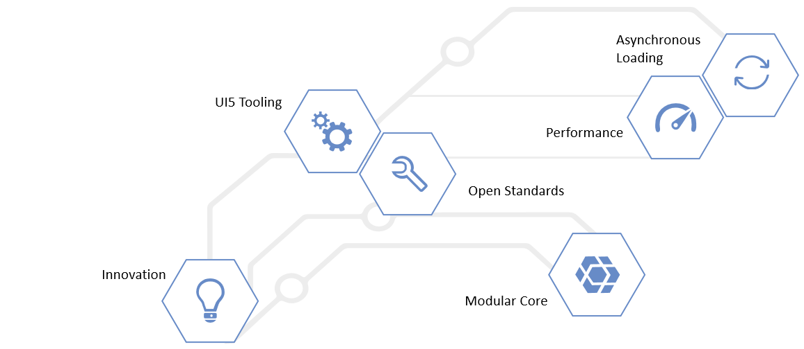

<!-- loiobf2d55eaa33b44a78ef95e7946d658e8 -->

# Enterprise Features of OpenUI5

OpenUI5 offers many powerful enterprise features to support your entire app development project.

The individual capabilities of OpenUI5 help you to easily build enterprise apps. Here are some of the most important value adds that OpenUI5 delivers:

-   **Consistent UX**: OpenUI5 enables the SAP Fiori design evolution towards a consistent user experience across all your solutions \(and beyond\).

-   **Use anywhere**: OpenUI5 allows a single, responsive app implementation for all browsers, platforms, and devices.

-   **Hundreds of enterprise UI elements**: OpenUI5 offers a rich set of UI elements to build professional user interfaces for an enterprise context while complying to product standards such as globalization/internationalization and accessibility.

-   **Easy to integrate**: OpenUI5 lets you run large numbers of highly-consistent apps that can be integrated to complex business processes.

-   **Flexible tools for any developer**: OpenUI5 supports a number of development environments and tools to efficiently build, test, and deploy apps.

-   **Benefit from innovations**: OpenUI5 brings a clear lifecycle separation of application and framework code to centrally innovate while being upgrade-compatible.

<a name="loiobf2d55eaa33b44a78ef95e7946d658e8__section_rbj_jfg_cgb"/>

## Key Concepts

Hover over the shapes to find out more about some key benefits of OpenUI5.

