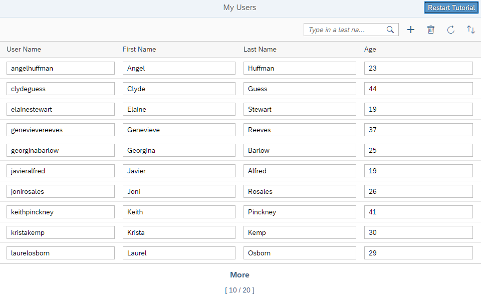

<!-- loiobcdbde6911bd4fc68fd435cf8e306ed0 -->

# OData V4 Tutorial

In this tutorial, we explore how features of OData V4 can be used in OpenUI5. We write a small app that consumes data from an OData V4 service to understand how to access, modify, aggregate, and filter data in an OData V4 model.

OData is a standard protocol for creating and consuming data by using simple HTTP and REST APIs for create, read, update, delete \(CRUD\) operations.

We start with an initial app that simply retrieves data from an OData V4 service and displays it as a plain list.

<a name="loiobcdbde6911bd4fc68fd435cf8e306ed0__section_dsn_cwc_z1b"/>

## Preview

> ### Tip:  
> You don't have to do all tutorial steps sequentially, you can jump directly to any step you want. In each step, download the code from the previous step, copy it to your workspace, and make sure that the application runs by calling the `webapp/index.html` file.
> 
> You can view and download the samples for all steps in the Demo Kit at [OData V4](https://ui5.sap.com/#/entity/sap.ui.core.tutorial.odatav4). Depending on your development environment you might have to adjust resource paths and configuration entries.
> 
> For more information check the [Downloading Code for a Tutorial Step](get-started-setup-tutorials-and-demo-apps-8b49fc1.md#loio8b49fc198bf04b2d9800fc37fecbb218__tutorials_download) section of the tutorials overview page [Get Started: Setup, Tutorials, and Demo Apps](get-started-setup-tutorials-and-demo-apps-8b49fc1.md).

**Related Information**  

[OData Standard Protocol](http://www.odata.org/documentation/)

[OData V4 Model](../04_Essentials/odata-v4-model-5de13cf.md "The sap.ui.model.odata.v4.ODataModel is the model implementation for consuming an OData V4 service.")

[*Basic Tutorial* on the *OData* Home Page](http://www.odata.org/getting-started/basic-tutorial/)

