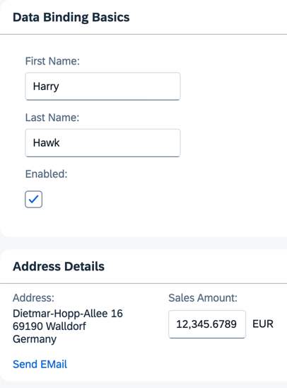

<!-- loio9252ee4015f24fc49c71c295394d1b8d -->

# Step 10: Property Formatting Using Data Types

OpenUI5 offers a set of simple data types, including `Boolean`, `Currency`, `Date` and `Float`. You can apply these data types to controls to ensure that the value displayed on the screen is formatted correctly. If the field is open for input, this also ensures that the user input meets the requirements of that data type. Let's add a new field called *Sales Amount* of type `Currency`.


## Preview

  
  
**An input field for a currency amount is added to the second panel**




## Coding

You can view and download all files in the Demo Kit at [Data Binding - Step 10](https://ui5.sap.com/#/entity/sap.ui.core.tutorial.databinding/sample/sap.ui.core.tutorial.databinding.10).

1.  Add two new JSON model properties, `salesAmount` and `currencyCode`, to the `data.json` file.

    **webapp/model/data.json**

    ```
    {
    	"firstName": "Harry",
    	"lastName": "Hawk",
    	"enabled": true,
    	"address": {
    		"street": "Dietmar-Hopp-Allee 16",
    		"city": "Walldorf",
    		"zip": "69190",
    		"country": "Germany"
    	},
    	"salesAmount": 12345.6789,
    	"currencyCode": "EUR"
    }
    ```

2.  Add the highlighted XML code to the `App.view.xml` file.

    **webapp/view/App.view.xml**

    ```xml
    <mvc:View
    	controllerName="ui5.databinding.controller.App"
    	xmlns="sap.m"
    	xmlns:core="sap.ui.core"
    	xmlns:form="sap.ui.layout.form"
    	xmlns:l="sap.ui.layout"
    	xmlns:mvc="sap.ui.core.mvc"
    	core:require="{Currency: 'sap/ui/model/type/Currency'}">
    	<Panel headerText="{i18n>panel1HeaderText}" class="sapUiResponsiveMargin" width="auto">
    		<form:SimpleForm editable="true" layout="ColumnLayout">
    			<Label text="{i18n>firstName}"/>
    			<Input value="{/firstName}" valueLiveUpdate="true" width="200px" enabled="{/enabled}"/>
    			<Label text="{i18n>lastName}"/>
    			<Input value="{/lastName}" valueLiveUpdate="true" width="200px" enabled="{/enabled}"/>
    			<Label text="{i18n>enabled}"/>
    			<CheckBox selected="{/enabled}"/>
    		</form:SimpleForm>
    	</Panel>
    	<Panel headerText="{i18n>panel2HeaderText}" class="sapUiResponsiveMargin" width="auto">
    		<content>
    			<l:HorizontalLayout>
    				<l:VerticalLayout>
    					<Label labelFor="address" text="{i18n>address}:"/>
    					<FormattedText class="sapUiSmallMarginBottom"
    						htmlText="{/address/street}&lt;br&gt;{/address/zip} {/address/city}&lt;br&gt;{/address/country}"
    						id="address" width="200px"/>
    					<Link href="{
    							parts: [
    								'/firstName',
    								'/lastName'
    							],
    							formatter: '.formatMail'
    						}"
    						text="{i18n>sendEmail}"/>
    				</l:VerticalLayout>
    				<l:VerticalLayout>
    					<Label labelFor="salesAmount" text="{i18n>salesAmount}:"/>
    					<Input description="{/currencyCode}" enabled="{/enabled}" id="salesAmount"
    						value="{
    							parts: [
    								{path: '/salesAmount'},
    								{path: '/currencyCode'}
    							],
    							type: 'Currency',
    							formatOptions: {showMeasure: false}
    						}" width="200px"/>
    				</l:VerticalLayout>
    			</l:HorizontalLayout>
    		</content>
    	</Panel>
    </mvc:View>
    ```

    We've created a new pair of `Label` and `Input` elements for the `salesAmount` model property. The description property of the `Input` element is bound to the `currencyCode` model property. The value property of the `Input` element is bound to the model properties `salesAmount` and `currencyCode`. The `{showMeasure: false}` parameter switches off the display of the currency symbol within the input field itself. This isn't necessary because the currency symbol is displayed using the `Input` element's description property.

3.  Add the highlighted texts to the `properties` files. Remember, you need to enter special characters \(non-Latin-1\) using Unicode escape characters.

    **webapp/i18n/i18n.properties**

    ```ini
    # Field labels
    firstName=Vorname
    lastName=Nachname
    enabled=Enabled
    address=Address
    salesAmount=Sales Amount
    ...
    ```

    **webapp/i18n/i18n\_de.properties**

    ```ini
    # Field labels
    firstName=Vorname
    lastName=Nachname
    enabled=Aktiviert
    address=Adresse
    salesAmount=Verk\u00e4ufe bis zum heutigen Datum
    ...
    ```


**Related Information**  


[Formatting, Parsing, and Validating Data](../04_Essentials/formatting-parsing-and-validating-data-07e4b92.md "Data that is presented on the UI often has to be converted so that is human readable and fits to the locale of the user. On the other hand, data entered by the user has to be parsed and validated to be understood by the data source. For this purpose, you use formatters and data types.")

