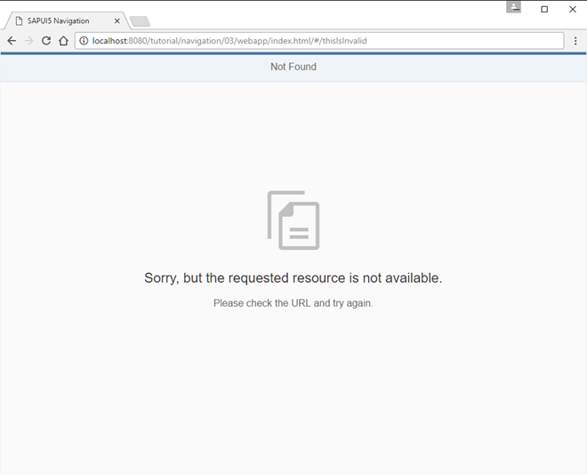
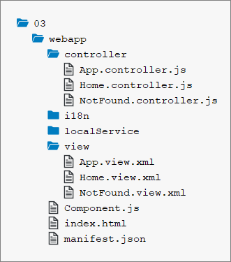

<!-- loioe047e0596e8a4a1db50f4a53c11f4276 -->

# Step 3: Catch Invalid Hashes

Sometimes it is important to display an indication that the requested resource was not found. To give you an example: If a user tries to access an invalid pattern which does not match any of the configured routes, the user is notified that something went wrong. You might also know this as a "404" or *Not Found Page* from traditional web pages. In this step, we will implement a feature that detects invalid hashes and visualizes this in a nice way.


## Preview

  
  
**Not Found page**




## Coding

You can view and download all files in the *Samples* in the Demo Kit at [Routing and Navigation - Step 3](https://ui5.sap.com/#/entity/sap.ui.core.tutorial.navigation/sample/sap.ui.core.tutorial.navigation.03).

  
  
**Folder structure for this step**




## webapp/manifest.json

```js
{
   ...
   "sap.ui5": {
      ...
      "routing": {
         "config": {
            "routerClass": "sap.m.routing.Router",
            "type": "View",
            "viewType": "XML",
            "path": "sap.ui.demo.nav.view",
            "controlId": "app",
            "controlAggregation": "pages",
            "transition": "slide",
            "bypassed": {
               "target": "notFound"
            },
            "async": true
         },
         "routes": [{
            "pattern": "",
            "name": "appHome",
            "target": "home"
         }],
         "targets": {
            "home": {
               "id": "home",
               "name": "Home",
               "level" : 1
            },
            "notFound": {
               "id": "notFound",
               "name": "NotFound",
               "transition": "show"
            }
         }
      }
   }
}
```

Let's extend the routing configuration in the descriptor by adding a `bypassed` property and setting its `target` to `notFound`. This configuration tells the router to display the `notFound` target in case no route was matched to the current hash. Next, we add a `notFound` target to the `bypassed` section. The `notFound` target simply configures a `notFound` view with a `show` transition.


## webapp/view/NotFound.view.xml \(New\)

```xml
<mvc:View
   controllerName="sap.ui.demo.nav.controller.NotFound"
   xmlns="sap.m"
   xmlns:mvc="sap.ui.core.mvc">
   <MessagePage
      title="{i18n>NotFound}"
      text="{i18n>NotFound.text}"
      description="{i18n>NotFound.description}"/>
</mvc:View>
```

Now we create the view referenced above in a new file `NotFound.view.xml` in the `webapp/view folder`. It uses a `sap.m.MessagePage` control to display an error message to the user. In a real app you might use a dynamic message matching the current error situation. Here, we simply display a preconfigured text from our resource bundle.


## webapp/controller/NotFound.controller.js \(New\)

```js
sap.ui.define([
   "sap/ui/core/mvc/Controller"
], function (Controller) {
   "use strict";
   return Controller.extend("sap.ui.demo.nav.controller.NotFound", {
      onInit: function () {
      }
   });
});
```

Now we create the controller for the `NotFound` view and save it into the `webapp/controller` folder. This controller will be extended later.


## webapp/i18n/i18n.properties

```js
...
NotFound=Not Found
NotFound.text=Sorry, but the requested resource is not available.
NotFound.description=Please check the URL and try again.
```

Add the new properties to the `i18n.properties` file.

Open the URL `index.html#/thisIsInvalid` in your browser. From now on the user will see a nice *Not Found* page if a hash could not be matched to one of our routes.


## Conventions

-   Always configure the `bypassed` property and a corresponding target

-   Use the `sap.m.MessagePage` control to display routing related error messages


**Related Information**  


[API Reference: `sap.m.MessagePage`](https://ui5.sap.com/#/api/sap.m.MessagePage)

[API Overview and Samples: `sap.m.MessagePage` ](https://ui5.sap.com/#/entity/sap.m.MessagePage)

