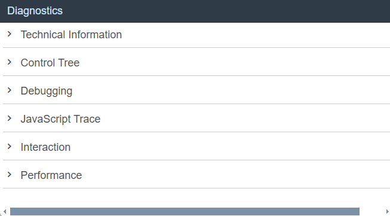

<!-- loio04b75eae78ef4bae9b40cd7540ae8bdc -->

# Step 4: Diagnostics Window

In this tutorial step, we have a closer look at the Diagnostics window. It offers a wealth of information including comprehensive technical information, a control tree, and debugging features.

<a name="loio04b75eae78ef4bae9b40cd7540ae8bdc__section_gt2_djf_c1b"/>

## Preview

<a name="loio04b75eae78ef4bae9b40cd7540ae8bdc__section_r2s_vkf_c1b"/>

## Opening the Example App and the Diagnostics Window

1.  Download the example app with errors from the Demo Kitat [Troubleshooting](https://ui5.sap.com/#/entity/sap.ui.core.tutorial.troubleshooting/sample/sap.ui.core.tutorial.troubleshooting.01) and run the app.

2.  Open the *Diagnostics* window by pressing [Ctrl\] + [Shift\] + [Alt\] + [S\] .

<a name="loio04b75eae78ef4bae9b40cd7540ae8bdc__section_p3z_kmf_c1b"/>

## Improving App Performance

Let's say that you are facing a performance issue in your app, so let's check some performance-relevant settings in the *Diagnostics* window:

1.  Expand the *Technical Information* section and scroll down to view the loaded libraries.

2.  If you spot any libraries that you originally defined, but you don't actually use, remove them from the `manifest.json` file in your development environment to prevent them from loading. In this case, you can see that the example app loads the `sap.ui.layout` library, even though the `layout` control is not used.

<a name="loio04b75eae78ef4bae9b40cd7540ae8bdc__section_xgg_qnf_c1b"/>

## Simulating UI Changes

The app contains a *Do Something* button and you want to make the button bigger. The control tree allows you to test which width is the best.

1.  Expand the *Control Tree* section. Make sure that you display both the app and the *Diagnostics* windows side-by-side or on different monitors. Otherwise the diagnostics window will go to the background.

2.  Press and hold the [Ctrl\] + [Shift\] + [Alt\]  keys and click the *Do Something* button in the app. You see the button blinking green.

3.  In the control tree of the *Diagnostics* window, the button is selected and you can see its properties on the right.

4.  Change the value of the `width` property to `100%` and confirm with [Enter\].

    The button width is automatically increased.

5.  The changes that you make in the *Diagnostics* window are only temporary. To make your change permanent, you have to change the app code.

<a name="loio04b75eae78ef4bae9b40cd7540ae8bdc__section_ftz_34f_c1b"/>

## Trying Different Framework Versions

If you find a bug in your application, you can easily check whether it has already been fixed in a newer framework version:

1.  Expand the *Technical Information* section and check the loaded version.

2.  Expand the *Debugging* section.

3.  Choose *Other* from the *Boot application with different UI5 version on next reload* dropdown list.

4.  Enter a custom URL, for example `https://sdk.openui5.org/nightly/resources/sap-ui-core.js`.

5.  Choose *Activate Reboot URL*, confirm the dialog box, and reload the app.

6.  Reopen the *Diagnostics* window and expand the *Technical Information* section. The loaded OpenUI5 version is now changed.

<a name="loio04b75eae78ef4bae9b40cd7540ae8bdc__section_fcy_kpf_c1b"/>

## More Features

More features are waiting for you to discover in the *Diagnostics* window. For more information, see [Diagnostics](../04_Essentials/diagnostics-6ec18e8.md#loio6ec18e80b0ce47f290bc2645b0cc86e6).

