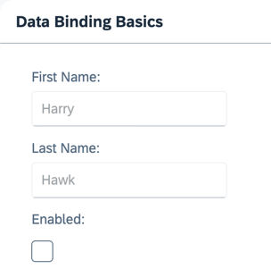

<!-- loioc72b922fdb59422496661000165d7ff1 -->

# Step 4: Two-Way Data Binding

In the examples we've looked at so far, we've displayed the value of a model property using a read-only field. We'll now change the user interface to display first and last name fields using `sap.m.Input` fields. We're also adding a check box control to enable or disable both input fields. This setup illustrates a feature known as "two-way data binding". As the view now contains more controls, we're also moving the view definition into an XML file.


## Preview

  
  
**Two input fields and a checkbox to enable or disable them**


## Coding

You can view and download all files in the Demo Kit at [Data Binding - Step 4](https://ui5.sap.com/#/entity/sap.ui.core.tutorial.databinding/sample/sap.ui.core.tutorial.databinding.04).

1.  Replace the content of the `App.view.xml file` with the following content:

    **webapp/view/App.view.xml**

    ```xml
    <mvc:View
    	xmlns="sap.m"
    	xmlns:form="sap.ui.layout.form"
    	xmlns:mvc="sap.ui.core.mvc">
    	<Panel headerText="{/panelHeaderText}" class="sapUiResponsiveMargin" width="auto">
    		<form:SimpleForm editable="true" layout="ColumnLayout">
    			<Label text="First Name"/>
    			<Input value="{/firstName}" valueLiveUpdate="true" width="200px" enabled="{/enabled}"/>
    			<Label text="Last Name"/>
    			<Input value="{/lastName}" valueLiveUpdate="true" width="200px" enabled="{/enabled}"/>
    			<Label text="Enabled"/>
    			<CheckBox selected="{/enabled}"/>
    		</form:SimpleForm>
    	</Panel>
    </mvc:View>
    ```

2.  Replace the content of the `data.json` file in the `model` folder with the following content:

    **webapp/model/data.json**

    ```
    {
    	"firstName" : "Harry",
    	"lastName" : "Hawk",
    	"enabled" : true,
    	"panelHeaderText" : "Data Binding Basics"
    }
    ```

    After these changes, refresh the application preview and select or deselect the checkbox. You'll notice that the input fields are automatically enabled or disabled in response to the state of the checkbox.

    

    It is clear that we haven't written any code to transfer data between the user interface and the model, yet the `Input` controls are enabled or disabled according to the state of the checkbox. This behavior results from the fact that OData models and JSON models implement two-way data binding. For JSON models, two-way binding is the default behavior. For more information, see [Binding Modes](../04_Essentials/data-binding-68b9644.md#loio68b9644a253741e8a4b9e4279a35c247__section_BindingModes).

    Two things are happening here:

    -   Data binding allows the property of a control to derive its value from any suitable property in a model.

    -   OpenUI5 automatically handles the transport of data from the model to the controls and back from the controls to the model. This is called two-way binding.


**Related Information**  


[Data Binding](../04_Essentials/data-binding-68b9644.md "You use data binding to bind UI elements to data sources to keep the data in sync and allow data editing on the UI.")

