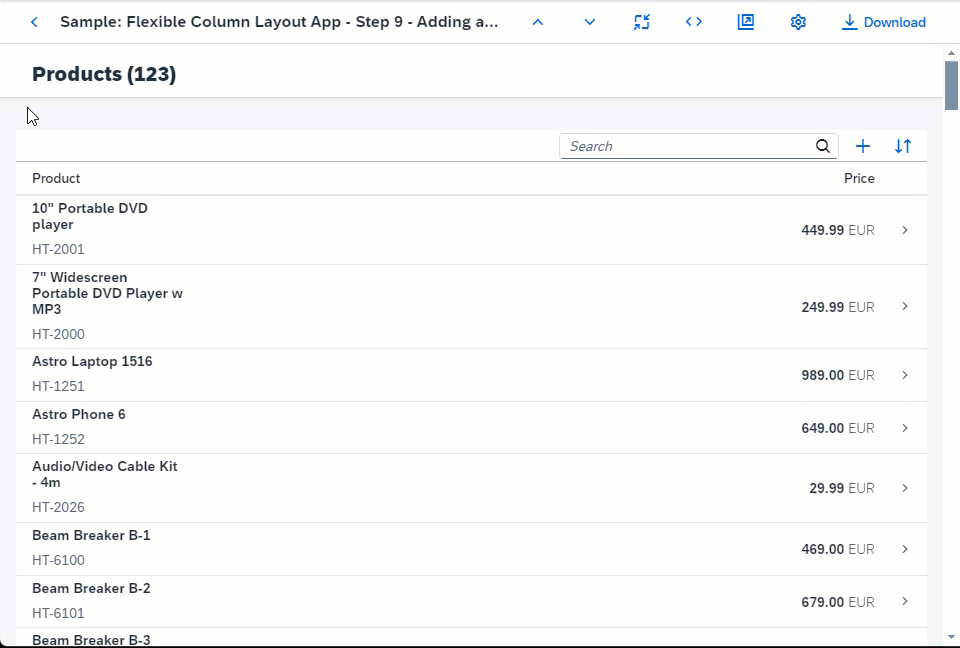

<!-- loioe4d21fd03edb49da82cbaab9dbd274e8 -->

# Step 9: Adding a Detail-Detail Page

In this step, we create a detail-detail page using `sap.f.DynamicPage`, which is opened by choosing a supplier from the detail page.


<a name="loioe4d21fd03edb49da82cbaab9dbd274e8__section_yfh_d31_12b"/>

## Preview

  
  
**Detail-detail page displaying the name of the selected supplier**




<a name="loioe4d21fd03edb49da82cbaab9dbd274e8__section_fd2_4dd_lbb"/>

## Coding

You can view and download all files at [Flexible Column Layout App - Step 9](https://ui5.sap.com/#/sample/sap.f.tutorial.fcl.09/preview).


<a name="loioe4d21fd03edb49da82cbaab9dbd274e8__section_i1z_w4j_l4b"/>

## webapp/view/DetailDetail.view.xml \[NEW\]

```xml
<mvc:View
	controllerName="sap.ui.demo.fcl.controller.DetailDetail"
	xmlns="sap.f"
	xmlns:m="sap.m"
	xmlns:mvc="sap.ui.core.mvc">
	<DynamicPage toggleHeaderOnTitleClick="false">
		<title>
			<DynamicPageTitle>
				<heading>
					<m:FlexBox wrap="Wrap" fitContainer="true" alignItems="Center">
						<m:Title text="{products>text}" wrapping="true" class="sapUiTinyMarginEnd"/>
					</m:FlexBox>
				</heading>
			</DynamicPageTitle>
		</title>
	</DynamicPage>
</mvc:View>
```

We create a detail-detail page view using `sap.f.DynamicPage` with only a title.


<a name="loioe4d21fd03edb49da82cbaab9dbd274e8__section_ocd_w4j_l4b"/>

## webapp/controller/DetailDetail.controller.js \[NEW\]

```js
sap.ui.define([
	"sap/ui/core/mvc/Controller"
], function (Controller) {
	"use strict";

	return Controller.extend("sap.ui.demo.fcl.controller.DetailDetail", {
		onInit: function () {
			var oOwnerComponent = this.getOwnerComponent();

			this.oRouter = oOwnerComponent.getRouter();
			this.oModel = oOwnerComponent.getModel();

			this.oRouter.getRoute("detailDetail").attachPatternMatched(this._onPatternMatch, this);
		},

		_onPatternMatch: function (oEvent) {
			this._supplier = oEvent.getParameter("arguments").supplier || this._supplier || "0";
			this._product = oEvent.getParameter("arguments").product || this._product || "0";

			this.getView().bindElement({
				path: "/ProductCollectionStats/Filters/1/values/" + this._supplier,
				model: "products"
			});
		},

		onExit: function () {
			this.oRouter.getRoute("detailDetail").detachPatternMatched(this._onPatternMatch, this);
		}
	});
});

```

We create the detail-detail page controller.


<a name="loioe4d21fd03edb49da82cbaab9dbd274e8__section_ubh_v4j_l4b"/>

## webapp/manifest.json \[MODIFY\]

```json
			...
			"routes": [
				{
					"pattern": ":layout:",
					"name": "list",
					"target": [
						"list",
						"detail"
					]
				},
				{
					"pattern": "detail/{product}/{layout}",
					"name": "detail",
					"target": [
						"list",
						"detail"
					]
				},
				{
					"pattern": "detail/{product}/detailDetail/{supplier}/{layout}",
					"name": "detailDetail",
					"target": [
						"list",
						"detail",
						"detailDetail"
					]
				}
			],
			"targets": {
				"list": {
					"name": "List",
					"controlAggregation": "beginColumnPages"
				},
				"detail": {
					"name": "Detail",
					"controlAggregation": "midColumnPages"
				},
				"detailDetail": {
					"name": "DetailDetail",
					"controlAggregation": "endColumnPages"
				}
			}
		}
	}
}
```

We add the detail-detail page to our existing routes in the `manifest.json`.


<a name="loioe4d21fd03edb49da82cbaab9dbd274e8__section_k5k_54j_l4b"/>

## webapp/view/Detail.view.xml \[MODIFY\]

```xml
			...
			<ObjectPageSection title="Suppliers">
				<subSections>
					<ObjectPageSubSection>
						<blocks>
							<m:Table
								id="suppliersTable"
								items="{path : 'products>/ProductCollectionStats/Filters/1/values'}">
								<m:columns>
									<m:Column/>
								</m:columns>
								<m:items>
									<m:ColumnListItem type="Navigation" press=".onSupplierPress">
										<m:cells>
											<m:ObjectIdentifier text="{products>text}"/>
										</m:cells>
									</m:ColumnListItem>
								</m:items>
							</m:Table>
						</blocks>
					</ObjectPageSubSection>
				</subSections>
			</ObjectPageSection>
		</sections>
		...
```

We add a `press` event handler for each item in the *SUPPLIERS* table in the detail page.


<a name="loioe4d21fd03edb49da82cbaab9dbd274e8__section_iyl_t4j_l4b"/>

## webapp/controller/Detail.controller.js \[MODIFY\]

```js
sap.ui.define([
	"sap/ui/core/mvc/Controller",
	'sap/f/library'
], function (Controller, fioriLibrary) {
	"use strict";

	return Controller.extend("sap.ui.demo.fcl.controller.Detail", {
		onInit: function () {
			var oOwnerComponent = this.getOwnerComponent();

			this.oRouter = oOwnerComponent.getRouter();
			this.oModel = oOwnerComponent.getModel();

			this.oRouter.getRoute("list").attachPatternMatched(this._onProductMatched, this);
			this.oRouter.getRoute("detail").attachPatternMatched(this._onProductMatched, this);
			this.oRouter.getRoute("detailDetail").attachPatternMatched(this._onProductMatched, this);
		},

		onSupplierPress: function (oEvent) {
			var supplierPath = oEvent.getSource().getBindingContext("products").getPath(),
				supplier = supplierPath.split("/").slice(-1).pop();

			this.oRouter.navTo("detailDetail", {layout: fioriLibrary.LayoutType.ThreeColumnsMidExpanded, supplier: supplier, product: this._product});
		},

		_onProductMatched: function (oEvent) {
		...
```

We add an `onSupplierPress` function in the detail page controller in order to pass the data for the selected supplier and navigate to the detail-detail page.


<a name="loioe4d21fd03edb49da82cbaab9dbd274e8__section_lnq_q4j_l4b"/>

## webapp/controller/App.controller.js \[MODIFY\]

```js
		...
		onRouteMatched: function (oEvent) {
			var sRouteName = oEvent.getParameter("name"),
				oArguments = oEvent.getParameter("arguments");

			// Save the current route name
			this.currentRouteName = sRouteName;
			this.currentProduct = oArguments.product;
			this.currentSupplier = oArguments.supplier;
		},

		onStateChanged: function (oEvent) {
			var bIsNavigationArrow = oEvent.getParameter("isNavigationArrow"),
				sLayout = oEvent.getParameter("layout");

			// Replace the URL with the new layout if a navigation arrow was used
			if (bIsNavigationArrow) {
				this.oRouter.navTo(this.currentRouteName, {layout: sLayout, product: this.currentProduct, supplier: this.currentSupplier}, true);
			}
		},

		onExit: function () {
			this.oRouter.detachRouteMatched(this.onRouteMatched, this);
		}
	});
});
```

Finally, we pass data for the supplier in the detail-detail page.

