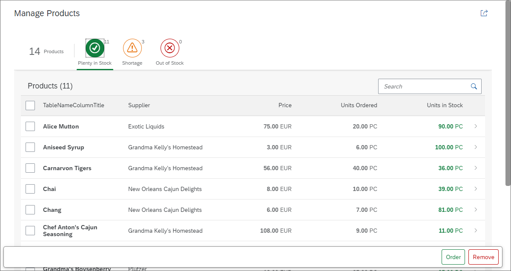

<!-- loio6a6a621c978145ad9eef2b221d2cf21d -->

## Worklist App Tutorial

In this tutorial we will build an app using OpenUI5 that, for example, a shop owner can use to manage his product stock levels.

The app provides the following features:

-   Overview of all products

-   Track products with shortages or products that are completely out of stock

-   Reorder products that are low in stock

-   View product details and add comments

We will use the worklist template as a starting point for this tutorial and add additional features to the app as we go through the steps. The template implements a typical "Worklist" floorplan, one of the patterns that are specified by the SAP Fiori design guidelines, but you can also use it as a starting point for easily creating any kind of list-based apps. For more information about worklist floorplans, see the *Related Information* section at the bottom of this topic.

### Preview

  
  
**Start page of the app with list of products and actions**

  
  
**Product detail page of the app**

> ### Tip:  
> You don't have to do all tutorial steps sequentially, you can also jump directly to any step you want. Just download the code from the previous step, and start there.
> 
> You can view and download the files for all steps in the Demo Kit at [Worklist App](https://ui5.sap.com/#/entity/sap.m.tutorial.worklist). Copy the code to your workspace and make sure that the application runs by calling the `webapp/index.html` file. Depending on your development environment you might have to adjust resource paths and configuration entries.
> 
> For more information check the [Downloading Code for a Tutorial Step](get-started-setup-tutorials-and-demo-apps-8b49fc1.md#loio8b49fc198bf04b2d9800fc37fecbb218__tutorials_download) section of the tutorials overview page [Get Started: Setup, Tutorials, and Demo Apps](get-started-setup-tutorials-and-demo-apps-8b49fc1.md).

**Related Information**  

[SAP Fiori design guidelines: Worklist Floorplans](https://experience.sap.com/fiori-design/floorplans/work-list/)

