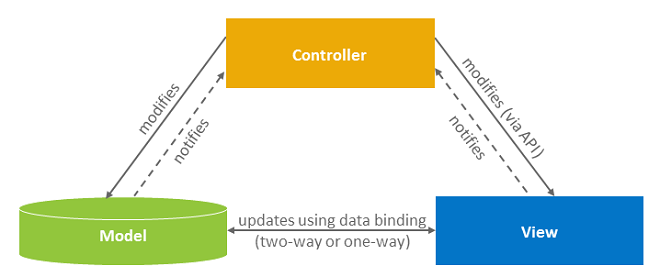

<!-- loio91f233476f4d1014b6dd926db0e91070 -->

## Model View Controller \(MVC\)

The Model View Controller \(MVC\) concept is used in OpenUI5 to separate the representation of information from the user interaction. This separation facilitates development and the changing of parts independently.

Model, view, and controller are assigned the following roles:

-   The **view** is responsible for defining and rendering the UI.
-   The **model** manages the application data.
-   The **controller** reacts to view events and user interaction by modifying the view and model.

The purpose of data binding in the UI is to separate the definition of the user interface \(view\), the data visualized by the application \(model\), and the code for the business logic for processing the data \(controller\). The separation has the following advantages: It provides better readability, maintainability, and extensibility and it allows you to change the view without touching the underlying business logic and to define several views of the same data.

Views and controllers often form a 1:1 relationship, but it is also possible to have controllers without a UI, these controllers are called application controllers. It is also possible to create views without controllers. From a technical position, a view is a OpenUI5 control and can have or inherit a OpenUI5 model.

View and controller represent reusable units, and distributed development is highly supported.

