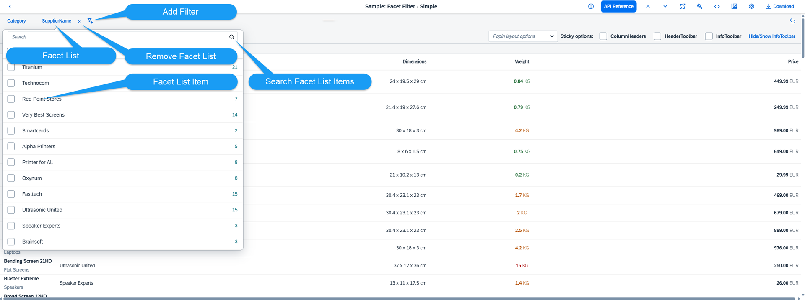

<!-- loioc6c38217a4a64001a22ad76cdfa97fae -->

# Facet Filter

Facet filters \(`sap.m.FacetFilter`\) support users in finding the information they need from potentially very large data sets.

With the facet filter, users can explore a data collection by applying multiple filters along certain discrete attributes or facets of the overall data collection.

The following figure shows the structure of the facet filter in default 'Simple' type.

The facet filter supports the following two types that can be configured using the control's `type` property:

-   Simple type

    With the Simple type facet filter you can offer multiple filters \('facets'\) to assist the user in narrowing down the data in, say, a table. With this default 'Simple' type, each filter is displayed in a row for selectionThe simple type is the default type and available for desktop and tablets.

-   Light type

    It is for small displays where only a selectable summary bar is shown, and a dialog is shown for setting the facet values. The "Light" type is automatically enabled on smartphone-sized devices, but is also available for desktop and tablets.

In addition, you can define Custom type facet filters by setting custom filtering criteria. For example, Custom type can be applied instead of the default filtering criteria of the control when searching in the FacetFilterList.

***

## Example

Your application displays a large list of products that can be grouped by category and supplier. With the facet filter, you allow users to dynamically filter the list so that it displays products from the categories and suppliers they want to see. In the following figure, the `FacetFilter` control is outlined in red and will be referred to as the 'toolbar' for the user. In this example the user has set the following filters, using the Simple type facet filter:

-   Category: Printers

-   SupplierName \(Alpha Printers\)

-   **[Facet Filter: Simple Type](facet-filter-simple-type-1586c19.md "The simple type of the FacetFilter control is only available for
		desktop and tablets.")**  
The simple type of the `FacetFilter` control is only available for desktop and tablets.
-   **[Facet Filter: Light Type](facet-filter-light-type-bb2aca0.md "The light type of the FacetFilter control is automatically enabled on
		smart phone devices and is also available for desktop and tablets.")**  
The light type of the `FacetFilter` control is automatically enabled on smart phone devices and is also available for desktop and tablets.
-   **[Facet Filter List and Facet Filter Item](facet-filter-list-and-facet-filter-item-395392f.md "The sap.m.FacetFilter control uses the FacetFilterList
		and the FacetFilterItem controls to model facets and their associated
		filters.")**  
The `sap.m.FacetFilter` control uses the `FacetFilterList` and the `FacetFilterItem` controls to model facets and their associated filters.
-   **[Events for Facet Filters](events-for-facet-filters-05c0ffc.md "Facet filters support several events, such as reset and list open.")**  
Facet filters support several events, such as reset and list open.
-   **[Data Binding for Facet Filters](data-binding-for-facet-filters-e17beca.md "FacetFilter fully supports the OpenUI5 data binding concept.")**  
`FacetFilter` fully supports the OpenUI5 data binding concept.
-   **[Filter Search](filter-search-559f60e.md "The popover and dialog displayed by FacetFilter contain an
			sap.m.SearchField control. This enables the user to search for specific
		items in the list.")**  
The popover and dialog displayed by `FacetFilter` contain an `sap.m.SearchField` control. This enables the user to search for specific items in the list.
-   **[Facet Filter Selection](facet-filter-selection-ef860fc.md "The FacetFilterList.getSelectedItems() method returns a copy of each
        selected facet filter item. You use the method to get the selected filter items when
        filtering the target data set. Therefore, you should not attempt to modify any of the item's
        properties.")**  
The `FacetFilterList.getSelectedItems()` method returns a copy of each selected facet filter item. You use the method to get the selected filter items when filtering the target data set. Therefore, you should not attempt to modify any of the item's properties.
-   **[Dependent Facets](dependent-facets-e702774.md "Applications can have dependencies between facets where selection of filter items in one
        facet list limits the list of valid filters in another facet list.")**  
Applications can have dependencies between facets where selection of filter items in one facet list limits the list of valid filters in another facet list.

