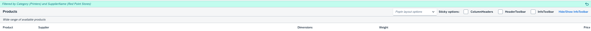
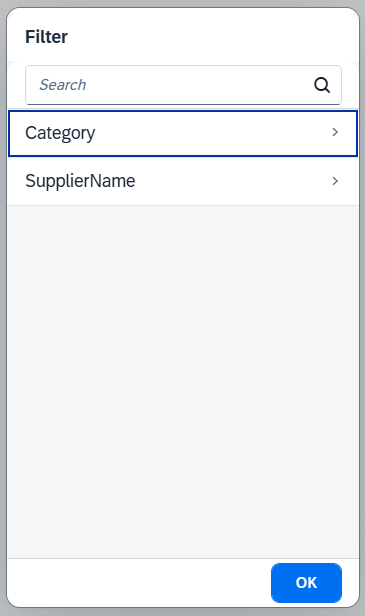
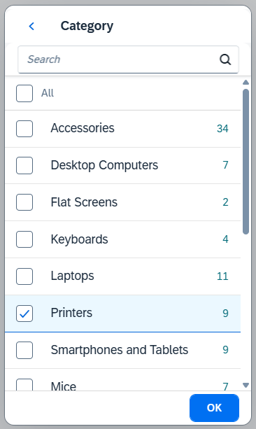

<!-- loiobb2aca0957534dba8f0b4cfe689c30c9 -->

## Facet Filter: Light Type

The light type of the `FacetFilter` control is automatically enabled on smart phone devices and is also available for desktop and tablets.

The active facets and selected filter items are displayed in the summary bar.

When the user selects the summary bar, a navigable dialog list of all facets is displayed. When the user selects a facet, the dialog scrolls to show the list of filters that are available for the selected facet.

By selecting any of its associated filters in the dialog, the user can add a facet to the summary bar.

