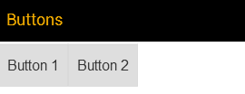
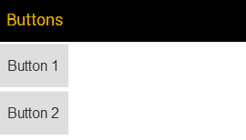
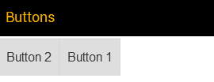

<!-- loio988d2c7652684dea98f9d6dbc94000c0 -->

## Getting Started With FlexBox

For a flexible box layout, create a `FlexBox` control and add any kind of controls to it.

You can either use the `addItem` method \(see option 1\), or the `items` aggregation of a configuration object \(see option 2\).

Option 1

```js

// FlexBox required from "sap/m/FlexBox"
// Button required from "sap/m/Button"

var oMyFlexbox = new FlexBox();
oMyFlexbox.addItem(new Button({text: "Button 1"}));
oMyFlexbox.addItem(new Button({text: "Button 2"}));
```

Option 2

```js

// FlexBox required from "sap/m/FlexBox"
// Button required from "sap/m/Button"

var oMyFlexbox = new FlexBox({
    items: [
        new Button({text: "Button 1"}),
        new Button({text: "Button 2"})
    ]
});
```

The following figure gives an example how the result looks like if used inside a mobile app page. The necessary code is not shown here.




<a name="loio988d2c7652684dea98f9d6dbc94000c0__section_N1003F_N10011_N10001"/>

### Layout properties

Some properties that affect the layout need to be set in the `FlexBox` control. Other properties can be attached to the controls which are placed inside the `FlexBox` by means of the `layoutData` aggregation. The layout direction, for example is set in the `FlexBox` as follows:

```js

// FlexBox required from "sap/m/FlexBox"
// Button required from "sap/m/Button"

var oMyFlexbox = new FlexBox({
    items: [
        new Button({text: "Button 1"}),
        new Button({text: "Button 2"})
    ],
    direction: "Column"
});
```



The order is attached to the button inside a `FlexItemData` object as follows:

```js

// FlexBox required from "sap/m/FlexBox"
// Button required from "sap/m/Button"
// FlexItemData required from "sap/m/FlexItemData"

var oMyFlexbox = new FlexBox({
    items: [
        new Button({
            text: "Button 1",
            layoutData: new FlexItemData({order: 2})
        }),
        new sap.m.Button({text: "Button 2"})
    ]
});
```



> ### Note:  
> The `FlexBox` control is a wrapper for the flexible box layout properties in CSS. The control renderer sets the CSS properties \(including prefixed versions where necessary\) on the appropriate HTML elements. The actual layouting is done by the browser.

The controls that you place in the `FlexBox` control are each wrapped in a `DIV` or `LI` element, depending on the `renderType` property. All elements are placed inside another `DIV` or `UL` container, again depending on the `renderType`. If you use `Bare` as `renderType`, elements will be rendered without a wrapping HTML tag. The outermost element represents the so-called *flex container* while its child elements are *flex items*. The HTML structure resulting from all of the examples above looks as follows:

```html

<div class="sapMFlexBox">

       <div class="sapMFlexItem">

              <button id="__button1">Button 1</button>

       </div>

       <div class="sapMFlexItem">
              
              <button id="__button2">Button 2</button>

       </div>
</div>
```

> ### Note:  
> The `layoutData` properties that you can attach to a control are applied to its wrapper element with *sapMFlexItem* class. This is because browsers currently only support these properties on some elements, for example `DIV`.

The two additional controls `HBox` and `VBox` are `FlexBoxes` that are fixed to horizontally or vertically layout their children.

