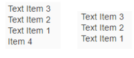

| loio |
| -----|
| 2abc8ffc18b34c6b991165fc017b87a9 |

<div id="loio">

view on: [help.sap.com](https://help.sap.com/viewer/DRAFT/3237636b137e43519a20ad5513c49ccb/latest/en-US/2abc8ffc18b34c6b991165fc017b87a9.html) | [demo kit nightly build](https://openui5nightly.hana.ondemand.com/#/topic/2abc8ffc18b34c6b991165fc017b87a9) | [demo kit latest release](https://openui5.hana.ondemand.com/#/topic/2abc8ffc18b34c6b991165fc017b87a9)</div>
<!-- loio2abc8ffc18b34c6b991165fc017b87a9 -->

## Aggregations

This sections shows you a use case for aggregations in the XML composite control.

If you would like to define an aggregation within a control used in the XML composite control, you proceed as usual:

```lang-js
sap.ui.define([
    'sap/ui/core/XMLComposite'], 
    function( XMLComposite ) {
    "use strict";
    var TextList = XMLComposite.extend("fragments.TextList", {
        metadata: {
            aggregations: {
                texts: { 
                    type: "sap.ui.core.Item",
                    multiple: true
                }
            }
        }
    })
    return TextList;
}, /* bExport= */true);
```

For this use case, the fragment definition XML file might now look like this:

```lang-xml
<core:FragmentDefinition xmlns:m="sap.m" xmlns:core="sap.ui.core">
    <m:VBox items="{$this>/texts}">
        <m:Text text="{$this>text}" />
    </m:VBox>
</core:FragmentDefinition>
```

In the `items` template of the `VBox` \(in our case an `sap.m.Text`\), we bind to the `texts` aggregation. As a result, a list of text items is rendered within a `VBox`.

You can see an example of how you can use the XML composite control in the following HTML file:

```lang-html
//add the TextList and place it in the page
var oTextList = new fragments.TextList();
oTextList.addText(new sap.ui.core.Item({text: "Text Item 1"}));
oTextList.addText(new sap.ui.core.Item({text: "Text Item 2"}));
oTextList.addText(new sap.ui.core.Item({text: "Text Item 3"}));
oTextList.addText(new sap.ui.core.Item({text: "Item 4"}));
oTextList.placeAt("body");
```

You can also use advanced features of `ListBinding` to display your data. For example, you can sort or filter your items, as the following examples show:

``` xml
<core:FragmentDefinition xmlns:m="sap.m" xmlns:core="sap.ui.core">
    <m:VBox items="{path:'$this>/texts', *HIGHLIGHT START*sorter:{path:'text', descending:true}}*HIGHLIGHT END*">
        <m:Text text="{$this>text}" />
    </m:VBox>
</core:FragmentDefinition>
```

``` xml
<core:FragmentDefinition xmlns:m="sap.m" xmlns:core="sap.ui.core">
    <m:VBox items="{path:'$this>/texts', *HIGHLIGHT START*filters:{path:'text', operator:'Contains', value1:'Text'}, sorter:{path:'text', descending:true}}">*HIGHLIGHT END*
        <m:Text text="{$this>text}" />
    </m:VBox>
</core:FragmentDefinition>
```

The result will look like this:

   
  
Sorting and Filtering UI<a name="loio2abc8ffc18b34c6b991165fc017b87a9__fig_h32_qwp_d1b"/>

  

