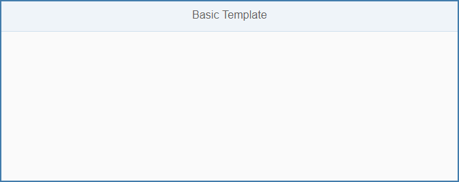
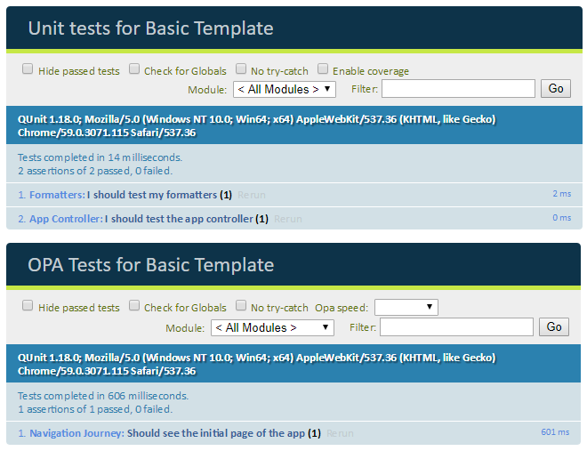

<!-- loio7a4d93c0b0bb439b9d889ffc5b02eac9 -->

| loio |
| -----|
| 7a4d93c0b0bb439b9d889ffc5b02eac9 |

view on: [demo kit nightly build](https://openui5nightly.hana.ondemand.com/#/topic/7a4d93c0b0bb439b9d889ffc5b02eac9) | [demo kit latest release](https://openui5.hana.ondemand.com/#/topic/7a4d93c0b0bb439b9d889ffc5b02eac9)

## Basic Template

The basic template is intended for all developers who want to start developing their own OpenUI5 app from scratch.

With this basic template you have a blank canvas to start coding right away. The basic file structure is set up according to our best practices.

> Note:
> This template does not include SAP Fiori launchpad \(FLP\) features and is intended for standalone use. If you want to convert it to a launchpad app you have to add some features manually, such as the *Save as Tile* feature.
> 
> 

   
  
Screenshot of the Basic App<a name="loio7a4d93c0b0bb439b9d889ffc5b02eac9__fig_f4h_gvw_k1b"/>

  

The `index.html` file defines the page that is displayed when the app is started. It is located in the `webapp` folder. It contains an XML view with a header and a title from the `sap.m` library as a starting point. You can easily modify the app to add more functionality.

***

<a name="loio7a4d93c0b0bb439b9d889ffc5b02eac9__section_sgm_1yw_k1b"/>

### Integrated Tests

   
  
Test for the Basic App<a name="loio7a4d93c0b0bb439b9d889ffc5b02eac9__fig_gmw_vxw_k1b"/>

  

An important best practice is to have unit and integration tests for your app. With this template, we have included sample tests that you can use: Tests on formatters and the app controller are the basic tests any app should cover. You can find them in the `test` subfolder of the `webapp` folder.

***

<a name="loio7a4d93c0b0bb439b9d889ffc5b02eac9__section_els_xvw_k1b"/>

### Where Can I Find the Basic Template?

You can find the template in the following places:

-   **SAPUI5 Application** in SAP Web IDE

    For more information about SAP Web IDE, see the documentation for SAP Web IDE on the SAP Help Portal at [https://help.sap.com/viewer/p/SAP\_Web\_IDE](https://help.sap.com/viewer/p/SAP_Web_IDE).

-   **Basic Template**under [Demo Apps](https://openui5.hana.ondemand.com/#demoapps.html).

-   `openui5-basic-template-app` in the [SAP Repository on GitHub](https://github.com/SAP).

    For more information about how to clone or download the template from GitHub, refer to the template documentation on [GitHub]().

**Related information**  

[Demo Apps](Demo_Apps_a3ab54e.md)

[Development Environment](Development_Environment_7bb04e0.md)

