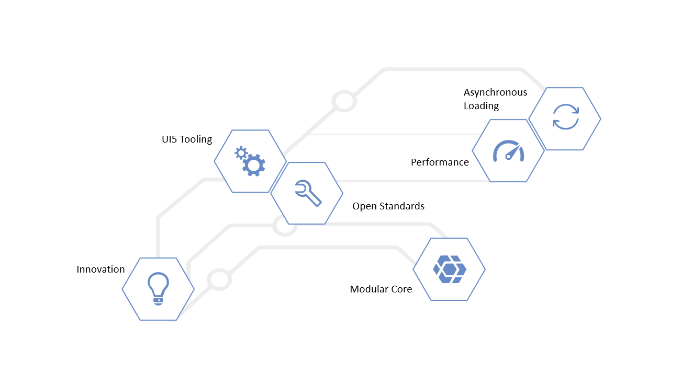

<!-- loio28fcd55b04654977b63dacbee0552712 -->

| loio |
| -----|
| 28fcd55b04654977b63dacbee0552712 |

view on: [demo kit nightly build](https://openui5nightly.hana.ondemand.com/topic/28fcd55b04654977b63dacbee0552712) | [demo kit latest release](https://sdk.openui5.org/topic/28fcd55b04654977b63dacbee0552712)

## Best Practices for App Developers

In this section, we have compiled a set of best practice recommendations to help you develop high-quality OpenUI5 apps.

***

The best practices articles are built around the key concepts below. Where applicable, we show hands-on examples and refer you to our tutorials as well as to our the detailed documentation.

***

<a name="loio28fcd55b04654977b63dacbee0552712__section_rbj_jfg_cgb"/>

### Key Concepts

Hover over the shapes to find out more about some key benefits of OpenUI5.

-   [Best Practices for App Developers](Best_Practices_for_App_Developers_28fcd55.md)
-   [Best Practices for App Developers](Best_Practices_for_App_Developers_28fcd55.md)
-   [Best Practices for App Developers](Best_Practices_for_App_Developers_28fcd55.md)
-   [Best Practices for App Developers](Best_Practices_for_App_Developers_28fcd55.md)
-   [Best Practices for App Developers](Best_Practices_for_App_Developers_28fcd55.md)
-   [Best Practices for App Developers](Best_Practices_for_App_Developers_28fcd55.md)

***

> ### Tip:  
> All demo apps, templates, and tutorials in the OpenUI5 Demo Kit follow these recommendations.

-   **[Load Only What You Really Need](Load_Only_What_You_Really_Need_e8fca3e.md "The amount of resources and data that your app loads will directly affect the performance of your app. You should declare all dependencies
		and remove unused libraries and classes from your code.")**  
The amount of resources and data that your app loads will directly affect the performance of your app. You should declare all dependencies and remove unused libraries and classes from your code.
-   **[Use the MVC Concept](Use_the_MVC_Concept_07afcf4.md "MVC (Model-View-Controller) is a concept for structuring your software. It makes it easier to maintain and to extend your
		apps.")**  
MVC \(Model-View-Controller\) is a concept for structuring your software. It makes it easier to maintain and to extend your apps.
-   **[Keep Your Views Short and Simple](Keep_Your_Views_Short_and_Simple_b0d7db7.md "The view part of your app reflects what users can see and interact with. You should use a suitable set of UI controls that match your
		scenario and keep things simple.")**  
The view part of your app reflects what users can see and interact with. You should use a suitable set of UI controls that match your scenario and keep things simple.
-   **[Use Stable IDs](Use_Stable_IDs_79e910e.md "If you keep the IDs of controls, elements, and components stable, you can be sure that other OpenUI5 features will be able to identify them correctly during
		processing.")**  
If you keep the IDs of controls, elements, and components stable, you can be sure that other OpenUI5 features will be able to identify them correctly during processing.
-   **[Make Your App CSP Compliant](Make_Your_App_CSP_Compliant_1f81a09.md "CSP stands for Content Security Policy and is a security standard to prevent cross-site scripting or other code injection
		attacks.")**  
CSP stands for Content Security Policy and is a security standard to prevent cross-site scripting or other code injection attacks.
-   **[Use Asynchronous Loading](Use_Asynchronous_Loading_676b636.md "Asynchronous loading is the way to go: It makes your applications a lot faster and, through that, better to use.")**  
Asynchronous loading is the way to go: It makes your applications a lot faster and, through that, better to use.
-   **[Is Your Application Ready for Asynchronous Loading?](Is_Your_Application_Ready_for_Asynchronous_Loading_493a15a.md "Find a collection of information that helps you to find out if your application is ready
		for asynchronous loading.")**  
Find a collection of information that helps you to find out if your application is ready for asynchronous loading.
-   **[Performance Checklist](Performance_Checklist_9c6400e.md "Follow these steps to apply performance best practices to your application.")**  
Follow these steps to apply performance best practices to your application.

