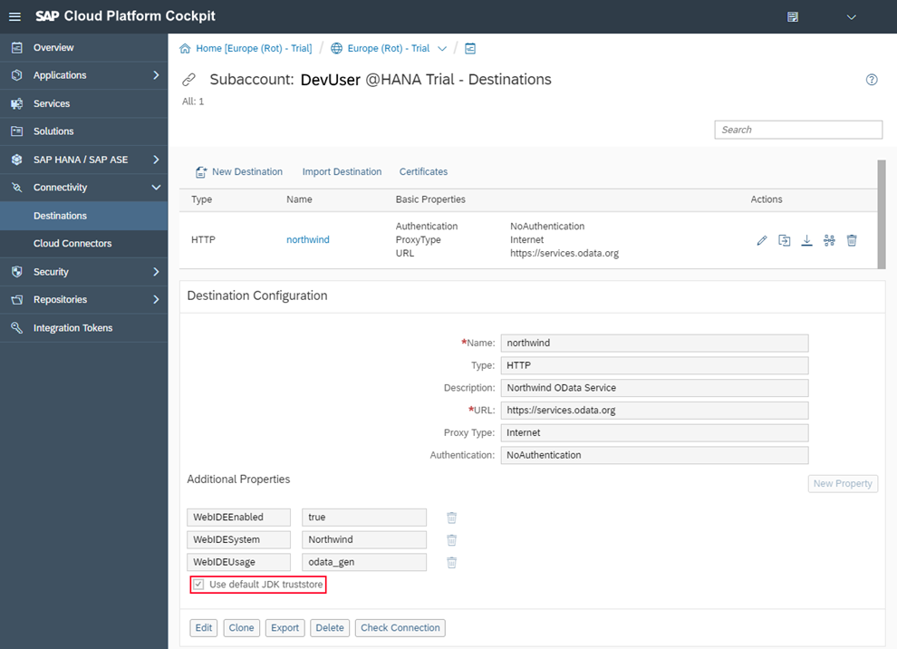

<!-- loio3a16c7a2f1e944deb000db49e5ece6be -->

| loio |
| -----|
| 3a16c7a2f1e944deb000db49e5ece6be |

<div id="loio">

view on: [demo kit nightly build](https://openui5nightly.hana.ondemand.com/#/topic/3a16c7a2f1e944deb000db49e5ece6be) | [demo kit latest release](https://openui5.hana.ondemand.com/#/topic/3a16c7a2f1e944deb000db49e5ece6be)</div>

## Create a Northwind Destination

Configure a destination in the SAP Cloud Platform Cockpit in order to bypass the same-origin policy of the browser.

***

To be able to test your app, you can use a remote OData service that provides product data from the Northwind demo service of the OData group.

In the navigation bar of the SAP Cloud Platform Cockpit, choose *Destinations* and then choose *New Destination* in the toolbar.

  

Enter the following values into the corresponding fields:

|Field|Value|
|-----|-----|
| *Name* | `northwind` |
| *Type* | `HTTP` |
| *Description* | `Northwind OData Service` |
| *URL* | `https://services.odata.org` |
| *Proxy Type* | `Internet` |
| *Authentication* | `NoAuthentication` |

Also, enter the following properties in the section *Additional Properties*:

|Property|Value|
|--------|-----|
| `WebIDEEnabled` | `true` |
| `WebIDESystem` | `Northwind` |
| `WebIDEUsage` | `odata_gen` |
| `Use default JDK truststore` |Set the checkmark.|

***

<a name="loio3a16c7a2f1e944deb000db49e5ece6be__section_ill_4vz_ghb"/>

### neo-app.json

With this configuration you can use the destination for any app inside SAP Web IDE. Whenever an app calls a \(local\) service beginning with `/destinations/northwind/*`, the created destination becomes active as a simple proxy. This helps to prevent any possible issues related to the same-origin policy of browsers. For this, you need to add another route to the `neo-app.json`:

``` json
{
  "welcomeFile": "index.html",
  "routes": [
    {
      
      "path": "/resources",
      "target": {
        "type": "service",
        "name": "sapui5",
        "version": "snapshot",
        "entryPath": "/resources"
      },
      "description": "SAPUI5 Resources"
    },
    {
      "path": "/test-resources",
      "target": {
        "type": "service",
        "name": "sapui5",
        "entryPath": "/test-resources"
      },
      "description": "SAPUI5 Test Resources"
    }*HIGHLIGHT START*,
    {
      "path": "/destinations/northwind",
      "target": {
        "type": "destination",
        "name": "northwind"
      },
      "description": "Northwind OData Service"
    }*HIGHLIGHT END*
  ]
}
```

***

<a name="loio3a16c7a2f1e944deb000db49e5ece6be__section_t5m_fwz_ghb"/>

### webapp/manifest.json

In the app descriptor, the service URL is then defined relative to the destination path specified above:

``` json
...
"sap.app": {
 "dataSources": {
   "": {
     "uri": "*HIGHLIGHT START*/destinations/northwind/V2/Northwind/Northwind.svc/*HIGHLIGHT END*",
     "type": "OData",
     "settings": {
       "odataVersion": "2.0"
     }
   }
 }
}
...
```

