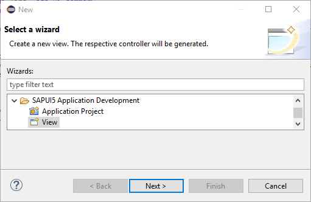
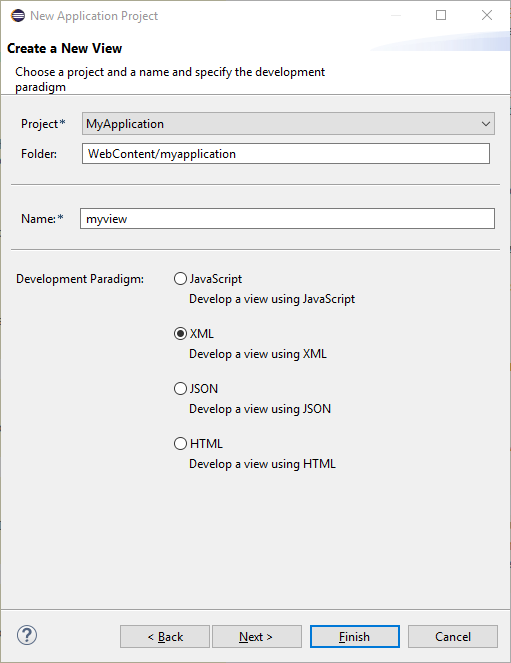

<!-- loio727bc3f650e24af7932d4fc9a6695a16 -->

| loio |
| -----|
| 727bc3f650e24af7932d4fc9a6695a16 |

view on: [demo kit nightly build](https://openui5nightly.hana.ondemand.com/#/topic/727bc3f650e24af7932d4fc9a6695a16) | [demo kit latest release](https://openui5.hana.ondemand.com/#/topic/727bc3f650e24af7932d4fc9a6695a16)

## Create an Additional View

An SAPUI5 application view can only be created for an SAPUI5 application project that has been created with the SAPUI5 Application Wizard and **not** for other kinds of projects.

***

-   A SAPUI5 application view name needs to be unique inside the project folder.
-   The specified folder for a SAPUI5 application view needs to be `WebContent/<application name>` or a sub folder.

1.  Choose *New* \> *Other...* \> *SAPUI5 Application Development* \> *View* to open the New **SAPUI5 Application View** wizard.

    

2.  Fill in the required data:

    -   Select the SAPUI5 application project, in which you want to create the view.
    -   Select a folder, in which you want to store the view \(default is `WebContent/<application name>`\).
    -   Enter a name for the view.
    -   Select the development paradigm with which you want to develop your view.
    

***

When you finish the wizard, the system creates the view in the specified folder. The file name suffix indicates the development paradigm:

-   `<viewname>.view.js` for JavaScript views
-   `<viewname>.view.xml` for XML views
-   `<viewname>.view.json` for JSON views
-   `<viewname>.view.html` for HTML views

If the corresponding index.html file contains `sap.m` lib in the bootstrap, that is, if the SAPUI5 application project has been created for a mobile target device, the view contains coding for instantiating a mobile page control  `sap.m.Page`.

The system also creates a controller file `<viewname>.controller.js` with draft coding.

For JavaScript views, code completion is available, see [JavaScript Code Completion](JavaScript_Code_Completion_85ce1ed.md).

> Note:
> If you rename the view or controller file, or move them to a different folder, the coding in the view and controller and in the places where the view is used needs to be adapted manually.
> 
> 

**Related information**  

[Views](Views_91f27e3.md)

