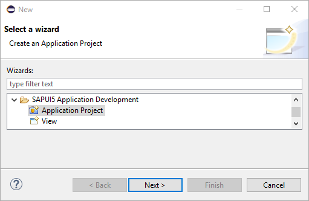
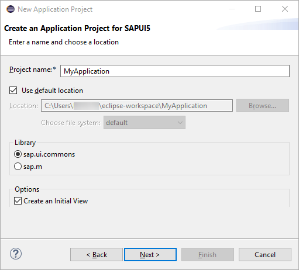

<!-- loioda0c8ca95ba447f2970cdba2aef7639b -->

| loio |
| -----|
| da0c8ca95ba447f2970cdba2aef7639b |

view on: [demo kit nightly build](https://openui5nightly.hana.ondemand.com/#/topic/da0c8ca95ba447f2970cdba2aef7639b) | [demo kit latest release](https://openui5.hana.ondemand.com/#/topic/da0c8ca95ba447f2970cdba2aef7639b)

## Create an SAPUI5 Application Project

To create an SAPUI5 Application Project, you must have installed the SAPUI5 Application Development feature in your Eclipse installation.

1.  Start the *New SAPUI5 Application Project* wizard in the Eclipse by choosing *File* \> *New* \> *Other...* \> *SAPUI5 Application Development* \> *Application Project* \> *Next*.

    

2.  Enter the following project-related data:

    -   Enter a project name \(mandatory\).
    -   Enter a location \(optional, prefilled from the current workspace\).
    -   Select a library: 'sap.m' \(mobile target device\) or 'sap.ui.commons' \(desktop target device\).
    -   Select *Create an Initial View*.

        Views can also be added later using the *SAPUI5 Application View* wizard.

    -   Choose *Next*.
    

3.  Enter the following view-related data:

    -   Choose the folder in which the view shall be created.
    -   Enter a unique name for your view.
    -   Choose the *Development Paradigm* \(we recommend XML\).
    

4.  Choose *Finish*.

***

After you finish the wizard, the system performs the following steps:

-   A new dynamic Web project is created. All relevant files are created in the `WebContent` folder.
-   A prefilled `index.html` is created, which contains the `sap.ui.commons` lib and the `sap_belize` theme in the bootstrap in case of a desktop target device, or the `sap.m` lib and `sap_mvi` theme in case of mobile target device. This depends on the choice you made in Step 2.
-   In `WEB-INF` folder, a `web.xml` file is created, which contains settings for resource handling and the use of `SimpleProxyServlet`.
-   The installed SAPUI5 UI lib plugins are automatically added to the Java build path and to the deployment assembly.
-   TheSAPUI5 class path container \(if available\) is automatically added to the JavaScript include path.
-   The `index.html` page is opened in the standard editor.
-   Inside the JavaScript block of `index.html`, code completion is available, see [JavaScript Code Completion](JavaScript_Code_Completion_85ce1ed.md).
-   The J2EE perspective is automatically loaded.
-   If you have selected the *Create an Initial View* option on the first page of the *SAPUI5 Application Project* wizard, a view and a view controller are created, and the coding to call the view is added to the `index.html` file.

***

[Add a Control to Your View](Add_a_Control_to_Your_View_07d2bdc.md)

[Implement a Method in the Controller](Implement_a_Method_in_the_Controller_10c6b87.md)

[Create an Additional View](Create_an_Additional_View_727bc3f.md)

[Integrate a New View](Integrate_a_New_View_5da1208.md)

**Related information**  

[JavaScript Code Completion](JavaScript_Code_Completion_85ce1ed.md)

[Use JavaScript and XML Templates](Use_JavaScript_and_XML_Templates_fcf5e9b.md)

[SAPUI5 Snippets](SAPUI5_Snippets_b43514f.md)

[Linking your Eclipse Editor to the Demo Kit](Linking_your_Eclipse_Editor_to_the_Demo_Kit_8d80e84.md)

