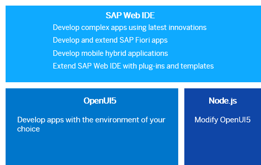

| loio |
| -----|
| 7bb04e05f9484e1b95b38a2e48ecef4f |

view on: [help.sap.com](https://help.sap.com/viewer/DRAFT/3237636b137e43519a20ad5513c49ccb/latest/en-US/7bb04e05f9484e1b95b38a2e48ecef4f.html) | [demo kit nightly build](https://openui5nightly.hana.ondemand.com/#/topic/7bb04e05f9484e1b95b38a2e48ecef4f) | [demo kit latest release](https://openui5.hana.ondemand.com/#/topic/7bb04e05f9484e1b95b38a2e48ecef4f)

<!-- loio7bb04e05f9484e1b95b38a2e48ecef4f -->

## Development Environment

This part of the documentation gives you guidance on the most common and recommended use cases of the installation, configuration, and setup of the OpenUI5 development environment.

***

Depending on your use case, you can choose one of the following development environments.

-   [App Development Using SAP Web IDE](App_Development_Using_SAP_Web_IDE_13ced94.md)
-   [App Development Using OpenUI5](App_Development_Using_OpenUI5_b1fbe1a.md)
-   [App Development Using SAPUI5 Tools for Eclipse](App_Development_Using_SAPUI5_Toolsfor_Eclipse_0404f90.md)
-   [Developing OpenUI5](Developing_OpenUI5_ee8726a.md)

