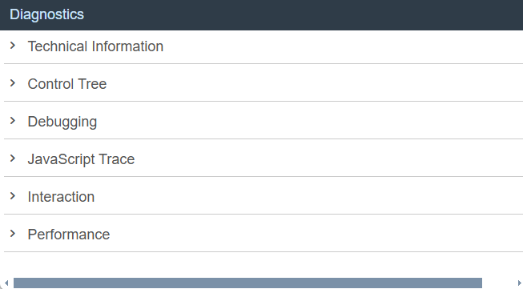

<!-- loio6ec18e80b0ce47f290bc2645b0cc86e6 -->

| loio |
| -----|
| 6ec18e80b0ce47f290bc2645b0cc86e6 |

view on: [demo kit nightly build](https://openui5nightly.hana.ondemand.com/topic/6ec18e80b0ce47f290bc2645b0cc86e6) | [demo kit latest release](https://sdk.openui5.org/topic/6ec18e80b0ce47f290bc2645b0cc86e6)

## Diagnostics

The *Diagnostics* window available in OpenUI5 is a support tool that runs within an existing OpenUI5 app.

To open *Diagnostics*, use the following [shortcuts](Keyboard_Shortcuts_for_OpenUI5_Tools_154844c.md):  [CTRL\] + [SHIFT\] + [Alt\] / [Option\] + [S\]  in the app.

  

> ### Note:  
> Depending on your app, additional features may be available. Check the sections below for more information.

 <a name="loio452944574e64438fbe07276b3b4d4673"/>

<!-- loio452944574e64438fbe07276b3b4d4673 -->

### Technical Information

In this section you can view the technical details of the app and turn on the debug sources. It provides the same features as the Technical Information dialog. Additionally, the Technical Information dialog is available on mobile devices that support multi-touch. For more information, see [Technical Information Dialog](Technical_Information_Dialog_616a3ef.md#loio616a3ef07f554e20a3adf749c11f64e9).

In addition, you can see the following information:

-   The jQuery version that is loaded from the server. If you want to use a specific jQuery feature, you should check whether the feature is supported in the loaded version.

-   The bootstrap configuration, where you can check, for example, the resource root, the theme, or the libraries. The libraries should be listed in the `libs` configuration parameter or in the descriptor file \(recommended\), see [Descriptor for Applications, Components, and Libraries \(manifest.json\)](Descriptor_for_Applications_Components_and_Libraries_manifest_json_be0cf40.md). To improve performance, remove unused libraries and add the libraries that you use and are not yet listed. These libraries are loaded as a preload file. We recommend to also add the `async` configuration option to the bootstrap. This configuration option enables asynchronous loading of modules and preload files and can, thus, further improve performance. For more information, see [Performance: Speed Up Your App](Performance_Speed_Up_Your_App_408b40e.md).

-   The computed configuration

-   The version of each library that is available and of the libraries that are loaded

-   A list of all loaded modules

-   URI parameters that are set

-   End-to-end \(E2E\) trace function

    The *E2E Trace* is used to create an XML file that traces the communication to a different part of your app.

    Start the E2E trace and navigate in the app. Afterwards, a dialog opens indicating that your transaction has finished. Choose *OK* to continue running the current trace. Choose *Cancel* to stop the trace and display the result in a new window.

    After stopping the trace, you can view the result and \(optionally\) upload it to a server by entering a `host name` and a `port number`, and then choosing *Submit*.

 <a name="loio790defe9ff8643bf8629c8567270e290"/>

<!-- loio790defe9ff8643bf8629c8567270e290 -->

### Control Tree

The control tree shows all controls that are used in the app. You can select controls either directly in the app by choosing [CTRL\] + [SHIFT\] + [Alt\] and clicking on the control, or by selecting the control in the control tree.

The following functions are available in the dialog:

-   On the *Properties* tab, you can change the defined properties of the selected control, and you can add or remove breakpoints. Use the respective checkbox to add or remove a breakpoint for the get and set method of a control property.

    

-   The *Binding Infos* tab shows all existing bindings for the selected control together with additional information. To update the binding, choose *Refresh Binding*.

    

    You can also see the binding context for the selected control. To navigate to the respective controls, use the hyperlinks.

-   On the *Breakpoints* tab, you can add or remove breakpoints for methods on object level. You can either select the method from the dropdown box, or use auto-completion. To set the breakpoint, select the method and choose *Add breakpoint*. To remove a breakpoint, select the red x.

    For more information, see [Breakpoints on the Object Level](Debugging_c9b0f8c.md#loiob691c4e7e970484991007a4e30fcd6d0).

-   Many code samples are written in JavaScript. To facilitate the conversion of these code samples into XML or HTML, OpenUI5 provides a generic conversion tool. To run the tool, proceed as follows:

    1.  Select the root UI area in the tree on the left-hand side.

    2.  Open the *Export* tab and choose *Export*.

    3.  Open the ZIP archive and extract the files to your file system.

    If your app does **not** contain views, the content is put in one view in the output. If your app contains views and all views are loaded, the content is output as separate files.

    > ### Note:  
    > The conversion captures the runtime status of the app. This can differ from the build declaration.

 <a name="copyee6f8f5a976347cb9426bdf5e689bc11"/>

<!-- copyee6f8f5a976347cb9426bdf5e689bc11 -->

### Breakpoints on the Object Level

In the *Control Tree* of the *Diagnostics* window, you can set breakpoints on the object level.

1.  Open the *Control Tree* view of the *Diagnostics* window.

2.  Select a control in the tree.

    You can also press and hold [Ctrl\] + [Shift\] + [Alt\] and select a control in your app to select it in the tree.

3.  Select the *Breakpoints* tab on the right.

4.  From the dropdown list, select the method for which you want to set the breakpoint and choose *Add breakpoint*.

    The selected methods are listed below the dropdown list.

5.  Open the developer tools of your browser. Whenever the selected methods are called for any instance on the control, the code execution is paused in the debugger.

    

6.  To remove a breakpoint, select the red x.

 <a name="loio7f4327d5aa274efda0c275d091c9d2f9"/>

<!-- loio7f4327d5aa274efda0c275d091c9d2f9 -->

### Debugging

The *Diagnostics* window provides you with the following features that help you when debugging your app:

-   You can switch the OpenUI5 version you want to debug with.

-   You can set breakpoints for methods on class level.

<a name="copyf96072c32f20456b9d20da049800b515"/>

<!-- copyf96072c32f20456b9d20da049800b515 -->

### Switching the OpenUI5 Version

***

Open the *Diagnostics* window with the shortcut [CTRL\] + [SHIFT\] + [ALT\] + [S\].

At the top of the *Debugging* view, you can configure a custom URL from which the application should load OpenUI5 the next time that the app opens.

Either select a known OpenUI5 installation from the dropdown box, or enter a different URL that points to the `sap-ui-core.js` file within a complete OpenUI5 runtime.

Once you have entered the URL, press *Activate Reboot URL*. When you then reload the application page, the application loads OpenUI5 from the alternative URL. This only happens for the next single reboot; after that, OpenUI5 is loaded again from the standard URL referenced within the app.

This feature can be used to test an application against a newer or older version of OpenUI5 as part of compatibility testing, or for verifying a bug fix or regression.

 <a name="copy75d0c576f8e04a6aa3067ede31ebf8d4"/>

<!-- copy75d0c576f8e04a6aa3067ede31ebf8d4 -->

### Breakpoints on the Class Level

In the *Debugging* section of the *Diagnostics* window, you can set breakpoints on the class level.

1.  Open the *Debugging* view of the *Diagnostics* window.

2.  Select a class from the dropdown list or enter the name of the class and choose *Add Class*.

    The selected class is now visible below the dropdown list.

    The number next to the method name shows the number of methods that belong to the class and the number of methods for which a breakpoint is set.

3.  Select the class. On the right side of the view, you can now select methods of the selected class from a dropdown list.

4.  From the dropdown list, select the method for which you want to set the breakpoint and choose *Add breakpoint*.

    The selected methods are listed below the dropdown list.

5.  Open the developer tools of your browser. Whenever the selected methods are called for any instance of the selected control, the code execution is paused in the debugger.

    

    In the call stack you find the method for which you set a breakpoint.

    

6.  To remove a breakpoint, select the red x.

 <a name="loio1ecb6b9f3d044e7d8f5136447bd6d39e"/>

<!-- loio1ecb6b9f3d044e7d8f5136447bd6d39e -->

### XML View and Templating Support Tools

This section of *Diagnostics* shows the code of the loaded XML view exactly as you would see it in your development environment. This way, you can check and test your XML code without the need to switch environments. If your app is connected to a remote service or a back-end system, you can also view the XML metadata.

Before you can use this feature, restart your app in Support Mode \(with the `sap-ui-support=true` URL parameter added to the URL or your app\).

***

<a name="loio1ecb6b9f3d044e7d8f5136447bd6d39e__section_frx_c2w_r1b"/>

### XML Metadata

<table>
<tr>
<td valign="top">

You can display XML metadata by expanding the related nodes in the tree. This helps you to better understand how the data is stored in the back end and which properties it has. This is especially important when investigating binding issues.

</td>
<td valign="top">

XML metadata of a service with three main entity sets: `Product`, `ProductCategory`, and `FeaturedProduct`

</td>
</tr>
</table>

***

<a name="loio1ecb6b9f3d044e7d8f5136447bd6d39e__section_yy3_k2w_r1b"/>

### XML Code

<table>
<tr>
<td valign="top">

When you expand an XML view in the tree, you can display the XML code.

You can choose the following options for this view:

-   You can choose which kind of IDs you want to see:

    -   IDs as they are in the DOM \(option *Show Real IDs*\)

    -   IDs as they are defined in the XML view \(option *Show XML View ID*\)

        If no stable ID is defined in the view, the ID tag is empty \(`id=" "`\), if there is an ID, the value is set to `true` \(`id="true"`\).

-   You can show or hide the namespaces to improve readability of the code.

</td>
<td valign="top">

</td>
</tr>
<tr>
<td valign="top">

When you select a control in the code, the following information is displayed:

-   Name of the control with a link to the API Reference and its ID in the DOM tree

-   Instances that are **cloned** in the control with their IDs

-   Attributes and properties of the control with their values

    Similar to the *Control Tree* section of *Diagnostics*, you can change those values here for testing purposes.

-   Methods that are available for the control.

> ### Note:  
> When you select, for example, an aggregation, you see the name of the control which has this aggregation or the name of the parent.

</td>
<td valign="top">

</td>
</tr>
</table>

 <a name="loio2e698c47a18e4303af9c6e59b6dd69b5"/>

<!-- loio2e698c47a18e4303af9c6e59b6dd69b5 -->

### Visualizing User Interaction

With this feature, you can collect and visualize the performance data collected for the interaction steps in an easy and intuitive way. In addition, you can enable statistics for OData calls that give you information about the app processing time taken by the OData back end.

***

### Activation

You can start the interaction data collection in the following ways:

-   Enable interaction steps recording:

    -   To measure the initial loading of the app, add the query string parameter `sap-ui-xx-fesr=true` at the end of the application URL and reload.

    -   To measure the interaction performance, choose *Start recording* from the *Interaction* panel and then switch back to the app to do the steps that you want to record. Each user activity, such as clicking buttons or list items or scrolling a list, triggers an interaction. The end of an interaction is when the UI is fully updated by the app. The collected data is displayed once you choose *Stop Recording*.

-   You can enable the OData statistics by using query string URL parameter `sap-statistics=true`, or from the UI by selecting *Enable OData Statistics*.

***

### Output

-   **Interaction details** - Selecting an interaction step bar, opens a dialog with details about the selected interaction: end-to-end duration, total number of requests, the size of the transferred data, and so on.

    

-   **Interaction requests** - All interactions contain 0 to N requests, which can be displayed in a list by selecting the expand icon.

-   **Request details** - Selecting a request opens a dialog with details, such as request type, URI, overall duration and how it is spread across client, server, and connection establishing processing. When OData statistics are enabled and the request is processed by the SAP NetWeaver OData gateway, in the details dialog there is a section with OData times – *Gateway Total*, *Framework*, and *Application* processing times.

    > ### Note:  
    > The OData time \(*Gateway Total*\) is included in the total server time processing. Such requests and their interaction are identified with a blue icon .

    

***

### Additional features

-   **Export** - Collected data can be exported as a ZIP archive for easy distribution through e-mail.

-   **Import** - Already collected data stored as an archive can be visualized again, using the *Import* function. The input can be either an already exported archive file or directly the JSON file that contains the performance data. This enables remote analysis of app data by another team or expert.

**Related Information**  

[Interaction Tracking for Performance Measurement](Interaction_Tracking_for_Performance_Measurement_b2825ea.md "You can analyze the performance of your UI5 application by tracking the interaction that is performed on the UI.")

