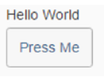
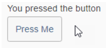

<!-- loio04e851db01024fc69e7a78f13e83b661 -->

| loio |
| -----|
| 04e851db01024fc69e7a78f13e83b661 |

<div id="loio">

view on: [demo kit nightly build](https://openui5nightly.hana.ondemand.com/#/topic/04e851db01024fc69e7a78f13e83b661) | [demo kit latest release](https://openui5.hana.ondemand.com/#/topic/04e851db01024fc69e7a78f13e83b661)</div>

## Events

This sections shows an example of a `press`event.

You can enhance the XML composite control created in the first step by adding a button. It's as simple as doing it in an XML view.

``` xml

<core:FragmentDefinition xmlns:m="sap.m" xmlns:core="sap.ui.core">
    <m:HBox>
        <m:Text text="{$this>/text}" />
        <m:Button text="Press Me" />
    </m:HBox>
</core:FragmentDefinition>
```

Now the sample should look like this:

   
  
Sample UI<a name="loio04e851db01024fc69e7a78f13e83b661__fig_a2f_mmj_d1b"/>

  

To handle the `press` event of the new button in the interface, first define the handler in the XML file, and then add a method in the JS file:

``` xml

<core:FragmentDefinition xmlns:m="sap.m" xmlns:core="sap.ui.core">
    <m:HBox>
        <m:Text text="{$this>/text}" />
        <m:Button text="Press Me" press="_handlePress"/>
    </m:HBox>
</core:FragmentDefinition>
```

``` js

...
    var SimpleText = XMLComposite.extend("fragments.SimpleText", {
        ...
    });
    SimpleText.prototype._handlePress = function () {
        this.setText("You pressed the button");
    }
    return SimpleText;
```

If you click the button now, the text should change:

   
  
Changed Sample UI<a name="loio04e851db01024fc69e7a78f13e83b661__fig_fzw_jpj_d1b"/>

  

> Note:
> When accessing controls within the fragment definition XML file, for example, the text or the button, you should use the `byId` method of `XMLComposite` and not `sap.ui.getCore().byId`. If the text has an `id=”myText”`, you could get the text instance in the `_handlePress` method via `this.byId(“myText”)`.
> 
> 

