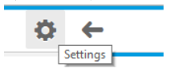

<!-- loioee37fc7138b843c0a66700f0aeaba3fe -->

| loio |
| -----|
| ee37fc7138b843c0a66700f0aeaba3fe |

view on: [demo kit nightly build](https://openui5nightly.hana.ondemand.com/#/topic/ee37fc7138b843c0a66700f0aeaba3fe) | [demo kit latest release](https://openui5.hana.ondemand.com/#/topic/ee37fc7138b843c0a66700f0aeaba3fe)

## General Recommendations

When developing OpenUI5 applications, you need to pay attention to the correctness of the resulting HTML. Some vital accessibility features \(screen reader and keyboard support\) rely on a correct and meaningful structure of the application.

***

### Rules and Guidelines

***

#### Don't change the HTML

Theming \(CSS selectors\), keyboard handling \(tab order\) and screen reader support are tightly coupled with the HTML structure of the generated pages. If you change the structure of the elements \(for example, from custom JavaScript, HTML or CSS\), this could break some or all of the accessibility aspects. In addition, it makes debugging the application more difficult.

***

#### Check the focus persistence

When opening or closing a dialog or navigating between pages, the focus should stay on the same control as it was on before opening or navigating. If the control no longer exists, the focus should be put on its parent \(for example, if the control was inside an action sheet, set the focus on the button which opened the action sheet\).

> Note:
> When the parent control cannot receive focus or is no longer available, the focus should go to a control nearby.
> 
> 

For more information, see [sap.ui.core.Element/methods/focus](https://openui5.hana.ondemand.com/#/api/sap.ui.core.Element/methods/focus) API documentation in the Demo Kit.

***

#### Initial focus position

Within an application, the inital focus should be placed on the element that is most likely to be edited or interacted with first \(for example, mandatory fields on a form\).

When opening dialogs or new pages, the focus should be on the first focusable element inside the content area.

> Note:
> On touch devices, if the first focusable element is a control that would open the soft keyboard, it is better to place the focus elsewhere - on the footer of the dialog or on a control that requires no keyboard input.
> 
> A good practice is to set the focus on the first mandatory element.
> 
> 

***

#### Don't interfere with existing accessibility features

Overriding code, for example the keyboard tab order, will impact the correct handling and may break the accessibility of the whole application.

***

#### Make sure that each component has a unique ID

The OpenUI5 framework handles the creation of unique IDs automatically. If you pass IDs yourself, make sure that they are unique within the whole application. For more information, see the *Related Information* section.

***

#### Provide meaningful tooltips for icons, icon buttons and where otherwise appropriate

Provide a text alternative for non-text elements and the necessary additional information, in case the text space is insufficient. You should use a tooltip as a label for unlabeled elements only. Additionally, a `Placeholder` can be used as a label if it is not a formatting hint.

> Note:
> 
> 
> 

***

#### Tooltips for container controls

Container and layout controls such as `VerticalLayout` or `Grid` inherit the tooltip property from `sap.ui.core.Element`.

> Note:
> We do not recommend setting a tooltip for the whole layout control, as it will not be displayed. You can set the needed tooltips for the individual controls which the container holds.
> 
> 

> Note:
> If you are developing your own controls, follow the guidelines listed under *Related Information*.
> 
> 

***

### Tips for Testing

Start the application and check each screen element. Check the following:

-   Does it have a label or a tooltip \(hover with the mouse\)?

-   Are the labels and tooltips \(fully\) visible, clear, accurate, and meaningful?

-   Is this also true for each input field or for a sequence of input fields? \(For example: street and number\)?

-   Is this also true for buttons, icons and images?

-   Is this also true for grouped information?

-   Is the user informed about the required entries and input?

**Related information**  

[Support for Unique IDs](Support_for_Unique_IDs_91f28be.md)

[Keyboard Handling for OpenUI5 Controls for Developers](Keyboard_Handling_for_OpenUI5_Controls_for_Developers_3e631ad.md)

[Screen Reader Support for OpenUI5 Controls](Screen_Reader_Support_for_OpenUI5_Controls_656e825.md)

[Theming](Theming_497c27a.md)

