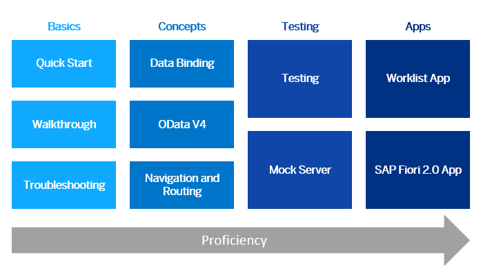

<!-- loio8b49fc198bf04b2d9800fc37fecbb218 -->

| loio |
| -----|
| 8b49fc198bf04b2d9800fc37fecbb218 |

view on: [demo kit nightly build](https://openui5nightly.hana.ondemand.com/#/topic/8b49fc198bf04b2d9800fc37fecbb218) | [demo kit latest release](https://openui5.hana.ondemand.com/#/topic/8b49fc198bf04b2d9800fc37fecbb218)

## Get Started: Setup and Tutorials

Set up your development environment and go through our tutorials. They introduce you to all major development paradigms of OpenUI5 using practical examples in an interactive format.

***

<a name="loio8b49fc198bf04b2d9800fc37fecbb218__tutorials_prerequisites"/>

### Prerequisites and Setup

-   You should be familiar with JavaScript.

-   Set up your development environment: Get OpenUI5 and place it in a location, which can be accessed in the resources folder \(not necessary for SAP Web IDE\). For more information, see [Development Environment](Development_Environment_7bb04e0.md).

-   Set up a folder where you would place the application content. We will refer to this folder as the “app folder”.

***

<a name="loio8b49fc198bf04b2d9800fc37fecbb218__tutorials_path"/>

### Learning Path

-   [Quick Start](Quick_Start_592f36f.md)
-   [Walkthrough](Walkthrough_3da5f4b.md)
-   [Troubleshooting](Troubleshooting_5661952.md)
-   [Data Binding](Data_Binding_e531093.md)
-   [OData V4](OData_V4_bcdbde6.md)
-   [Navigation and Routing](Navigation_and_Routing_1b6dcd3.md)
-   [Testing](Testing_291c912.md)
-   [Mock Server](Mock_Server_3a9728e.md)
-   [Worklist App](Worklist_App_6a6a621.md)
-   [SAP Fiori 2.0 App](SAP_Fiori_2.0_App_c4de2df.md)

***

> Note:
> **Learn with openSAP:**
> 
> The openSAP course [Developing Web Apps with SAPUI5](https://open.sap.com/courses/ui51) introduces you to the main concepts of SAPUI5.
> 
> The JavaScript exercises for each unit will give you the technical background needed to develop your own responsive Web apps. We’ll start from scratch with the very basics and lots of hands-on coding. As we go through the weeks of this course, you’ll learn more about the powerful development concepts and truly master SAPUI5.
> 
> 

***

<a name="loio8b49fc198bf04b2d9800fc37fecbb218__tutorials_download"/>

### Downloading Code for a Tutorial Step

To download the code from the Demo Kit, follow these steps:

1.  Choose the link in the *Coding* section of the tutorial step you want to work on or find the code in the *Samples* section of the Demo Kit \(filter by "*Tutorial*" to get a list of the tutorials that are available\).

2.  Choose the icon with the *Show source code for this sample* tooltip in the right-hand part of the header bar to display all files included in this sample.

3.  Choose the *Download* button. A `zip` file is downloaded to your local machine.

4.  Extract or upload the `zip` file to your development environment.

5.  Adjust the project configuration files to match your development environment as described below.

6.  Test the project by calling one of the HTML pages in your development environment and make sure that the app is displaying the features exactly as shown in the preview of the step.

***

<a name="loio8b49fc198bf04b2d9800fc37fecbb218__tutorials_adaptation"/>

### Adapting Code to Your Development Environment

You might have to adapt parts of the coding to your local development environment to make the app work. Please check the following settings carefully:

-   **Project Path and Deployment**

    All tutorials assume that the app is deployed and can be accessed under a certain path on a web server. You will not be able to run the app without a Web server as the browser does not allow you to load the required resources locally due to security restrictions.

-   **OpenUI5 Resources**

    You can either download and deploy the runtime to your \(local\) Web server or reference the CDN version located at `https://openui5.hana.ondemand.com/resources/sap-ui-core.js`. Some development environments such as the SAP Web IDE also provide a local runtime for testing purposes. If you download the code from the samples in the Demo Kit, you will have to adapt the **resource path in the bootstrap section** of all HTML pages included in the project. In the tutorial code, we assume that OpenUI5 can be accessed from the `/resources` path of the server.

-   **Accessing Remote Services**

    Browsers typically prevent accessing remote resources due to the Cross-Origin Resource Sharing \(CORS\) policy. If you would like to call a real service or remote resources, you will have to either configure the development environment or the remote server to accept these requests. This strongly depends on the development environment and is described in more detail below.

***

<a name="loio8b49fc198bf04b2d9800fc37fecbb218__tutorials_troubleshooting"/>

### Troubleshooting

If you get stuck, check the [Troubleshooting](Troubleshooting_615d9e4.md) section under *Essentials*, or refer to the [Troubleshooting tutorial](Troubleshooting_5661952.md).

If you can't fix the problem, try downloading the solution of the previews or current step. This should get your project fixed again, just don’t forget to check the resource path and the project configuration files again.

**Related information**  

[App Templates: Kick Start Your App Development](App_Templates_Kick_Start_Your_App_Development_a460a73.md)

[Demo Apps](Demo_Apps_a3ab54e.md)

