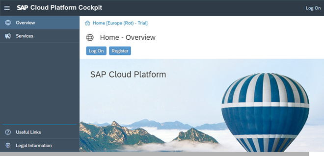
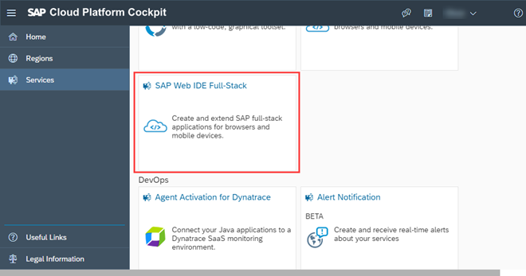

<!-- loio34bfb4531a974bf7be15f5937c7899d8 -->

| loio |
| -----|
| 34bfb4531a974bf7be15f5937c7899d8 |

view on: [demo kit nightly build](https://openui5nightly.hana.ondemand.com/#/topic/34bfb4531a974bf7be15f5937c7899d8) | [demo kit latest release](https://openui5.hana.ondemand.com/#/topic/34bfb4531a974bf7be15f5937c7899d8)

## Get a Trial Account and Access SAP Web IDE

Steps for creating an SAP Cloud Platform trial account

If you do not have access to SAP Web IDE, you can create a free account. To create an account, simply register an SAP Cloud Platform trial account at [https://account.hanatrial.ondemand.com/](https://account.hanatrial.ondemand.com/), and log on afterwards.

  

After you have logged on, choose *Services* in the navigation bar of the SAP Cloud Platform cockpit, and open the detailed information on your SAP Web IDE by choosing the SAP Web IDE Full-Stack tile.

  

> Note:
> Do **not** choose the simple SAP Web IDE tile \(without "Full-Stack" in the title\), because this service is not longer available for our purposes.
> 
> 

Selecting *Go to Service* leads you to your personal SAP Web IDE.

> Note:
> You can bookmark this link to access SAP Web IDE later.
> 
> 

