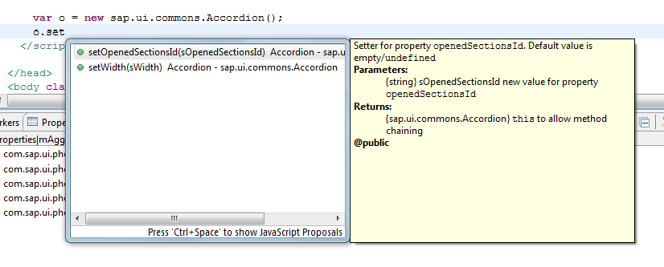
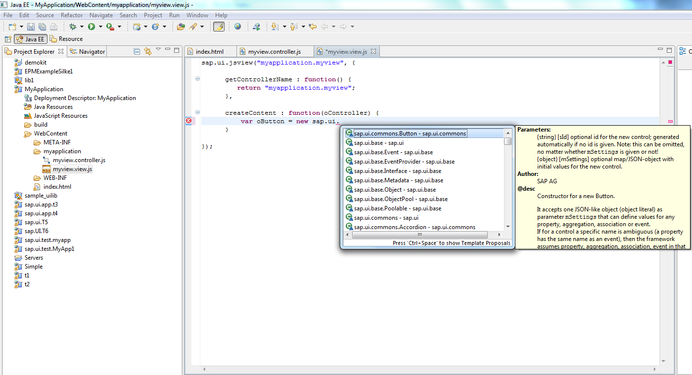
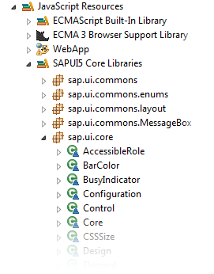

<!-- loio85ce1edb55dd4de3beac5b6d24d36d8a -->

| loio |
| -----|
| 85ce1edb55dd4de3beac5b6d24d36d8a |

view on: [demo kit nightly build](https://openui5nightly.hana.ondemand.com/#/topic/85ce1edb55dd4de3beac5b6d24d36d8a) | [demo kit latest release](https://openui5.hana.ondemand.com/#/topic/85ce1edb55dd4de3beac5b6d24d36d8a)

## JavaScript Code Completion

Code completion provides a context-sensitive input help while you're coding.

***

<a name="loio85ce1edb55dd4de3beac5b6d24d36d8a__section_N10020_N10011_N10001"/>

### Automatic Code Completion for SAPUI5 Application Projects

The Eclipse JavaScript Development Tools \(JSDT\) provide an editor which parses scripts and offers a code completion functionality.

***

<a name="loio85ce1edb55dd4de3beac5b6d24d36d8a__section_N10035_N10012_N10001"/>

### Code Completion for SAPUI5 Views

For JavaScript views, code completion is available.

***

<a name="loio85ce1edb55dd4de3beac5b6d24d36d8a__section_N10030_N10011_N10001"/>

### Enabling Code Completion for Other Projects

If you are not working with a SAPUI5 application project, you can perform the following preparing steps to add the required SAPUI5 core libraries to the JavaScript include path.

To set the JavaScript facet, proceed as follows:

1.  Open *Project* \> *Properties*.
2.  Select *Project Facets*.
3.  If you do not see the list of all possible facets, click the link: *Convert to facet form* and wait a second to see all available facets.
4.  Mark *JavaScript* facet on the same view.
5.  Choose *Apply and Close*.

Your project now has the JavaScript facet. Now you can add the SAPUI5 core libraries. Proceed as follows:

-   Open *Project* \> *Properties*.
-   Choose *JavaScript* \> *Include Path*.
-   Select *Add JavaScript Library…*.
-   Select *SAPUI5*.
-   Choose *Finish*.
-   Choose *Apply and Close*.

You should now be able to see the following JavaScript resources in your project:

