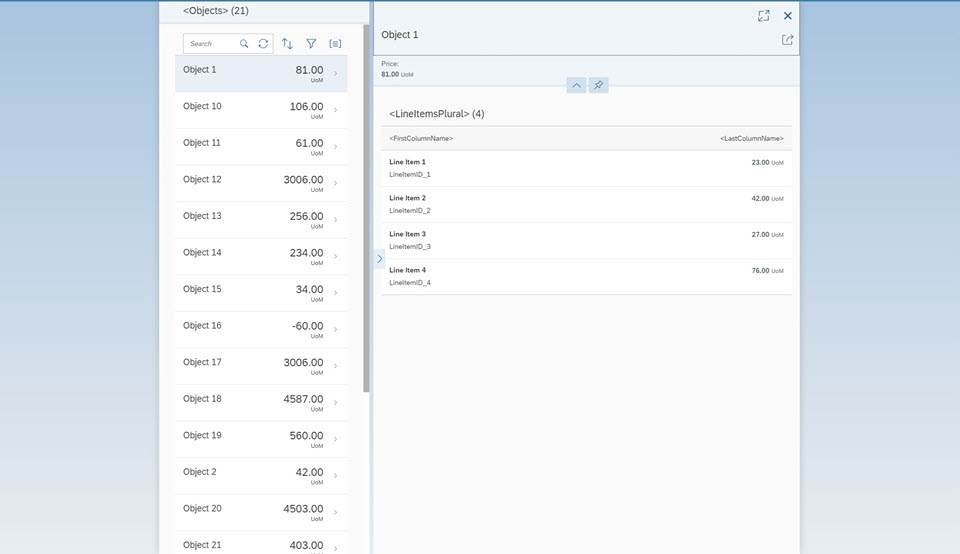

<!-- loio8ed9339f3a99418e82a02f0fb4b5d6b9 -->

| loio |
| -----|
| 8ed9339f3a99418e82a02f0fb4b5d6b9 |

view on: [demo kit nightly build](https://openui5nightly.hana.ondemand.com/#/topic/8ed9339f3a99418e82a02f0fb4b5d6b9) | [demo kit latest release](https://openui5.hana.ondemand.com/#/topic/8ed9339f3a99418e82a02f0fb4b5d6b9)

## Master-Detail Template

The **SAP Fiori Master-Detail Application** template implements a flexible column layout, one of the design patterns that is specified by the SAP Fiori design guidelines.

The flexible column layout is a layout control that displays multiple floorplans on a single page. This allows faster and more fluid navigation between multiple floorplans than the usual page-by-page navigation. The flexible column layout offers different layouts with up to three columns. In the template, we use two colums \(master and detail\). For more information about flexible columns and master-detail apps, see the  [SAP Fiori Design Guidelines](https://experience.sap.com/fiori-design-web/).

> Note:
> You have two options: You can use this template to build an **app for the SAP Fiori launchpad \(FLP\)** or to build **standalone apps**.
> 
> -   If the app runs in FLP it also contains additional features like *Save as Tile* or *Share in SAP Jam* that depend on FLP at runtime. This app cannot be run standalone, meaning no `index.html` file is created but only files for testing the app in the FLP sandbox.
> 
> -   Only standalone apps contain an `index.html` file that is used to start the app.
> 
> 
> 

   
  
Screenshot of the Master-Detail App<a name="loio8ed9339f3a99418e82a02f0fb4b5d6b9__fig_jjm_khh_bt"/>

  

The main control of this app is the `sap.f.flexibleColumnLayout` control. This control first displays only the *Master* view with a list of objects. When the user selects an object in the master list, the *Detail* view is displayed on the right side, showing the details for the selected item.

The *Master* view shows the current number of items and a search field that can be used to search through the list items. The number of items are updated automatically and the search filters for a preconfigured field of the list. Functionality for sorting, filtering, and grouping the list is also included in the template as well.

The *Detail* page contains a dynamic page header displaying more details for the selected object, an `sap.m.Overflowtoolbar` that can be enriched with custom content, and a table of line items that are associated to the selected object in the data model.

The master list and the line item table are set to `growing` mode so that initially only the first few items are displayed for performance reasons. Using the `scrollToLoad` feature, the user can display more items by scrolling down or pressing the trigger at the end of the list.

We use the semantic `MasterPage` and `DetailPage` controls for the content aggregations of the `sap.f.FlexibleColumnLayout` control. A `SemanticPage` is an enhanced `sap.f.DynamicPage` that contains controls with semantic-specific meaning and displays them according to the SAP Fiori design guidelines. For more details about semantic controls, see the [sample](https://openui5.hana.ondemand.com/#/api/sap.f.semantic.SemanticPage/samples) in the Demo Kit.

> Note:
> As the use cases for apps using a master-detail pattern differ greatly, we only show a basic scenario in our template as a starting point for your individual development activities. For more information, see [How Do I Enhance the Template?](Master-Detail_Template_8ed9339.md#loio8ed9339f3a99418e82a02f0fb4b5d6b9__section_EnhanceTemplate)
> 
> 

***

<a name="loio8ed9339f3a99418e82a02f0fb4b5d6b9__section_els_xvw_k1b"/>

### Where Can I Find the Master-Detail Template?

You can find the template in the following places:

-   **SAP Fiori Master-Detail Application** template in SAP Web IDE

    For more information about SAP Web IDE, see the documentation for SAP Web IDE on the SAP Help Portal at [https://help.sap.com/viewer/p/SAP\_Web\_IDE](https://help.sap.com/viewer/p/SAP_Web_IDE).

-   **Master-Detail Template** under [Demo Apps](https://openui5.hana.ondemand.com/#demoapps.html).

-   `openui5-masterdetail-app` in the [SAP Repository on GitHub](https://github.com/SAP)

    For more information on how to clone or download the template from GitHub, refer to the template documentation on [GitHub]() .

***

<a name="loio8ed9339f3a99418e82a02f0fb4b5d6b9__section_EnhanceTemplate"/>

### How Do I Enhance the Template?

In our template, we use a simple layout that you can use as a basis for enhancements. For example, if you want to use an object page with a dynamic header, you can use one of the page-type [Object Page Layout samples](https://openui5.hana.ondemand.com/#/sample/sap.uxap.sample.ObjectPageDynamicHeader/preview). All you have to do is replace the relevant content in the template with the content from the sample. To add a third column to your app, create a new view and have a look at the **sap.f.FlexibleColumnLayout** examples to see how to configure it.

You can find more information about the possibilities of object pages at [SAP Fiori Design Guidelines - Object Page](https://experience.sap.com/fiori-design-web/object-page/).

**Related information**  

[Demo Apps](Demo_Apps_a3ab54e.md)

[Development Environment](Development_Environment_7bb04e0.md)

