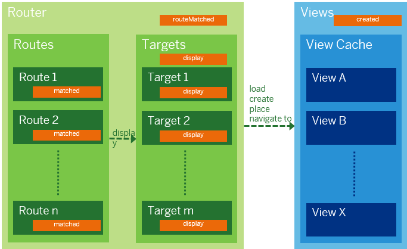

<!-- loio516e477e7e0b4e188b19a406e7528c1e -->

| loio |
| -----|
| 516e477e7e0b4e188b19a406e7528c1e |

<div id="loio">

view on: [demo kit nightly build](https://openui5nightly.hana.ondemand.com/#/topic/516e477e7e0b4e188b19a406e7528c1e) | [demo kit latest release](https://openui5.hana.ondemand.com/#/topic/516e477e7e0b4e188b19a406e7528c1e)</div>

## Methods and Events for Navigation

OpenUI5 provides a method and events for navigation.

***

### Methods

Navigation can be triggered by method `navTo` on `Router` with changing the hash or method `display` on `Targets` for showing a new view without changing the hash.

***

#### `navTo` method

Use this method to navigate to the given route and fill the hash with the corresponding data. It the route contains a target, the target is displayed. The listener callbacks of controllers listening to this route are provided with data. When changing the hash, all listeners to this hash are informed.

The method uses the following parameters:

-   `name` of the route parameter

-   route `parameters`

-   `replace` \(default: `false`\) to define whether the hash should be replaced \(no new browser history entry\) or set \(browser history entry\)


``` js
sap.ui.require([
    "sap/ui/core/UIComponent", ...
], function(UIComponent, ...) {
    sap.ui.controller("MyApp.View2", {
        anyEvent: function() {
            var oRouter = this.getOwnerComponent().getRouter();
            oRouter.navTo("product", {
                id: "5",
                productId: "3"
            });
        }
    });
});

```

***

#### `display` method

Use this method to navigate to display one or multiple targets. The method uses the target name or an array of target names as only parameter.

***

### Events

  
  
Navigation events<a name="loio516e477e7e0b4e188b19a406e7528c1e__fig_srm_3dn_1w"/>

  

***

#### Events `attachRouteMatched` on `Router` and `attachMatched` on `Route`

These events are fired when a hash matches a route or a pattern. The `routeMatched` event is fired if a pattern of any route in the routing configuration is matched. The matched event is fired for a specific route.

If you want to only react to specific routes, check if the `name` parameter matches the route that you want to listen to. The events have the following parameters:

-   `name` of the route that has been matched

-   `arguments` that are part of the route, mainly the parameters of the hash

-   `config` of the route


``` js
sap.ui.controller("MyApp.View1", {
    onInit: function() {
        var oRouter = this.getOwnerComponent().getRouter();
        oRouter.getRoute("view1").attachMatched(function(oEvent) {
            this._selectItemWithId(oEvent.getParameter("arguments").id);
        }, this);
    },
    
    _selectItemWithId : function(id) {
        //implementation
    }
}

```

***

#### `display` event on `Target`

This event is fired on the target instance when this target is added and displayed on the UI. The event has the following parameters:

-   `object` for the instance which is displayed; this is either a `View` instance or a `ComponentContainer` instance which wraps the loaded component

-   `control` in which the target object is displayed

-   `config` of the target

-   `data` of the object passed when calling the `display` method


***

#### `created` event on `Views`

This event is fired on the view/component cache in OpenUI5 routing which can be fetched by calling the `getViews()` method on a router instance every time a new view or component has been created by navigation. The event has the following parameters:

-   `object` for the created instance

-   `options` containing additional options


**Related information**  


[Tutorial: Navigation and Routing](Navigation_and_Routing_1b6dcd3.md)

[API Reference: `sap.ui.core.routing`](https://openui5.hana.ondemand.com/#docs/api/symbols/sap.ui.core.routing.html)

[API Reference: `sap.m.routing.Router`](https://openui5.hana.ondemand.com/#docs/api/symbols/sap.m.routing.Router.html)

