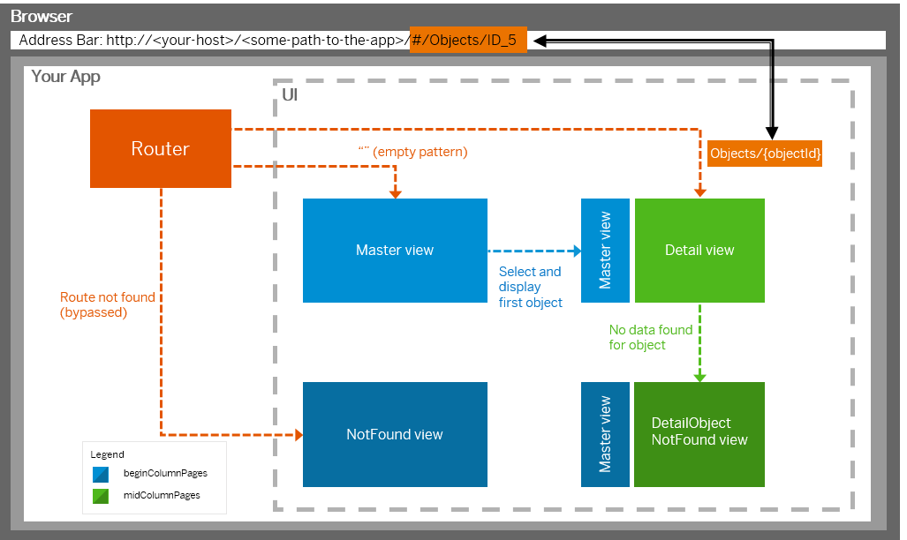

<!-- loio89de2f43b91d470daa8121a0b4ba35cc -->

| loio |
| -----|
| 89de2f43b91d470daa8121a0b4ba35cc |

<div id="loio">

view on: [demo kit nightly build](https://openui5nightly.hana.ondemand.com/#/topic/89de2f43b91d470daa8121a0b4ba35cc) | [demo kit latest release](https://openui5.hana.ondemand.com/#/topic/89de2f43b91d470daa8121a0b4ba35cc)</div>

## Navigation

The navigation flow of the Master-Detail app considers both the *Master* and *Detail* pages, and is therefore slightly more complex than a typical full-screen scenario.

With an empty hash in the URL, only the master view is shown initially. When the user enters the app with an object id in the hash, both views are loaded at the same time, and methods in the controller logic make sure that the pages are in sync. Additional *not found* pages display a message to the user in case of any navigation errors that occur for the master and the detail page.

   
  
Navigation Flow of the Master-Detail App<a name="loio89de2f43b91d470daa8121a0b4ba35cc__fig_xyz_nkh_bt"/>

  

The two main views *Master* and *Object* each have a route and two targets configured. When the route matches the URL, both targets are displayed and the corresponding views are created. The target master puts the created view in the **beginColumnPages** aggregation of the **sap.f.FlexibleColumnLayout** control. All other targets put their created views in the **midColumnPages** aggregation. For more information, see [Routing and Navigation](Routing_and_Navigation_3d18f20.md).

Here is a sample implementation for navigating from the *Master* to the *Object* page. The below**\_showDetail** method is called by the **selectionChange** event handler of the **sap.m.List** control. We need to change the layout parameter of the **sap.f.FlexibleColumnLayout** to **TwoColumnsMidExpanded** and navigate to the **object** route. Then, we extract the current ID of the object pressed by using its binding context. We supply this parameter to the mandatory **objectId** parameter and pass it to the **navTo** function, as described in the [sap.ui.core.routing.Routing\#navTo](https://openui5.hana.ondemand.com/#/api/sap.ui.core.routing.Router/methods/navTo) section of the *API Reference* in the Demo Kit and shown here:

``` js
...
/**
  * Shows the selected item on the detail page
  * On phones an additional history entry is created
  * @param {sap.m.ObjectListItem} oItem selected Item
  * @private
  */
_showDetail : function (oItem) {
      var bReplace = !Device.system.phone;
      // set the layout property of FCL control to show two columns
      this.getModel("appView").setProperty("/layout", "TwoColumnsMidExpanded");
      this.getRouter().navTo("object", {
         objectId : oItem.getBindingContext().getProperty("ObjectID")
      }, bReplace);
},
...
```

After calling `navTo`, the hash of the browser is updated, and you get an event on the `DetailController` when the route **object** matches the current hash. In the **\_onObjectMatched** handler that we register in the **init** method of the controller, we extract the **objectID** from the event arguments and create a valid model path with the help of the **createKey** method of our OData model. We then bind the data to the view:

``` js
...
/**
  * Binds the view to the object path and expands the aggregated line items.
  * @function
  * @param {sap.ui.base.Event} oEvent pattern match event in route 'object'
  * @private
  */
*HIGHLIGHT START*_onObjectMatched : function (oEvent) {*HIGHLIGHT END*

      var sObjectId =  oEvent.getParameter("arguments").objectId;
*HIGHLIGHT START*      this.getModel("appView").setProperty("/layout", "TwoColumnsMidExpanded");
      this.getModel().metadataLoaded().then( function() {
*HIGHLIGHT END*
        var sObjectPath = this.getModel().createKey("Objects", {
          ObjectID :  sObjectId
*HIGHLIGHT START*        });
        this._bindView("/" + sObjectPath);
      }.bind(this));
},*HIGHLIGHT END*
...
```

***

### notFound \(similar to an HTTP 404 "not found" status code\)

The *not found* pages are implemented using an [sap.m.MessagePage](https://openui5.hana.ondemand.com/explored.html#/entity/sap.m.MessagePage/samples). They display an error message according to the SAP Fiori UX specifications. There are different "not found" cases that each have a separate target and a *notFound* view.

If you have the following URL, no route will match: `index.html/#/thisIsInvalid`. This means that the *notFound* view will be displayed, as the target *notFound* is defined in the bypassed section.

The code sample below shows the relevant parts of the configuration. In addition, we set the layout property for the **sap.f.FlexibleColumnLayout** to **OneColumn** in the controller of the *notFound* page so that only a single column is displayed in this case. For a full implementation of a *not found* page, see [Step 3: Catch Invalid Hashes](Step_3_Catch_Invalid_Hashes_e047e05.md).

``` js
"routing": {
    "config": {
    …
    "bypassed": {
    "target": "notFound"
    }
    }
    …
    "targets": {
    …
    "notFound": {
      "viewName": "NotFound",
      "viewId": "notFound"
    }

}
```

***

### detailObjectNotFound

If the object route matches – an ID is passed \(for example `#/Objects/1337`\) but the back end does not contain an object with the ID `1337`, then you need to display the *detailObjectNotFound* page. This is achieved by listening to the “change” event of a binding. Inside this, you check if there is no data and tell the router to display the *detailObjectNotFound* target, as shown in the sample code below:

``` js
// inside of a controller
this.getView().bindElement({
    path: "/Objects/1337",
    change: function () {
      // there is no data
      if (!this.getView().getElementBinding().getBoundContext()) {
          this.getRouter().getTargets().display("detailObjectNotFound
");
      return;
				}
      // code handling the case if there is data in the backend
      …
};
});
```

