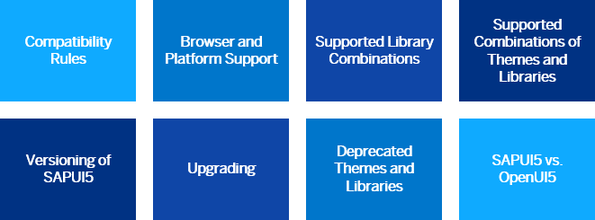

<!-- loio167193ced54c41c3961d7df3479d7bbe -->

| loio |
| -----|
| 167193ced54c41c3961d7df3479d7bbe |

view on: [demo kit nightly build](https://openui5nightly.hana.ondemand.com/#/topic/167193ced54c41c3961d7df3479d7bbe) | [demo kit latest release](https://openui5.hana.ondemand.com/#/topic/167193ced54c41c3961d7df3479d7bbe)

## Read Me First

Before you start using OpenUI5 productively, please read the **important information** in the section. Here you read everything you need to know about supported library combinations, the supported browsers and platforms, and so on.

***

-   [Compatibility Rules](Compatibility_Rules_91f0873.md)
-   [Browser and Platform Support](Browser_and_Platform_Support_74b59ef.md)
-   [Supported Library Combinations](Supported_Library_Combinations_363cd16.md)
-   [Supported Combinations of Themes and Libraries](Supported_Combinations_of_Themes_and_Libraries_38ff8c2.md)
-   [SAPUI5 vs. OpenUI5](SAPUI5_vs._OpenUI5_5982a97.md)
-   [Deprecated Themes and Libraries](Deprecated_Themes_and_Libraries_a87ca84.md)
-   [Upgrading](Upgrading_9638e4f.md)
-   [Versioning of OpenUI5](Versioning_of_OpenUI5_91f0214.md)

