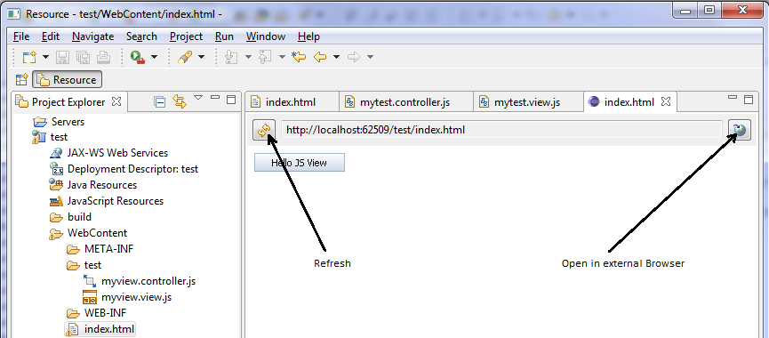

<!-- loio05a9c69666074a2f831816534c32db9e -->

| loio |
| -----|
| 05a9c69666074a2f831816534c32db9e |

<div id="loio">

view on: [demo kit nightly build](https://openui5nightly.hana.ondemand.com/#/topic/05a9c69666074a2f831816534c32db9e) | [demo kit latest release](https://openui5.hana.ondemand.com/#/topic/05a9c69666074a2f831816534c32db9e)</div>

## Running an App in the Application Preview

You access the application preview using the Web App Preview, provided with the embedded Jetty Web server. You can quickly check on your application and open it in the default browser.

1.  To test the new application with the application preview in an embedded Jetty Web server, right-click the HTML file or the project node, and choose *Run As* \> *Web App Preview*. Everything is configured automatically.

2.  To refresh the preview after you have changed a file of your application, choose *Refresh* on the left hand side of the preview editor.

3.  To check the files of your application project in an external browser, choose *Open in External Browser* on the right-hand side of the preview editor. This function opens the external browser that is specified under *Window* \> *Preferences* \> *General* \> *Web Browser*. This is usually the default browser of your PC. For other external browsers, you can also copy the URL from the preview to the external browser.

    Depending on the libraries you use, different browsers are supported. For more information, see: [Browser and Platform Support](Browser_and_Platform_Support_74b59ef.md)

    Open in External Browser

    

    > Note:
    > The embedded Jetty server is a lightweight Web server that you can use for development. Depending on your requirements, you can install other Web servers. To do this, choose *File* \> *New* \> *Other...* \> *Server* \> *Server*. Then, choose *Next*, and follow the instructions for your preferred Web server.
    > 
    > 

    > Note:
    > Before you deploy an application that has been created by using the Eclipse application development tool on a Java server, remove the mapping to the test resources in the `web.xml` file in the `<WebContent folder name>/WEB-INF` folder of the application. Test resources should only be used during testing. Remove or comment the following lines out:
    > 
    > ``` xml
    >    <servlet-mapping>
    >       <servlet-name>ResourceServlet</servlet-name>
    >       <url-pattern>/test-resources/*</url-pattern>
    >    </servlet-mapping>
    > 
    > ```
    > 
    > 


