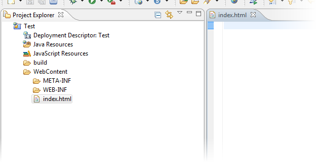
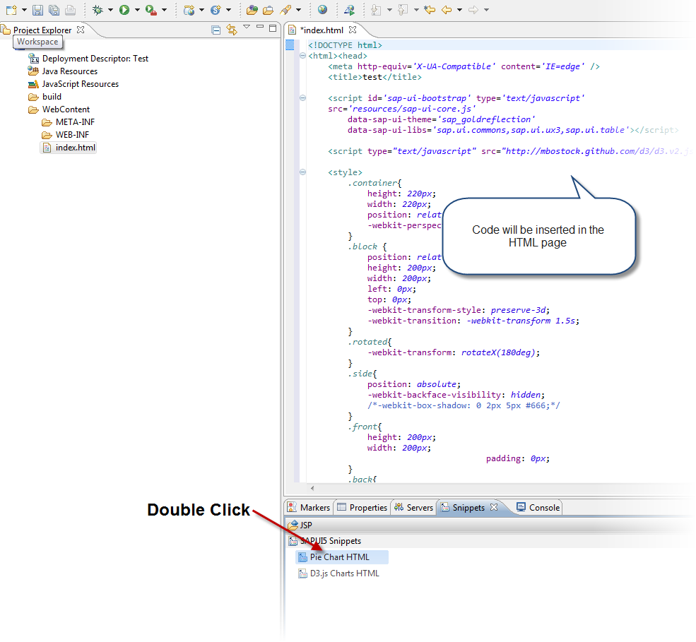
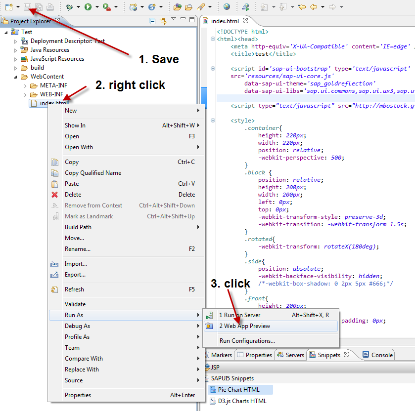
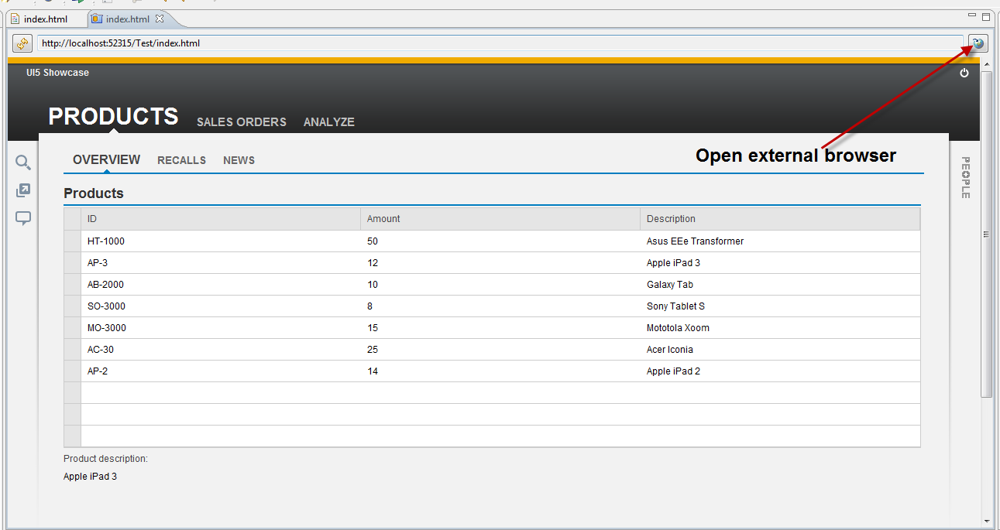
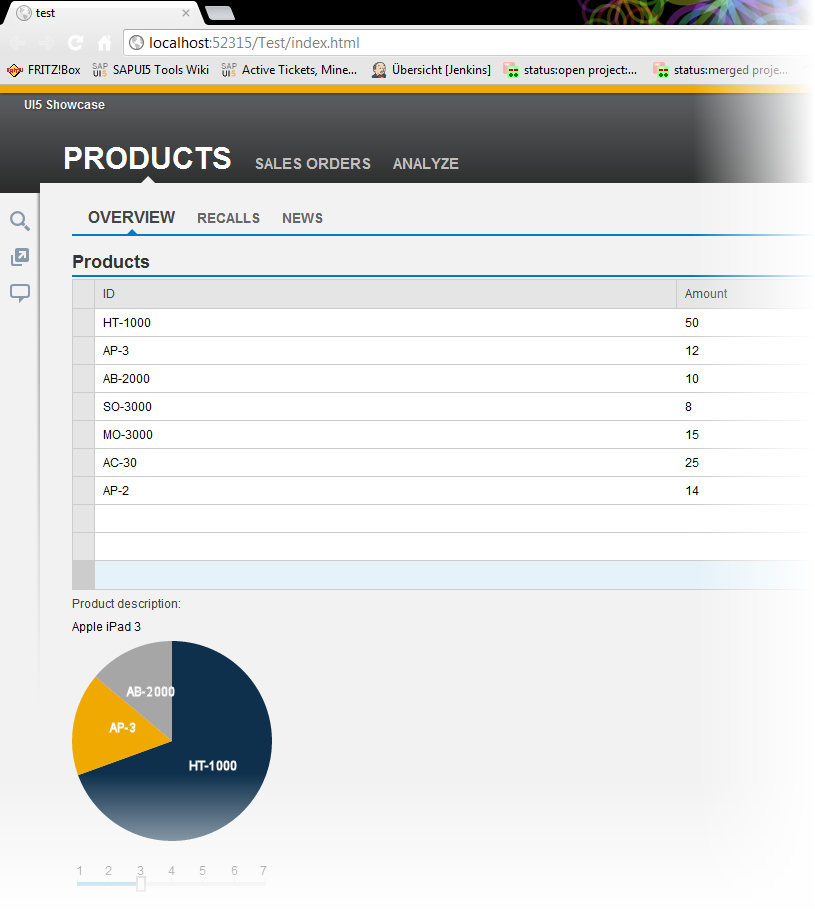

<!-- loiob43514f9e7a94650a7affddd9056fb35 -->

| loio |
| -----|
| b43514f9e7a94650a7affddd9056fb35 |

view on: [demo kit nightly build](https://openui5nightly.hana.ondemand.com/#/topic/b43514f9e7a94650a7affddd9056fb35) | [demo kit latest release](https://openui5.hana.ondemand.com/#/topic/b43514f9e7a94650a7affddd9056fb35)

## SAPUI5 Snippets

SAPUI5 snippets are templates and examples on how to use the SAPUI5 runtime and controls.

***

You can add SAPUI5-specific code parts, so called SAPUI5snippets. SAPUI5 snippets are available as prepared HTML pages with no separation between model, view and, controller \(MVC\). They are generated during startup of the Eclipse runtime.

1.  To open the *Snippets* view, proceed as follows:

    1.  Choose *Window* \> *Show View* \> *Other...*.

    2.  In the **Show View** dialog, choose *General* \> *Snippets*, and confirm you selection with *Open*.

    The *Snippet* view opens.

    

2.  To insert a snippet, proceed as follows:

    1.  Open the `index.html` of your application project in the HTML editor.

        

    2.  Delete all content.

    3.  To insert the snippet code, double click the snippet, or use drag&drop.

        

    4.  Save the code, and run it in the integrated browser.

        

        > Note:
        > If you have problems with incorrectly rendered pages, open the external browser.
        > 
        > 

***

The page should then be displayed correctly:

