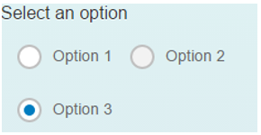
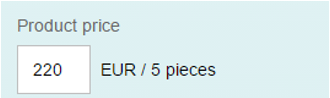

<!-- loio33fae3482358438e93daea5232527093 -->

| loio |
| -----|
| 33fae3482358438e93daea5232527093 |

<div id="loio">

view on: [demo kit nightly build](https://openui5nightly.hana.ondemand.com/#/topic/33fae3482358438e93daea5232527093) | [demo kit latest release](https://openui5.hana.ondemand.com/#/topic/33fae3482358438e93daea5232527093)</div>

## Screen Reader Support

OpenUI5 application developers need to be aware of how the screen reader reads out the contents of the UI. Labels, headings and descriptions help you describe the contents and visual elements of an application.

***

### General Recommendations

The following rules and guidelines will help you avoid common pitfalls and show you best practices. You still need to be aware that there may be deviations between the interpretation of the markup by the different screen readers.

***

#### Generate valid HTML

The screen reader software gets the information about the page directly from the DOM. Therefore, if the DOM is invalid, the information presented to the user might be invalid as well. Ideally, if the DOM is correct, the screen reader software will interpret it correctly. When you need to create new controls or change the HTML structure of existing ones for some reason, you have to check the validity of the resulting HTML.

***

#### Use titles for complex components

Complex controls like pages, panels and tables need a title to summarize the contents they hold. If you use the standalone `Title` control, make sure that it is associated with the element that needs the title.

> Note:
> ```
> <mvc:View
>       xmlns:mvc="sap.ui.core.mvc"
>       xmlns="sap.m">
>    **<Title id="rbGroupTitle" text="Select an option" textAlign="Center"/\>
> **
>    <RadioButtonGroup columns="2" selectedIndex="2" **ariaLabelledBy="rbGroupTitle"**>
>       <buttons>
>          <RadioButton id="RB2-1" text="Option 1"/>
>          <RadioButton id="RB2-2" text="Option 2" editable="false"/>
>          <RadioButton id="RB2-3" text="Option 3"/>
>       </buttons>
>    </RadioButtonGroup>
> </mvc:View>
> 
> ```
> 
> 

**Result:**



***

#### Use labels

Make sure that all edit boxes, search fields and column headers have labels. If not, use the `Label` control and add one. Labels have to be connected to each control, for example by using one of the following:

-   `labelFor=”…”`

-   `aria-label=”…”`

-   `aria-labelledby=”…”`

-   `placeholder=”…”`

-   `title=”…”`


***

#### Titles in headings

For headings \(table toolbar, page header, form toolbar, panel toolbar\) the text should be in a `sap.m.Title` control \(make sure that it is associated with the element that needs the title and, if not, add the reference using `aria-labelledby`\).

> Note:
> ```
> <mvc:View
>       xmlns:mvc="sap.ui.core.mvc"
>       xmlns="sap.m">
>    <Panel expandable="true">
>       <headerToolbar>
>          <Toolbar height="3rem">
>            ** <Title text="Header"/\>
> **
>             <ToolbarSpacer/>
>             <Button icon="sap-icon://settings"/>
>             <Button icon="sap-icon://drop-down-list"/>
>          </Toolbar>
>       </headerToolbar>
>       <content>
>          <Text text="Lorem ipsum"/>
>       </content>
>    </Panel>
> </mvc:View>
> 
> 
> ```
> 
> 

***

#### Labels and descriptions for input controls

When using the `Input` control, always provide a label \(make sure it is connected with the input\). You can also use the `description` property to add additional information. For the input, the description is usually used for showing the unit of measurement \(for example. "EUR"\).

> Note:
> ```
> <mvc:View
>    xmlns:l="sap.ui.layout"
>    xmlns:mvc="sap.ui.core.mvc"
>    xmlns="sap.m">
>    <l:VerticalLayout
>       class="sapUiContentPadding"
>       width="100%">
>       <l:content>
>          <Label text="Product price" labelFor="productPriceInput"/>
>          <Input
>             id="productPriceInput"
>             value="220"
>             description="EUR / 5 pieces"
>             width="200px"
>             fieldWidth="60px" />
>       </l:content>
>    </l:VerticalLayout>
> </mvc:View>
> 
> ```
> 
> 

**Result:**



***

#### Empty labels in drop-down lists

In some cases, you may need to provide an empty option in a drop-down field such as `Select`. This way you want to indicate that none of the items in the drop-down is applicable, or offer the empty option as a way to clear the selection. In this case, you should properly label the empty option with *\(None\)* and not leave it blank.

The labelling on the empty option will be read by the screen reader and the end-user will be correctly informed about the semantics of the empty option.

> Note:
> The empty label *\(None\)* should always be the first item in the drop-down.
> 
> 

***

### Tips for Testing

Start a screen reader, start the application, walk through the application using the keyboard and listen. For example, you can also use *Virtual Cursor mode* or similar functions of your screen reader because some elements do not need to have the focus to be readable by screen readers.

-   Is everything that you need to use the application read correctly?

    -   Each element’s role, name, state, label, tooltip, further information \(attached errors, usage hints\)?

    -   Is this the case for interactive and semantic/non-semantic elements?

    -   Actively check that all visible UI elements are read.

-   Is it read correctly?

    -   No duplicates?

    -   No strange pronunciation, like reading English with German words or vice versa?

    -   No nonsense, wrong values, another element’s attributes?

-   Are screen updates like application messages, dialogs \(popups\) and similar dynamic content read correctly and at the right time?


