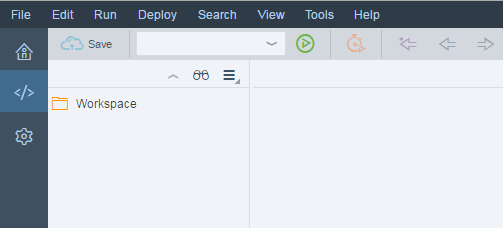

<!-- loio213a69ca0f5949bfb29d0715ed95084a -->

| loio |
| -----|
| 213a69ca0f5949bfb29d0715ed95084a |

view on: [demo kit nightly build](https://openui5nightly.hana.ondemand.com/#/topic/213a69ca0f5949bfb29d0715ed95084a) | [demo kit latest release](https://openui5.hana.ondemand.com/#/topic/213a69ca0f5949bfb29d0715ed95084a)

## Start SAP Web IDE

Initial Steps in SAP Web IDE

***

1.  Open SAP Web IDE and wait until the initialization has finished.

    When you start it for the first time, you will see a home screen containing more information about SAP Web IDE.

2.  Change to the *Development* perspective by clicking the icon with the code symbol on the left sidebar.

    You now see a folder list with an entry *Workspace* on the left side and an empty code editor on the right side.

      

3.  Create your project within the *Workspace* folder by choosing *File* \> *New* \> *Folder* from the menu or * Ctrl Alt Shift N *. Enter, for example, `myProject` as the folder name.

