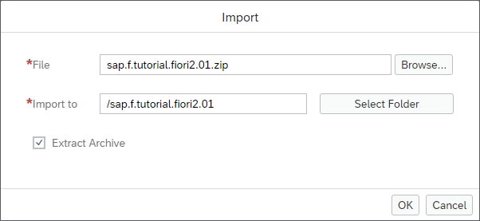
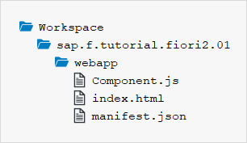

<!-- loio59b772bfac5241b89c16b12395c1116c -->

| loio |
| -----|
| 59b772bfac5241b89c16b12395c1116c |

view on: [demo kit nightly build](https://openui5nightly.hana.ondemand.com/#/topic/59b772bfac5241b89c16b12395c1116c) | [demo kit latest release](https://openui5.hana.ondemand.com/#/topic/59b772bfac5241b89c16b12395c1116c)

## Step 1: Setting Up the Initial App

We start by setting up a basic OpenUI5 app for this tutorial.

The structure in this step will be used throughout the rest of this tutorial. The basic OpenUI5 app created in this step will be extended in the subsequent steps to illustrate the main features of an SAP Fiori 2.0 app.

***

<a name="loio59b772bfac5241b89c16b12395c1116c__section_kbt_wfv_mbb"/>

### Prerequisites

You have set up your SAP Web IDE as described under [App Development Using SAP Web IDE](App_Development_Using_SAP_Web_IDE_13ced94.md).

> Note:
> If your preferred development environment is not SAP Web IDE, you can skip the instructions below and set up your project for this tutorial by directly downloading the files for the initial app from the *Samples* in the Demo Kit at [SAP Fiori 2.0 App - Step 1](https://openui5.hana.ondemand.com/#/sample/sap.f.tutorial.fiori2.01/preview). Copy the code to your workspace and make sure that the app runs by calling the `webapp/index.html` file.
> 
> 

***

<a name="loio59b772bfac5241b89c16b12395c1116c__section_ed2_4dd_lbb"/>

### Preview

   
  
The basic OpenUI5 app<a name="loio59b772bfac5241b89c16b12395c1116c__fig_r1j_pst_mr"/>

  

***

<a name="loio59b772bfac5241b89c16b12395c1116c__section_wsp_qvv_mbb"/>

### Create the Initial App Using the SAP Web IDE Import Functionality

1.  Download the code for the initial app from the *Samples* in the Demo Kit at [SAP Fiori 2.0 App - Step 1](https://openui5.hana.ondemand.com/#/sample/sap.f.tutorial.fiori2.01/preview).

2.  Launch SAP Web IDE.

3.  Choose *File* \> *Import* \> *File or Project*

4.  Choose *Browse* and select the downloaded **`sap.f.tutorial.fiori2.01.zip`** file, then choose *Open*.

    

5.  Make sure *Extract Archive* is checked and choose *OK*.

    A new folder **`sap.ui.demo.fiori2.01`** is now available in your local workspace. It contains the following files and folders of the initial app:

    

6.  Run the app by selecting the *webapp* folder and then *Run* \> *Run as* \> *Web Application*. Keep in mind that there is no content yet and the app appears as an empty page.

From now on, you can quickly run the app by selecting the root folder **`sap.ui.demo.fiori2`** of your project in SAP Web IDE and pressing the *Run* button. The system will automatically use the option from the *Run* menu that you chose last \(in this case, the *Run index.html* option\).

