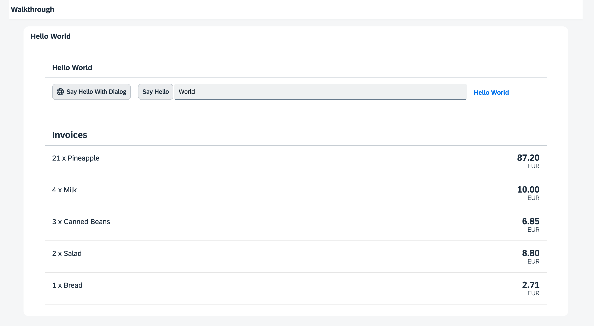

<!-- loio0dad01aa741c49508b74082dd9f8c9af -->

| loio |
| -----|
| 0dad01aa741c49508b74082dd9f8c9af |

<div id="loio">

view on: [demo kit nightly build](https://sdk.openui5.org/nightly/#/topic/0dad01aa741c49508b74082dd9f8c9af) | [demo kit latest release](https://sdk.openui5.org/topic/0dad01aa741c49508b74082dd9f8c9af)</div>

## Step 20: Data Types \(TypeScript\)

The list of invoices is already looking nice, but what is an invoice without a price assigned? Typically prices are stored in a technical format and with a '`.`' delimiter in the data model. For example, our invoice for pineapples has the calculated price `87.2` without a currency. We are going to use the OpenUI5 data types to format the price properly, with a locale-dependent decimal separator and two digits after the separator.

***

### Preview

  
  
**The list of invoices with prices and number units**



***

<a name="loio0dad01aa741c49508b74082dd9f8c9af__section_wqj_flk_syb"/>

### Coding

You can view all files at [OpenUI5 TypeScript Walkthrough - Step 20: Data Types](https://github.com/sap-samples/ui5-typescript-walkthrough/tree/main/steps/20) and [download the solution as a zip file](https://sap-samples.github.io/ui5-typescript-walkthrough/ui5-typescript-walkthrough-step-20.zip).

***

<a name="loio0dad01aa741c49508b74082dd9f8c9af__section_ol1_zfz_nzb"/>

### webapp/controller/InvoiceList.controller.ts \(New\)

We want to display in our list view the price in Euro, and typically the currency is part of our data model in the back end. Here this is not the case, so we need to define it directly in the app. We therefore create a controller for the invoice list and define a view model for the currency code for Euro. It is a simple JSON model with just one key `currency` and the value `EUR`.

```js
*import Controller from "sap/ui/core/mvc/Controller";
import JSONModel from "sap/ui/model/json/JSONModel";

/**
 * @namespace ui5.walkthrough.controller
 */
export default class App extends Controller {
    
    onInit(): void {
        const viewModel = new JSONModel({
            currency: "EUR"
        });
        this.getView()?.setModel(viewModel, "view");        
    } 
};
```

***

<a name="loio0dad01aa741c49508b74082dd9f8c9af__section_xqj_flk_syb"/>

### webapp/view/InvoiceList.view.xml

We add a reference to the invoice list controller to the view to get access to the view model we defined in the controller.

We add a price and the currency to our invoices list in the view by adding the `number` attribute to the `ObjectListItem` control, then we apply the currency data type on the number by setting the `type` attribute of the binding syntax to `sap.ui.model.type.Currency`. The `Currency` type handles the formatting of the price for us based on the currency code. In our case, the price is displayed with 2 decimals.

Additionally, we set the formatting option `showMeasure` to `false`. This hides the currency code in the property `number`, because it is passed on to the `ObjectListItem` control as a separate property `numberUnit`.

```xml
<mvc:View
    controllerName="ui5.walkthrough.controller.InvoiceList"
    xmlns="sap.m"
    xmlns:mvc="sap.ui.core.mvc">
    <List
        headerText="{i18n>invoiceListTitle}"
        class="sapUiResponsiveMargin"
        width="auto"
        items="{invoice>/Invoices}">
        <items>
            <ObjectListItem
                title="{invoice>Quantity} x {invoice>ProductName}"
                number="{
                    parts: [
                        'invoice>ExtendedPrice',
                        'view>/currency'
                    ],
                    type: 'sap.ui.model.type.Currency',
                    formatOptions: {
                        showMeasure: false
                    }
                }"
                numberUnit="{view>/currency}"/>
        </items>
    </List>
</mvc:View>
```

As you can see above, we use a special binding syntax for the `number` property of the `ObjectListItem`. This binding syntax makes use of so-called "Calculated Fields", which allows the binding of multiple properties from different models to a single property of a control. The properties bound from different models are called “parts”. In the example above, the property of the control is `number` and the bound properties \(“parts”\) retrieved from two different models are `invoice>ExtendedPrice` and `view>/currency`.

***

### Conventions

Use data types instead of custom formatters whenever possible.

**Parent topic:**[Walkthrough Tutorial \(TypeScript\)](Walkthrough_Tutorial_TypeScript_dad1905.md "In this tutorial we'll introduce you to all major development paradigms of OpenUI5. We'll demonstrate the use of TypeScript with OpenUI5 and highlight the specific characteristics of this approach.")

**Next:**[Step 19: Aggregation Binding \(TypeScript\)](Step_19_Aggregation_Binding_TypeScript_24580fb.md "Now that we have established a good structure for our app, it's time to add some more functionality. We start exploring more features of data binding by adding some invoice data in JSON format that we display in a list below the panel.")

**Previous:**[Step 21: Expression Binding \(TypeScript\)](Step_21_Expression_Binding_TypeScript_8d67ba2.md "Sometimes the predefined types of OpenUI5 are not flexible enough and you want to do a simple calculation or formatting in the view - that is where expressions are really helpful. We use them to format our price according to the current number in the data model.")

**Related Information**  


[Composite Binding](Composite_Binding_a2fe8e7.md "Calculated fields enable the binding of multiple properties in different models to a single property of a control.")

[Formatting, Parsing, and Validating Data](Formatting_Parsing_and_Validating_Data_07e4b92.md "Data that is presented on the UI often has to be converted so that is human readable and fits to the locale of the user. On the other hand, data entered by the user has to be parsed and validated to be understood by the data source. For this purpose, you use formatters and data types.")

[API Reference: `sap.ui.base.ManagedObject`](https://sdk.openui5.org/api/sap.ui.base.ManagedObject)

[API Reference: `sap.ui.base.ManagedObject.PropertyBindingInfo`](https://sdk.openui5.org/api/sap.ui.base.ManagedObject.PropertyBindingInfo)

[API Reference: `sap.ui.model.type`](https://sdk.openui5.org/api/sap.ui.model.type)

[API Reference: `sap.ui.model.type.Currency`](https://sdk.openui5.org/api/sap.ui.model.type.Currency)

[Samples: `sap.ui.model.type.Currency` ](https://sdk.openui5.org/entity/sap.ui.model.type.Currency)

