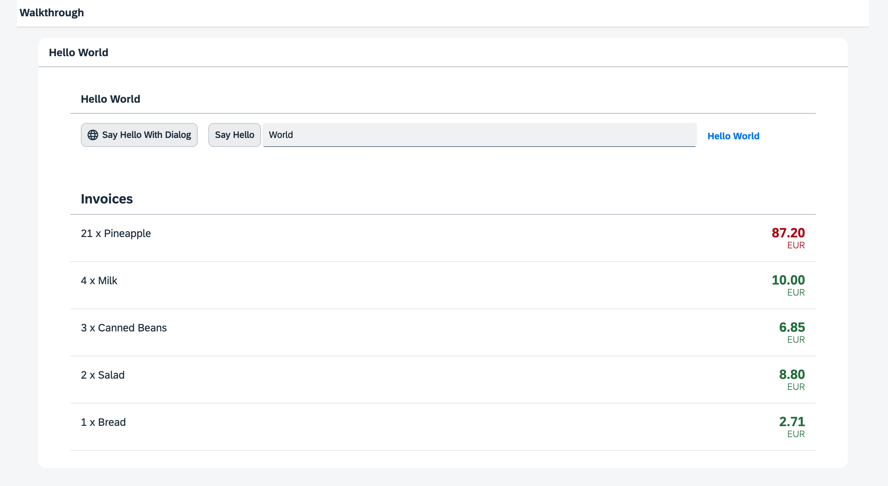

<!-- loio8d67ba2cc18c484fa529de855596982a -->

| loio |
| -----|
| 8d67ba2cc18c484fa529de855596982a |

<div id="loio">

view on: [demo kit nightly build](https://sdk.openui5.org/nightly/#/topic/8d67ba2cc18c484fa529de855596982a) | [demo kit latest release](https://sdk.openui5.org/topic/8d67ba2cc18c484fa529de855596982a)</div>

## Step 21: Expression Binding \(TypeScript\)

Sometimes the predefined types of OpenUI5 are not flexible enough and you want to do a simple calculation or formatting in the view - that is where expressions are really helpful. We use them to format our price according to the current number in the data model.

***

### Preview

  
  
**The price is now formatted according to its number**



***

<a name="loio8d67ba2cc18c484fa529de855596982a__section_uzp_rmk_syb"/>

### Coding

You can view all files at [OpenUI5 TypeScript Walkthrough - Step 21: Expression Binding](https://github.com/sap-samples/ui5-typescript-walkthrough/steps/21/README.md).

***

<a name="loio8d67ba2cc18c484fa529de855596982a__section_vzp_rmk_syb"/>

### webapp/view/InvoiceList.view.xml

We add the `numberState` attribute to the `ObjectListItem` control invoices list view. We use the `=` symbol to initiate an expression binding and specify that the number in `numberState` appears in red if the price is greater than 50, otherwise in green.

```xml
<mvc:View
    controllerName="ui5.walkthrough.controller.InvoiceList"
    xmlns="sap.m"
    xmlns:mvc="sap.ui.core.mvc">
    <List
        headerText="{i18n>invoiceListTitle}"
        class="sapUiResponsiveMargin"
        width="auto"
        items="{invoice>/Invoices}">
        <items>
            <ObjectListItem
                title="{invoice>Quantity} x {invoice>ProductName}"
                number="{
                    parts: [
                        'invoice>ExtendedPrice',
                        'view>/currency'
                    ],
                    type: 'sap.ui.model.type.Currency',
                    formatOptions: {
                        showMeasure: false
                    }
                }"
                numberUnit="{view>/currency}"
                numberState="{= ${invoice>ExtendedPrice} > 50 ? 'Error' : 'Success' }"/>
        </items>
    </List>
</mvc:View>
```

Expression binding can do simple calculation logic like the ternary operator shown here.

The condition of the operator is a value from our data model. A model binding inside an expression binding has to be escaped with the `$` sign as you can see in the code. We set the state to "Error" \(the number will appear in red\) if the price is higher than 50 and to "Success" \(the number will appear in green\) otherwise.

Expressions are limited to a particular set of operations that help formatting the data such as Math expression, comparisons, and such. You can look up the possible operations in the [documentation](Expression_Binding_daf6852.md).

***

### Conventions

-   Only use expression binding for trivial calculations.


**Parent topic:**[Walkthrough Tutorial \(TypeScript\)](Walkthrough_Tutorial_TypeScript_dad1905.md "In this tutorial we'll introduce you to all major development paradigms of OpenUI5. We'll demonstrate the use of TypeScript with OpenUI5 and highlight the specific characteristics of this approach.")

**Next:**[Step 20: Data Types \(TypeScript\)](Step_20_Data_Types_TypeScript_0dad01a.md "The list of invoices is already looking nice, but what is an invoice without a price assigned? Typically prices are stored in a technical format and with a '.' delimiter in the data model. For example, our invoice for pineapples has the calculated price 87.2 without a currency. We are going to use the OpenUI5 data types to format the price properly, with a locale-dependent decimal separator and two digits after the separator.")

**Previous:**[Step 22: Custom Formatters \(TypeScript\)](Step_22_Custom_Formatters_TypeScript_61d4e2b.md "If we want to do a more complex logic for formatting properties of our data model, we can also write a custom formatting function. We will now add a localized status with a custom formatter, because the status in our data model is in a rather technical format.")

**Related Information**  


[Expression Binding](Expression_Binding_daf6852.md "Expression binding is an enhancement of the OpenUI5 binding syntax, which allows for providing expressions instead of custom formatter functions.")

