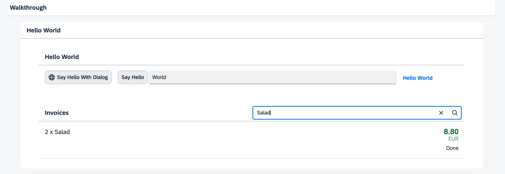

<!-- loio7f02e9d71b0f41749a4e5df2b73cb2dd -->

| loio |
| -----|
| 7f02e9d71b0f41749a4e5df2b73cb2dd |

<div id="loio">

view on: [demo kit nightly build](https://sdk.openui5.org/nightly/#/topic/7f02e9d71b0f41749a4e5df2b73cb2dd) | [demo kit latest release](https://sdk.openui5.org/topic/7f02e9d71b0f41749a4e5df2b73cb2dd)</div>

## Step 23: Filtering \(TypeScript\)

In this step, we add a search field for our product list and define a filter that represents the search term. When searching, the list is automatically updated to show only the items that match the search term.

***

### Preview

  
  
**A search field is displayed above the list**



***

<a name="loio7f02e9d71b0f41749a4e5df2b73cb2dd__section_qx5_wch_ycb"/>

### Coding

You can view all files at [OpenUI5 TypeScript Walkthrough - Step 23: Filtering](https://github.com/sap-samples/ui5-typescript-walkthrough/tree/main/steps/23) and [download the solution as a zip file](https://sap-samples.github.io/ui5-typescript-walkthrough/ui5-typescript-walkthrough-step-23.zip).

***

<a name="loio7f02e9d71b0f41749a4e5df2b73cb2dd__section_s2c_dsz_nzb"/>

### webapp/controller/InvoiceList.controller.js

In the controller of the invoice list view we add a new `onFilterInvoices` event handler function with an `event` of type `SearchField$SearchEvent` as import parameter.

The search field defines a parameter `query` that we access by calling `getParameter("query")` on the `event` parameter.

If the query is not empty, we add a new filter object that searches in the `ProductName` for a given query string with filter operator `Contains`. The filter operator `FilterOperator.Contains` is **not** case-sensitive.

We get the invoice list by asking the view for the control with the ID "invoiceList". To achieve this, we make use of the helper function `byId`. On the list control we access the binding of the `items` aggregation to filter it with our newly constructed filter object. This will automatically filter the list by our search string, so that only the matching items are shown when the search is triggered.

If the query is empty, we filter the binding with an empty array. This makes sure that we see all list elements again. We could also add more filters to the array if we wanted to search more than one data field.

```js
import Controller from "sap/ui/core/mvc/Controller";
import JSONModel from "sap/ui/model/json/JSONModel";
import formatter from "../model/formatter";
import { SearchField$SearchEvent } from "sap/m/SearchField";
import Filter from "sap/ui/model/Filter";
import FilterOperator from "sap/ui/model/FilterOperator";
import ListBinding from "sap/ui/model/ListBinding";


/**
 * @namespace ui5.walkthrough.controller
 */
export default class App extends Controller {
    public formatter = formatter;
    onInit(): void {
        const viewModel = new JSONModel({
            currency: "EUR"
        });
        this.getView()?.setModel(viewModel, "view");        
    }

    onFilterInvoices(event: SearchField$SearchEvent): void {
        // build filter array
        const filter = [];
        const query = event.getParameter("query");
        if (query) {
            filter.push(new Filter("ProductName", FilterOperator.Contains, query));
        }
        // filter binding
        const list = this.byId("invoiceList");
        const binding = <ListBinding> list?.getBinding("items");
        binding?.filter(filter);
    }

};
```

***

<a name="loio7f02e9d71b0f41749a4e5df2b73cb2dd__section_rx5_wch_ycb"/>

### webapp/view/InvoiceList.view.xml

First, we specify "invoiceList" as an ID for the list control, so the event handler function `onFilterInvoices` we added to the controller of the invoice list view can identify the list when triggered.

We then remove the `headerText` property in the list control and use the `headerToolbar` aggregation with the `sap.m.Toolbar` assigned to it instead.. A toolbar control is way more flexible and can be adjusted as you like. To the toolbar control we add an `sap.m.Title` control displaying the title in the text attribute, a spacer, and the `sap.m.SearchField` with the width property set to 50% and the filter event handler function we defined in the controller assigned to the search event.

```xml
<mvc:View
   controllerName="ui5.walkthrough.controller.InvoiceList"
   xmlns="sap.m"
   xmlns:mvc="sap.ui.core.mvc">
   <List
      id="invoiceList"
      class="sapUiResponsiveMargin"
      width="auto"
      items="{invoice>/Invoices}" >
      <headerToolbar>
         <Toolbar>
            <Title text="{i18n>invoiceListTitle}"/>
            <ToolbarSpacer/>
            <SearchField 
               width="50%" 
               search=".onFilterInvoices"/>
         </Toolbar>
      </headerToolbar>
      ...
</mvc:View>
```

The search field is part of the list header, and therefore each change on the list binding will trigger a rerendering of the whole list, including the search field.

**Parent topic:**[Walkthrough Tutorial \(TypeScript\)](Walkthrough_Tutorial_TypeScript_dad1905.md "In this tutorial we'll introduce you to all major development paradigms of OpenUI5. We'll demonstrate the use of TypeScript with OpenUI5 and highlight the specific characteristics of this approach.")

**Next:**[Step 22: Custom Formatters \(TypeScript\)](Step_22_Custom_Formatters_TypeScript_61d4e2b.md "If we want to do a more complex logic for formatting properties of our data model, we can also write a custom formatting function. We will now add a localized status with a custom formatter, because the status in our data model is in a rather technical format.")

**Previous:**[Step 24: Sorting and Grouping \(TypeScript\)](Step_24_Sorting_and_Grouping_TypeScript_86bbe13.md "To make our list of invoices even more user-friendly, we sort it alphabetically instead of just showing the order from the data model. Additionally, we introduce groups and add the company that ships the products so that the data is easier to consume.")

**Related Information**  


[API Reference: `sap.ui.model.Filter`](https://sdk.openui5.org/api/sap.ui.model.Filter)

[API Reference: `sap.ui.model.FilterOperator`](https://sdk.openui5.org/api/sap.ui.model.FilterOperator)

[API Reference: `sap.m.SearchField`](https://sdk.openui5.org/api/sap.m.SearchField)

