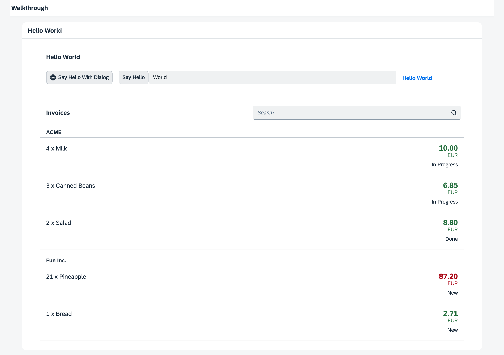

<!-- loio86bbe132b9924c8496b70824af94a209 -->

| loio |
| -----|
| 86bbe132b9924c8496b70824af94a209 |

<div id="loio">

view on: [demo kit nightly build](https://sdk.openui5.org/nightly/#/topic/86bbe132b9924c8496b70824af94a209) | [demo kit latest release](https://sdk.openui5.org/topic/86bbe132b9924c8496b70824af94a209)</div>

## Step 24: Sorting and Grouping \(TypeScript\)

To make our list of invoices even more user-friendly, we sort it alphabetically instead of just showing the order from the data model. Additionally, we introduce groups and add the company that ships the products so that the data is easier to consume.

***

### Preview

  
  
**The list is now sorted and grouped by the shipping company**



***

<a name="loio86bbe132b9924c8496b70824af94a209__section_sxl_41l_syb"/>

### Coding

You can view all files at [OpenUI5 TypeScript Walkthrough - Step 24: Sorting and Grouping](https://github.com/sap-samples/ui5-typescript-walkthrough/steps/24/README.md).

***

<a name="loio86bbe132b9924c8496b70824af94a209__section_txl_41l_syb"/>

### webapp/view/InvoiceList.view.xml

We add a declarative sorter to the binding syntax of the list control. We transform the simple binding syntax to the object notation, specify the path to the data, and now add an additional `sorter` property. In the path of the sorter, we specify that the invoice items should be sorted by product name, and OpenUI5 will take care of the rest.

```xml
<mvc:View
   controllerName="ui5.walkthrough.controller.InvoiceList"
   xmlns="sap.m"
   xmlns:mvc="sap.ui.core.mvc">
   <List
      id="invoiceList"
      class="sapUiResponsiveMargin"
      width="auto"
      items="{
         path : 'invoice>/Invoices',
         sorter : {
            path : 'ProductName' 
         }
      }" >
      ...
   </List>
</mvc:View>
```

By default, the sorting is ascending, but you could also add a property `descending` with the value `true` inside the sorter property to change the sorting order.

If we run the app now we can see a list of invoices sorted by the name of the products.

***

### webapp/view/InvoiceList.view.xml

We modify the view and and change the sorter so the path addresses the `ShipperName` data field instead of `ProductName`. This groups the invoice items by the shipping company. In addition, we set the sorter attribute `group` to `true`.

As with the sorter, no further action is required. The list and the data binding features of OpenUI5 will do the trick to display group headers automatically and categorize the items in the groups.

```xml
<mvc:View
    controllerName="ui5.walkthrough.controller.InvoiceList"
    xmlns="sap.m"
    xmlns:mvc="sap.ui.core.mvc">
    <List
        id="invoiceList"
        headerText="{i18n>invoiceListTitle}"
        class="sapUiResponsiveMargin"
        width="auto"
        items="{
            path : 'invoice>/Invoices',
            sorter : {
                path : 'ShipperName',
                group : true
            }

        }">
        ...
    </List>
</mvc:View>
```

We could define a custom group header factory if we wanted by setting the `groupHeaderFactory` property, but the result looks already fine.

**Parent topic:**[Walkthrough Tutorial \(TypeScript\)](Walkthrough_Tutorial_TypeScript_dad1905.md "In this tutorial we'll introduce you to all major development paradigms of OpenUI5. We'll demonstrate the use of TypeScript with OpenUI5 and highlight the specific characteristics of this approach.")

**Next:**[Step 23: Filtering \(TypeScript\)](Step_23_Filtering_TypeScript_7f02e9d.md "In this step, we add a search field for our product list and define a filter that represents the search term. When searching, the list is automatically updated to show only the items that match the search term.")

**Previous:**[Step 25: Remote OData Service \(TypeScript\)](Step_25_Remote_OData_Service_TypeScript_b68d321.md "So far we have worked with local JSON data, but now we will access a real OData service to visualize remote data.")

**Related Information**  


[API Reference: `sap.ui.model.Sorter`](https://sdk.openui5.org/api/sap.ui.model.Sorter)

[Sample: List - Grouping](https://sdk.openui5.org/entity/sap.m.List/sample/sap.m.sample.ListGrouping)

