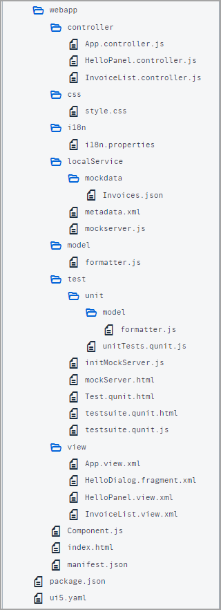

<!-- loioe1ce1de315994a02bf162f4b3b5a9f09 -->

| loio |
| -----|
| e1ce1de315994a02bf162f4b3b5a9f09 |

<div id="loio">

view on: [demo kit nightly build](https://sdk.openui5.org/nightly/#/topic/e1ce1de315994a02bf162f4b3b5a9f09) | [demo kit latest release](https://sdk.openui5.org/topic/e1ce1de315994a02bf162f4b3b5a9f09)</div>

## Step 27: Unit Test with QUnit

Now that we have a test folder in the app, we can start to increase our test coverage.

Actually, every feature that we added to the app so far, would require a separate test case. We have totally neglected this so far, so let’s add a simple unit test for our custom formatter function from Step 23. We will test if the long text for our status is correct by comparing it with the texts from our resource bundle.

> ### Note:  
> In this tutorial, we focus on a simple use case for the test implementation. If you want to learn more about QUnit tests, have a look at our [Testing Tutorial](Testing_Tutorial_291c912.md) tutorial, especially [Step 2: A First Unit Test](Step_2_A_First_Unit_Test_b81736e.md).

***

### Preview

  
  
**A unit test for our formatters is now available**


***

### Coding

You can view and download all files at [Walkthrough - Step 27](https://sdk.openui5.org/entity/sap.m.tutorial.walkthrough/sample/sap.m.tutorial.walkthrough.27).

  
  
**Folder Structure for this Step**



We add a new folder `unit` under the `test` folder and a `model` subfolder where we will place our formatter unit test. The folder structure matches the app structure to easily find the corresponding unit tests.

***

### webapp/test/unit/model/formatter.js \(New\)

```js
sap.ui.define([
	"ui5/walkthrough/model/formatter",
	"sap/ui/model/resource/ResourceModel",
], (formatter, ResourceModel) => {
	"use strict";

	QUnit.module("Formatting functions", {});

	QUnit.test("Should return the translated texts", (assert) => {
        const oResourceModel = new ResourceModel({
            bundleUrl: sap.ui.require.toUrl("ui5/walkthrough/i18n/i18n.properties"),
            supportedLocales: [
                ""
            ],
            fallbackLocale: ""
        });

        const oControllerMock = {
            getOwnerComponent() {
                return {
                    getModel() {
                        return oResourceModel;
                    }
                };
            }
        };

        const fnIsolatedFormatter = formatter.statusText.bind(oControllerMock);

        // Assert
        assert.strictEqual(fnIsolatedFormatter("A"), "New", "The long text for Status A is correct");
        assert.strictEqual(fnIsolatedFormatter("B"), "In Progress", "The long text for Status B is correct");
        assert.strictEqual(fnIsolatedFormatter("C"), "Done", "The long text for Status C is correct");
        assert.strictEqual(fnIsolatedFormatter("Foo"), "Foo", "The long text for Status Foo is correct");
	});
});
```

We create a new `formatter.js` file under `webapp/test/unit/model` where the unit test for the custom formatter is implemented. The `formatter` file that we want to test is loaded as a dependency.

The formatter file just contains one QUnit module for our formatter function and one unit test for the formatter function. In the implementation of the `statusText` function that we created in Step 23, we use the translated texts when calling the formatter. As we do not want to test the UI5 binding functionality, we just use text in the test instead of a `ResourceBundle`.

Finally, we perform our assertions. We check each branch of the formatter logic by invoking the isolated formatter function with the values that we expect in the data model \(`A`, `B`, `C`, and everything else\). We strictly compare the result of the formatter function with the hard-coded strings that we expect from the resource bundle and give a meaningful error message if the test should fail.

***

<a name="loioe1ce1de315994a02bf162f4b3b5a9f09__section_gnt_54c_yfb"/>

### webapp/test/unit/unitTests.qunit.html \(New\)

```html
<!DOCTYPE html>
<html>
<head>
	<title>Unit tests for UI5 Walkthrough</title>
	<meta charset="utf-8">

	<script
		id="sap-ui-bootstrap"
		src="../../resources/sap-ui-core.js"
		data-sap-ui-resourceroots='{
			"ui5.walkthrough": "../../"
		}'
		data-sap-ui-async="true">
	</script>

	<link rel="stylesheet" type="text/css" href="../../resources/sap/ui/thirdparty/qunit-2.css">

	<script src="../../resources/sap/ui/thirdparty/qunit-2.js"></script>
	<script src="../../resources/sap/ui/qunit/qunit-junit.js"></script>

	<script src="unitTests.qunit.js"></script>
</head>
<body>
	<div id="qunit"/>
	<div id="qunit-fixture"/>
</body>
</html>
```

The so-called QUnit test suite is an HTML page that triggers all QUnit tests for the application. Most of it is generating the layout of the result page that you can see in the preview and we won’t further explain these parts but focus on the application parts instead.

Let’s start with the namespaces. Since we are now in the `webapp/test/unit` folder, we actually need to go up two levels to get the `webapp` folder again. This namespace can be used inside the tests to load and trigger application functionality.

First, we load some basic QUnit functionality via script tags. Other QUnit tests can be added here as well. Then the HTML page loads another script called `unitTests.qunit.js`, which we will create next. This script will execute our formatter.

***

<a name="loioe1ce1de315994a02bf162f4b3b5a9f09__section_hnt_54c_yfb"/>

### webapp/test/unit/unitTests.qunit.js \(New\)

```js
QUnit.config.autostart = false;

sap.ui.require(["sap/ui/core/Core"], async(Core) => {
	"use strict";

	await Core.ready();

	sap.ui.require([
		"ui5/walkthrough/test/unit/model/formatter"
	], () => {
		QUnit.start();
	});
});
```

This script loads and executes our formatter. If we now open the `webapp/test/unit/unitTests.qunit.html` file in the browser, we should see our test running and verifying the formatter logic.

***

### Conventions

-   All unit tests are placed in the webapp/test/unit folder of the app.

-   Files in the test suite end with `*.qunit.html`.

-   The `unitTests.qunit.html` file triggers all unit tests of the app.

-   A unit test should be written for formatters, controller logic, and other individual functionality.

-   All dependencies are replaced by stubs to test only the functionality in scope.


**Parent topic:**[Walkthrough Tutorial](Walkthrough_Tutorial_3da5f4b.md "In this tutorial we will introduce you to all major development paradigms of OpenUI5.")

**Next:**[Step 26: Mock Server Configuration](Step_26_Mock_Server_Configuration_bae9d90.md "We just ran our app against a real service, but for developing and testing our app we do not want to rely on the availability of the “real” service or put additional load on the system where the data service is located.")

**Previous:**[Step 28: Integration Test with OPA](Step_28_Integration_Test_with_OPA_9bf4dce.md "If we want to test interaction patterns or more visual features of our app, we can also write an integration test.")

**Related Information**  


[Unit Testing with QUnit](Unit_Testing_with_QUnit_09d145c.md "QUnit is a powerful, easy-to-use JavaScript unit testing framework. It is used by the jQuery, jQuery UI and jQuery Mobile projects and is capable of testing any generic JavaScript code. It supports asynchronous tests out-of-the-box.")

[QUnit Home Page](https://qunitjs.com/)

[Testing Tutorial](Testing_Tutorial_291c912.md "In this tutorial we will test application functionality with the testing tools that are delivered with OpenUI5. At different steps of this tutorial you will write tests using QUnit, OPA5, and the OData V2 mock server. Additionally, you will learn about testing strategies, Test Driven Development (TDD), and much more.")

