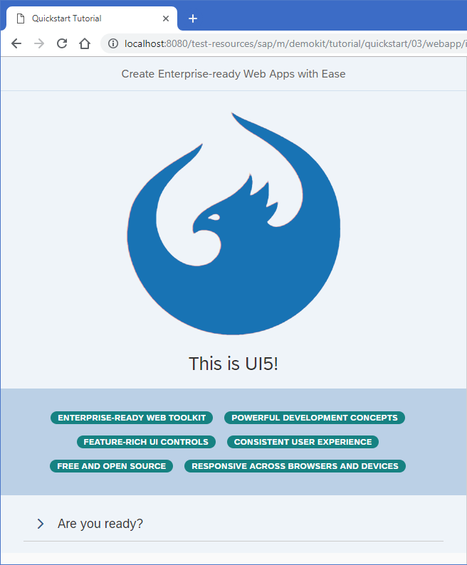

<!-- loio073d1073fc604beda94589d5c93b32e2 -->

| loio |
| -----|
| 073d1073fc604beda94589d5c93b32e2 |

<div id="loio">

view on: [demo kit nightly build](https://openui5nightly.hana.ondemand.com/#/topic/073d1073fc604beda94589d5c93b32e2) | [demo kit latest release](https://openui5.hana.ondemand.com/#/topic/073d1073fc604beda94589d5c93b32e2)</div>

## Step 3: Go!

Finally, we add a second page to our app showcasing some of the key OpenUI5 concepts.

***

### Preview

   
  
The second page shows plenty of UI controls and concepts to explore<a name="loio073d1073fc604beda94589d5c93b32e2__fig_hqz_2n3_1gb"/>

  

***

<a name="loio073d1073fc604beda94589d5c93b32e2__section_tph_kn3_1gb"/>

### Coding

You can view and download all files at [Quick Start - Step 3](https://openui5.hana.ondemand.com/#/sample/sap.m.tutorial.quickstart.03/preview).

***

<a name="loio073d1073fc604beda94589d5c93b32e2__section_cbq_4n3_1gb"/>

### webapp/index.html

``` html
<!DOCTYPE html>
<html>
<head>
	<meta charset="utf-8">
	<title>Quickstart Tutorial</title>
	<script id="sap-ui-bootstrap"
		src="../../../../../../../../resources/sap-ui-core.js"
		data-sap-ui-theme="sap_belize"
		data-sap-ui-libs="sap.m*HIGHLIGHT START*, sap.ui.layout, sap.tnt*HIGHLIGHT END*"
		data-sap-ui-resourceroots='{"Quickstart": "./"}'
		data-sap-ui-onInit="module:Quickstart/index"
		data-sap-ui-compatVersion="edge"
		data-sap-ui-async="true">
	</script>
</head>
<body class="sapUiBody" id="content"></body>
</html>
```

Let's spice up our app by adding some more UI controls. We add two more libraries in the bootstrap tag: `sap.ui.layout` and `sap.tnt`.

> Note:
> To browse all available controls and libraries, see the [Samples](https://openui5.hana.ondemand.com/#/controls). 
> 
> 

***

<a name="loio073d1073fc604beda94589d5c93b32e2__section_txk_n43_1gb"/>

### webapp/App.view.xml

``` xml
<mvc:View
	controllerName="Quickstart.App"
	displayBlock="true"
	xmlns="sap.m"
	xmlns:mvc="sap.ui.core.mvc"
	*HIGHLIGHT START*xmlns:l="sap.ui.layout"
	xmlns:core="sap.ui.core"
	xmlns:tnt="sap.tnt">*HIGHLIGHT END*
	<App *HIGHLIGHT START*id="app"*HIGHLIGHT END*>
		<Page title="My App">
			<Button
				*HIGHLIGHT START*icon="sap-icon://sap-ui5"
				text="Go!"*HIGHLIGHT END*
				press=".onPress"
				type="Emphasized"
				class="sapUiSmallMargin"/>
		</Page>
		*HIGHLIGHT START*<Page id="intro" title="Create Enterprise-ready Web Apps with Ease">
			<l:BlockLayout background="Light">
				<l:BlockLayoutRow>
					<l:BlockLayoutCell>
						<core:Icon color="#1873B4" src="sap-icon://sap-ui5" size="20rem" class="sapUiMediumMarginBottom" width="100%"/>
						<Title level="H1" titleStyle="H1" text="This is UI5!" width="100%" textAlign="Center"/>
					</l:BlockLayoutCell>
				</l:BlockLayoutRow>
				<l:BlockLayoutRow>
					<l:BlockLayoutCell>
						<FlexBox items="{/features}" justifyContent="Center" wrap="Wrap" class="sapUiSmallMarginBottom">
							<tnt:InfoLabel text="{}" class="sapUiSmallMarginTop sapUiSmallMarginEnd"/>
						</FlexBox>
					</l:BlockLayoutCell>
				</l:BlockLayoutRow>

				<l:BlockLayoutRow>
					<l:BlockLayoutCell>
						<Panel headerText="Are you ready?" expandable="true">
							<Switch change=".onChange" customTextOn="yes" customTextOff="no"/>
							<l:HorizontalLayout id="ready" visible="false" class="sapUiSmallMargin">
								<Text text="Ok, let's get you started!" class="sapUiTinyMarginEnd"/>
								<Link text="Learn more" href="https://openui5.hana.ondemand.com/"/>
							</l:HorizontalLayout>
						</Panel>
					</l:BlockLayoutCell>
				</l:BlockLayoutRow>
			</l:BlockLayout>
		</Page>
*HIGHLIGHT END*
	</App>
</mvc:View>
```

We also define the two new libraries in the `View` tag and give them a meaningful prefix. To the `App` control, we will assign an ID so that the controller can easily identify it.

The button now receives an icon and triggers our navigation to page two. Therefore, we change the text to "Go!".

Copy the second `Page` control with all its content into the view. It is defined with the `intro` ID and a new title. It contains several new UI controls like a `BlockLayout`, an `Icon`, and a `Panel`.

We use essential OpenUI5 concepts like navigation, data binding, and user interaction to define a nice playground on the second page of our app.

Don't worry too much about the details, we will explain them in the next tutorials.

***

<a name="loio073d1073fc604beda94589d5c93b32e2__section_uw2_gt3_1gb"/>

### webapp/App.controller.js

``` js
sap.ui.define([
	"sap/ui/core/mvc/Controller",
	"sap/m/MessageToast",
*HIGHLIGHT START*	"sap/ui/model/json/JSONModel"*HIGHLIGHT END*
], function (Controller, MessageToast*HIGHLIGHT START*, JSONModel*HIGHLIGHT END*) {
	"use strict";

	return Controller.extend("Quickstart.App", {
		onPress : function () {
			MessageToast.show(*HIGHLIGHT START*"Hello UI5!"*HIGHLIGHT END*);
			*HIGHLIGHT START*this.byId("app").to(this.byId("intro"));*HIGHLIGHT END*
		}*HIGHLIGHT START*,

		onInit : function () {
			this.getView().setModel(new JSONModel({
					features: [
						"Enterprise-Ready Web Toolkit",
						"Powerful Development Concepts",
						"Feature-Rich UI Controls",
						"Consistent User Experience",
						"Free and Open Source",
						"Responsive Across Browsers and Devices"
					]
				})
			);
		},

		onChange: function (oEvent) {
			var bState = oEvent.getParameter("state");
			this.byId("ready").setVisible(bState);
		}*HIGHLIGHT END*
	});

});
```

The `onPress` function now also triggers the navigation to the `intro` page. We fetch the `app` control by its ID and instruct it to navigate by calling the `to` method.

The `onInit` method is a lifecycle hook that is called automatically when the controller is initialized. It defines a simple JSON model with some texts located at the `features` key.

We display these texts on the second page using data binding. The `InfoLabel` tag from our view is a template that is repeated as many times as we have entries in our model.

Finally, we make the Panel in the lower part of the view interactive by attaching an `onChange` event to the switch defined there. OpenUI5 comes with a large set of feature-rich controls that you can combine as you need.

Run the app, and navigate to the second page to see some nice UI controls and interaction. If we expand the panel and click the switch, we toggle the visibility of the text and the link next to it.

You now have a little playground in your app that you can modify and extend as you wish. We intentionally did not go into all the details. If you want to know more, just continue with the Walkthrough tutorial.

Have fun with OpenUI5!

**Related information**  


[Working with Controls](Working_with_Controls_91f0a22.md)

[Data Binding](Data_Binding_68b9644.md)

[Routing and Navigation](Routing_and_Navigation_3d18f20.md)

