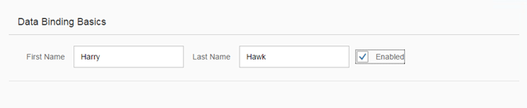
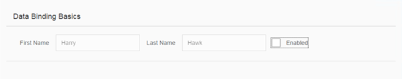

<!-- loioc72b922fdb59422496661000165d7ff1 -->

| loio |
| -----|
| c72b922fdb59422496661000165d7ff1 |

<div id="loio">

view on: [demo kit nightly build](https://openui5nightly.hana.ondemand.com/#/topic/c72b922fdb59422496661000165d7ff1) | [demo kit latest release](https://openui5.hana.ondemand.com/#/topic/c72b922fdb59422496661000165d7ff1)</div>

## Step 4: Two-Way Data Binding

In the examples used so far, we have used a read-only field to display the value of a model property. We will now change the user interface so that the first and last name fields are displayed using `sap.m.Input` fields and an additional check box control is used to enable or disable both input fields. This arrangement illustrates a feature known as "two-way data binding". Now that the view contains more controls, we will also move the view definition into an XML file.

***

### Preview

   
  
Input fields can be enabled or disabled<a name="loioc72b922fdb59422496661000165d7ff1__fig_r1j_pst_mr"/>

  

***

### Coding

You can view and download all files in the Demo Kit at [Data Binding - Step 4](https://openui5.hana.ondemand.com/explored.html#/sample/sap.ui.core.tutorial.databinding.04/preview).

***

### webapp/view/App.view.xml \(New\)

``` xml
*HIGHLIGHT START*<mvc:View xmlns="sap.m" xmlns:mvc="sap.ui.core.mvc">
  <Panel headerText="{/panelHeaderText}" class="sapUiResponsiveMargin" width="auto">
    <content>
      <Label text="First Name" class="sapUiSmallMargin" />
      <Input value="{/firstName}" valueLiveUpdate="true" width="200px" enabled="{/enabled}" />
      <Label text="Last Name" class="sapUiSmallMargin" />
      <Input value="{/lastName}" valueLiveUpdate="true" width="200px" enabled="{/enabled}" />
      <CheckBox selected="{/enabled}" text="Enabled" />
    </content>
  </Panel>
</mvc:View>*HIGHLIGHT END*
```

We create a new `view` folder in our app and a new file for our XML view inside the app folder.

***

### webapp/index.js

``` js
sap.ui.require([
	"sap/ui/model/json/JSONModel",
	"sap/ui/core/mvc/XMLView"
], function (JSONModel, XMLView) {
	"use strict";

	// Attach an anonymous function to the SAPUI5 'init' event
	sap.ui.getCore().attachInit(function () {
		// Create a JSON model from an object literal
		var oModel = new JSONModel({
*HIGHLIGHT START*			firstName: "Harry",
			lastName: "Hawk",
			enabled: true,
			panelHeaderText: "Data Binding Basics"
*HIGHLIGHT END*
		});
		// Assign the model object to the SAPUI5 core
		sap.ui.getCore().setModel(oModel);

*HIGHLIGHT START*		// Display the XML view called "App"
		new XMLView({
			viewName: "sap.ui.demo.db.view.App"
		}).placeAt("content");
*HIGHLIGHT END*
	});
});
```

We delete the code that assigned the `sap.m.Text` field to the UI and add an XML view that is identified by its resource name.

You can now refresh the application preview and select or deselect the checkbox. You will see that the input fields are automatically enabled or disabled in response to the state of the checkbox.



It is clear that we have not written any code to transfer data between the user interface and the model, yet the `Input` controls are enabled or disabled according to the state of the checkbox. This behaviour is the result of the fact that all OpenUI5 models implement two-way data binding, and for JSON Models, two-way binding is the default behavior.

Two things are happening here:

-   Data binding allows the property of a control to derive its value from any suitable property in a model.

-   OpenUI5 automatically handles the transport of data both from the model to the controls, and back from the controls to the model. This is called two-way binding.


**Related information**  


[Data Binding](Data_Binding_68b9644.md)

