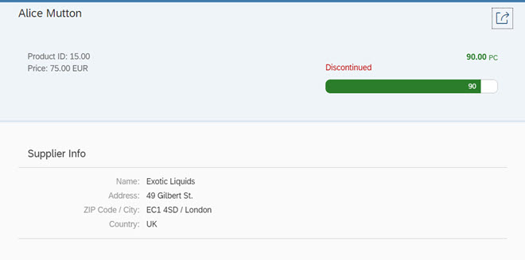

<!-- loiob561d146f9114b029bd60fa26df09c6b -->

| loio |
| -----|
| b561d146f9114b029bd60fa26df09c6b |

<div id="loio">

view on: [demo kit nightly build](https://openui5nightly.hana.ondemand.com/#/topic/b561d146f9114b029bd60fa26df09c6b) | [demo kit latest release](https://openui5.hana.ondemand.com/#/topic/b561d146f9114b029bd60fa26df09c6b)</div>

## Step 6: Extending the Detail Page

In this step, we will extend the detail page of our app to show more information of a given product with various UI controls. We will enrich the header area and display further attributes in an info panel for information about the supplier.

***

### Preview

   
  
Detail page with more product information<a name="loiob561d146f9114b029bd60fa26df09c6b__fig_z3h_cty_c5"/>

  

***

### Coding

You can view and download all files in the *Samples* in the Demo Kit at [Worklist App - Step 6](https://openui5.hana.ondemand.com/explored.html#/sample/sap.m.tutorial.worklist.06/preview) .

***

#### webapp/view/Object.view.xml

``` xml
<mvc:View
controllerName="mycompany.myapp.MyWorklistApp.controller.Object"
xmlns="sap.m"
xmlns:mvc="sap.ui.core.mvc"
xmlns:semantic="sap.f.semantic"
*HIGHLIGHT START*xmlns:form="sap.ui.layout.form"*HIGHLIGHT END*>

<semantic:SemanticPage
    id="page"
    headerPinnable="false"
    toggleHeaderOnTitleClick="false"
    busy="{objectView>/busy}"
    busyIndicatorDelay="{objectView>/delay}">
    <semantic:titleHeading>
    <Title text="{ProductName}" />
    </semantic:titleHeading>
    *HIGHLIGHT START*<semantic:headerContent>
			<FlexBox
				alignItems="Start"
				justifyContent="SpaceBetween">
				<Panel backgroundDesign="Transparent">
					<ObjectAttribute
						title="{i18n>ObjectProductIdText}"
						text="{
						path: 'ProductID',
						formatter: '.formatter.numberUnit'}"/>
					<ObjectAttribute
						title="{i18n>ObjectPriceTitle}"
						text="{
						path: 'UnitPrice',
						formatter: '.formatter.numberUnit'} EUR"/>
				</Panel>
				<Panel backgroundDesign="Transparent">
					<ObjectNumber
						id="objectHeader"
						unit="PC"
						textAlign="End"
						state="{
						path: 'UnitsInStock',
						formatter: '.formatter.quantityState'}"
						number="{
						path: 'UnitsInStock',
						formatter: '.formatter.numberUnit'}">
					</ObjectNumber>
					<ObjectStatus
						text="{i18n>ObjectDiscontinuedStatusText}"
						state="Error"
						visible="{path:'Discontinued'}"/>
					<ProgressIndicator
						width="300px"
						percentValue="{UnitsInStock}"
						displayValue="{UnitsInStock}"
						showValue="true"
						state="{
						path: 'UnitsInStock',
						formatter: '.formatter.quantityState'}"/>
				</Panel>
			</FlexBox>
    </semantic:headerContent>*HIGHLIGHT END*
    <semantic:content>
*HIGHLIGHT START*        <Panel
            class="sapUiNoContentPadding"
            headerText="{i18n>ObjectSupplierTabTitle}">
            <content>
                <form:SimpleForm
                    minWidth="1024"
                    maxContainerCols="2"
                    editable="false"
                    layout="ResponsiveGridLayout"
                    labelSpanL="3"
                    labelSpanM="3"
                    emptySpanL="4"
                    emptySpanM="4"
                    columnsL="1"
                    columnsM="1">
                    <form:content>
                        <Label text="{i18n>ObjectSupplierName}"/>
                        <Text text="{Supplier/CompanyName}"/>
                        <Label text="{i18n>ObjectSupplierAddress}"/>
                        <Text text="{Supplier/Address}"/>
                        <Label text="{i18n>ObjectSupplierZipcode} / {i18n>ObjectSupplierCity}"/>
                        <Text text="{Supplier/PostalCode} / {Supplier/City}"/>
                        <Label text="{i18n>ObjectSupplierCountry}"/>
                        <Text text="{Supplier/Country}"/>
                    </form:content>
                </form:SimpleForm>
            </content>
        </Panel>*HIGHLIGHT END*

    </semantic:content>
    <semantic:sendEmailAction>
        <semantic:SendEmailAction id="shareEmail" press="onShareEmailPress"/>
    </semantic:sendEmailAction>
</semantic:SemanticPage>
</mvc:View>
```

We define a new `headerContent` section as well as some additional attributes for the product with two `sap.m.ObjectAttribute` controls, one for the `Price` and one for the `ProductID`. These are important product attributes for us, so we want to include them in our header area.

To get a better visual representation of the current stock of the shown product, we use the `ObjectStatus` and `ProgressIndicator` control statuses. If our product will not be produced anymore, the `ObjectStatus` shows up as *Discontinued*. The `ProgressIndicator` uses the same formatter function as our `UnitsInStock` \(in the `state` of the `ObjectNumber`\).

Below the object header we can use `sap.m.Panel` to display some additional information in a nice layout on the page. Inside the panel we use `sap.ui.layout.form.SimpleForm` to align the labels and texts we want to display.

***

#### webapp/i18n/i18n.properties

``` prefs
...
*HIGHLIGHT START*#Price per unit text
ObjectPriceTitle=Price

#Discontinued text
ObjectDiscontinuedStatusText=Discontinued

#Supplier tab title
ObjectSupplierTabTitle=Supplier Info

#Supplier company name
ObjectSupplierName=Name

#Supplier contact person name
ObjectSupplierContact=Contact

#Supplier contact address
ObjectSupplierAddress=Address

#Supplier zip code
ObjectSupplierZipcode=ZIP Code

#Supplier city name
ObjectSupplierCity=City

#Supplier country
ObjectSupplierCountry=Country

#Object Product ID text
ObjectProductIdText=Product ID
*HIGHLIGHT END*

#~~~ Footer Options ~~~~~~~~~~~~~~~~~~~~~~~
...
```

As before, we add new i18n texts to the resource bundle.

Save all the changes and run the application. Click on any product and see the product details displayed on the detail page.

