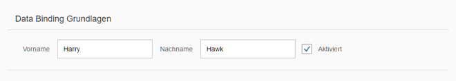

<!-- loio4e593b44e78a431e8b21be6b3915fb55 -->

| loio |
| -----|
| 4e593b44e78a431e8b21be6b3915fb55 |

<div id="loio">

view on: [demo kit nightly build](https://openui5nightly.hana.ondemand.com/#/topic/4e593b44e78a431e8b21be6b3915fb55) | [demo kit latest release](https://openui5.hana.ondemand.com/#/topic/4e593b44e78a431e8b21be6b3915fb55)</div>

## Step 7: \(Optional\) Resource Bundles and Multiple Languages

The reason we have resource bundles is to allow an app to run in multiple languages without the need to change any code. To demonstrate this feature, we will create a German version of the app – in fact all we need to do is create a German version of the resource bundle file. No code changes are needed.

***

### Preview

   
  
German version of our UI<a name="loio4e593b44e78a431e8b21be6b3915fb55__fig_r1j_pst_mr"/>

  

***

### Coding

You can view and download all files in the Demo Kit at [Data Binding - Step 7](https://openui5.hana.ondemand.com/explored.html#/sample/sap.ui.core.tutorial.databinding.07/preview).

***

### webapp/i18n/i18n\_de.properties \(New\)

``` prefs
# Field labels
firstName=*HIGHLIGHT START*Vorname*HIGHLIGHT END*
lastName=*HIGHLIGHT START*Nachname*HIGHLIGHT END*
enabled=*HIGHLIGHT START*Aktiviert*HIGHLIGHT END*

# Screen titles
panelHeaderText=*HIGHLIGHT START*Data Binding Grundlagen*HIGHLIGHT END*
```

In the `i18n` folder, take a copy of the file `i18n.properties` and call it `i18n**\_de**.properties`. Change the English text to the German text.

To test the outcome, change the default language of your browser to German and refresh your preview.

**Related information**  


[Localization](Localization_91f217c.md)

