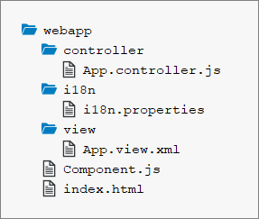

<!-- loio4cfa60872dca462cb87148ccd0d948ee -->

| loio |
| -----|
| 4cfa60872dca462cb87148ccd0d948ee |

<div id="loio">

view on: [demo kit nightly build](https://openui5nightly.hana.ondemand.com/#/topic/4cfa60872dca462cb87148ccd0d948ee) | [demo kit latest release](https://openui5.hana.ondemand.com/#/topic/4cfa60872dca462cb87148ccd0d948ee)</div>

## Step 9: Component Configuration

After we have introduced all three parts of the Model-View-Controller \(MVC\) concept, we now come to another important structural aspect of OpenUI5.

In this step, we will encapsulate all UI assets in a component that is independent from our `index.html` file. Components are independent and reusable parts used in OpenUI5 applications. Whenever we access resources, we will now do this relatively to the component \(instead of relatively to the `index.html`\). This architectural change allows our app to be used in more flexible environments than our static `index.html` page, such as in a surrounding container like the SAP Fiori launchpad.

***

### Preview

   
  
An input field and a description displaying the value of the input field \(No visual changes to last step\)<a name="loio4cfa60872dca462cb87148ccd0d948ee__fig_r1j_pst_mr"/>

 ") 

***

### Coding

You can view and download all files at [Walkthrough - Step 9](https://openui5.hana.ondemand.com/explored.html#/sample/sap.m.tutorial.walkthrough.09/preview).  
  
Folder Structure for this Step<a name="loio4cfa60872dca462cb87148ccd0d948ee__fig_os4_mbp_ns"/>

  

After this step your project structure will look like the figure above. We will create the `Component.js` file now and modify the related files in the app.

***

### webapp/Component.js \(New\)

``` js
*HIGHLIGHT START*sap.ui.define([
   "sap/ui/core/UIComponent"
], function (UIComponent) {
   "use strict";
   return UIComponent.extend("", {

      init : function () {
         // call the init function of the parent
         UIComponent.prototype.init.apply(this, arguments);
      }
   });
});
*HIGHLIGHT END*
```

We create an initial `Component.js` file in the `webapp` folder that will hold our application setup. The init function of the component is automatically invoked by OpenUI5 when the component is instantiated. Our component inherits from the base class `sap.ui.core.UIComponent` and it is obligatory to make the super call to the `init` function of the base class in the overridden `init` method.

***

### webapp/Component.js

``` js
sap.ui.define([
   "sap/ui/core/UIComponent"*HIGHLIGHT START*,*HIGHLIGHT END*
   *HIGHLIGHT START*"sap/ui/model/json/JSONModel",
   "sap/ui/model/resource/ResourceModel"*HIGHLIGHT END*
], function (UIComponent, *HIGHLIGHT START*JSONModel, ResourceModel*HIGHLIGHT END*) {
   "use strict";
   return UIComponent.extend(*HIGHLIGHT START*"sap.ui.demo.walkthrough.Component*HIGHLIGHT END*", {
      *HIGHLIGHT START*metadata : {
         rootView: {
            "viewName": "sap.ui.demo.walkthrough.view.App",
            "type": "XML",
            "async": true,
            "id": "app"
         }
      },*HIGHLIGHT END*
      init : function () {
         // call the init function of the parent
         UIComponent.prototype.init.apply(this, arguments);
        *HIGHLIGHT START* // set data model
         var oData = {
            recipient : {
               name : "World"
            }
         };
         var oModel = new JSONModel(oData);
         this.setModel(oModel);

         // set i18n model
         var i18nModel = new ResourceModel({
            bundleName : "sap.ui.demo.walkthrough.i18n.i18n"
         });
         this.setModel(i18nModel, "i18n");*HIGHLIGHT END*
      }
   });
});

```

The `Component.js` file consists of two parts now: The new `metadata` section that simply defines a reference to the root view and the previously introduced `init` function that is called when the component is initialized. Instead of displaying the root view directly in the `index.html` file as we did previously, the component will now manage the display of the app view.

In the `init` function we instantiate our data model and the `i18n` model like we did before in the app controller. Be aware that the models are directly set on the component and not on the root view of the component. However, as nested controls automatically inherit the models from their parent controls, the models will be available on the view as well.

***

### webapp/controller/App.controller.js

``` js
sap.ui.define([
   "sap/ui/core/mvc/Controller",
   "sap/m/MessageToast"
], function (Controller, MessageToast) {
   "use strict";
   return Controller.extend("sap.ui.demo.walkthrough.controller.App", {
      onShowHello : function () {
         // read msg from i18n model
         var oBundle = this.getView().getModel("i18n").getResourceBundle();
         var sRecipient = this.getView().getModel().getProperty("/recipient/name");
         var sMsg = oBundle.getText("helloMsg", [sRecipient]);
         // show message
         MessageToast.show(sMsg);
      }
   });
});

```

Delete the `onInit` function and the required modules; this is now done in the component. You now have the code shown above.

***

<a name="loio4cfa60872dca462cb87148ccd0d948ee__section_ok2_4n5_zgb"/>

### webapp\\index.js

``` js
sap.ui.define([
*HIGHLIGHT START*	"sap/ui/core/ComponentContainer"*HIGHLIGHT END*
], function (*HIGHLIGHT START*ComponentContainer*HIGHLIGHT END*) {
	"use strict";

*HIGHLIGHT START*	new ComponentContainer({
		name: "sap.ui.demo.walkthrough",
		settings : {
			id : "walkthrough"
		},
		async: true
	}).placeAt("content");*HIGHLIGHT END*
});
```

We now create a component container instead of the view in our `index.js` that instantiates the view for us according to the component configuration.

***

### Conventions

-   The component is named `Component.js`.

-   Together with all UI assets of the app, the component is located in the `webapp` folder.

-   The `index.html` file is located in the `webapp` folder if it is used productively.


**Related information**  


[Components](Components_958ead5.md)

[API Reference: `sap.ui.core.mvc.ViewType`](https://openui5.hana.ondemand.com/#docs/api/symbols/sap.ui.core.mvc.ViewType.html)

[Samples: `sap.ui.core.mvc.ViewType` ](https://openui5.hana.ondemand.com/explored.html#/entity/sap.ui.core.mvc.ViewType/samples)

[Declarative API for Initial Components](Declarative_API_for_Initial_Components_82a0fce.md)

[Make Your App CSP Compliant](Make_Your_App_CSP_Compliant_1f81a09.md)

