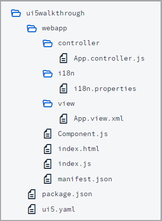

<!-- loiof9d0e2fcd2134ff7923fcdcba8bded96 -->

| loio |
| -----|
| f9d0e2fcd2134ff7923fcdcba8bded96 |

<div id="loio">

view on: [demo kit nightly build](https://sdk.openui5.org/nightly/#/topic/f9d0e2fcd2134ff7923fcdcba8bded96) | [demo kit latest release](https://sdk.openui5.org/topic/f9d0e2fcd2134ff7923fcdcba8bded96)</div>

## Step 9: Component Configuration \(TypeScript\)

After we have introduced all three parts of the Model-View-Controller \(MVC\) concept, we now come to another important structural aspect of OpenUI5.

In this step, we will encapsulate all UI assets in a component that is independent from our `index.html` file. Components are independent and reusable parts used in OpenUI5 applications. Whenever we access resources, we will now do this relatively to the component \(instead of relatively to the `index.html`\). This architectural change allows our app to be used in more flexible environments than our static `index.html` page, such as in a surrounding container like the SAP Fiori launchpad.

***

### Preview

  
  
**An input field and a description displaying the value of the input field \(No visual changes to last step\)**

")

***

### Coding

You can view all files at [OpenUI5 TypeScript Walkthrough - Step 9: Component Configuration](https://github.com/sap-samples/ui5-typescript-walkthrough/steps/09/README.md).

  
  
**Folder Structure for this Step**



After this step your project structure will look like the figure above. We will create the `Component.ts` file now and modify the related files in the app.

***

### webapp/Component.ts \(New\)

We create an initial `Component.ts` file in the `webapp` folder that will hold our application setup. The `init` function of the component is automatically invoked by OpenUI5 when the component is instantiated. Our component inherits from the base class `sap/ui/core/UIComponent`, and it is obligatory to make the super call to the `init` function of the base class in the overridden `init` method.

```js
import UIComponent from "sap/ui/core/UIComponent";

/**
 * @namespace ui5.walkthrough
 */
export default class Component extends UIComponent {

    init(): void {
        // call the init function of the parent
        super.init();
    };
};
```

***

### webapp/Component.ts

As a next step we need to define the metadata for our component. The `metadata` section defines a reference to the root view, so that instead of displaying the root view directly in the `index.ts` file as we did previously, the component now manages the display of the app view. It also implements the `sap.ui.core.IAsyncContentCreation` interface, which allows the component to be created fully asynchronously.

In the `init` function we instantiate our data model and the `i18n` model like we did before in the app controller.

```js
import UIComponent from "sap/ui/core/UIComponent";
import JSONModel from "sap/ui/model/json/JSONModel";
import ResourceModel from "sap/ui/model/resource/ResourceModel";

/**
 * @namespace ui5.walkthrough
 */
export default class Component extends UIComponent {
    public static metadata = {
        "interfaces": ["sap.ui.core.IAsyncContentCreation"],
        "rootView": {
            "viewName": "ui5.walkthrough.view.App",
            "type": "XML",
            "id": "app"
        }
    };
    init(): void {
        // call the init function of the parent
        super.init();
        // set data model
        const data = {
            recipient: {
                name: "World"
            }
        };
        const dataModel = new JSONModel(data);
        this.setModel(dataModel);
        // set i18n model
        const i18nModel = new ResourceModel({
            bundleName: "ui5.walkthrough.i18n.i18n"
        });
        this.setModel(i18nModel, "i18n");
    };
};
```

Be aware that the models are set directly on the component and not on the root view of the component. However, as nested controls automatically inherit the models from their parent controls, the models are available on the view as well.

***

### webapp/controller/App.controller.ts

We delete the `onInit` function and the required modules; this is now done in the component.

```js
import MessageToast from "sap/m/MessageToast";
import Controller from "sap/ui/core/mvc/Controller";
import JSONModel from "sap/ui/model/json/JSONModel";
import ResourceModel from "sap/ui/model/resource/ResourceModel";
import ResourceBundle from "sap/base/i18n/ResourceBundle";

/**
 * @name ui5.walkthrough.controller.App
 */
export default class AppController extends Controller {
    onShowHello() : void {
        // read msg from i18n model
        // functions with generic return values require casting 
        const resourceBundle = <ResourceBundle> (<ResourceModel> this.getView()?.getModel("i18n"))?.getResourceBundle();
        const recipient = (<JSONModel> this.getView()?.getModel())?.getProperty("/recipient/name");
        const msg = resourceBundle.getText("helloMsg", [recipient]) || "no text defined";
        // show message
        MessageToast.show(msg);
    }
};
```

***

<a name="loiof9d0e2fcd2134ff7923fcdcba8bded96__section_ok2_4n5_zgb"/>

### webapp\\index.ts

We now create a component container instead of the view in our `index.ts` that instantiates the view for us according to the component configuration.

```js
import ComponentContainer from "sap/ui/core/ComponentContainer";

new ComponentContainer({
    name: "ui5.walkthrough",
    settings: {
        id: "walkthroughts"
    },
    async: true
}).placeAt("content");
```

***

### Conventions

-   The component is named `Component.js` \(JavaScript\) or `Component.ts` \(in TypeScript\).

-   Together with all UI assets of the app, the component is located in the `webapp` folder.

-   The `index.html` file is located in the `webapp` folder if it is used productively.


**Parent topic:**[Walkthrough Tutorial \(TypeScript\)](Walkthrough_Tutorial_TypeScript_dad1905.md "In this tutorial we'll introduce you to all major development paradigms of OpenUI5. We'll demonstrate the use of TypeScript with OpenUI5 and highlight the specific characteristics of this approach.")

**Next:**[Step 8: Translatable Texts \(TypeScript\)](Step_8_Translatable_Texts_TypeScript_4dcf52e.md "In this step we move the texts of our UI to a separate resource file.")

**Previous:**[Step 10: Descriptor for Applications \(TypeScript\)](Step_10_Descriptor_for_Applications_TypeScript_2a46b75.md "All application-specific configuration settings will now further be put in a separate descriptor file called manifest.json. This clearly separates the application coding from the configuration settings and makes our app even more flexible. For example, all SAP Fiori applications are realized as components and come with a descriptor file in order to be hosted in the SAP Fiori launchpad.")

**Related Information**  


[Components](Components_958ead5.md "Components are independent and reusable parts used in OpenUI5 applications.")

[Declarative API for Initial Components](Declarative_API_for_Initial_Components_82a0fce.md "The declarative API enables you to define the initially started component directly in the HTML markup.")

[Methods Controlling the Initial Instantiation](Methods_Controlling_the_Initial_Instantiation_b430345.md "OpenUI5 provides two methods for the initial instantiation of the component.")

[Advanced Concepts for OpenUI5 Components](Advanced_Concepts_for_OpenUI5_Components_ecbc417.md "Advanced concepts for components include routing and navigation and component data as well as the event bus.")

[Make Your App CSP Compliant](Make_Your_App_CSP_Compliant_1f81a09.md "CSP stands for Content Security Policy and is a security standard to prevent cross-site scripting or other code injection attacks.")

