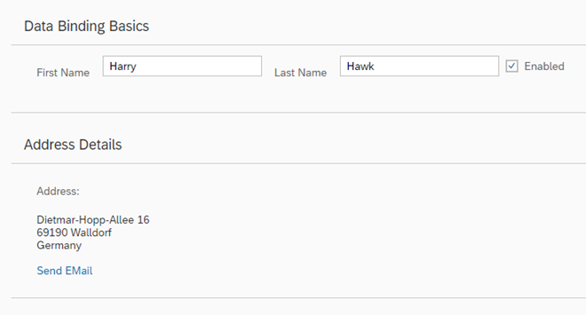

<!-- loio6fdf0acd0bc24ffdad327cf7e6f9e7e0 -->

| loio |
| -----|
| 6fdf0acd0bc24ffdad327cf7e6f9e7e0 |

<div id="loio">

view on: [demo kit nightly build](https://openui5nightly.hana.ondemand.com/#/topic/6fdf0acd0bc24ffdad327cf7e6f9e7e0) | [demo kit latest release](https://openui5.hana.ondemand.com/#/topic/6fdf0acd0bc24ffdad327cf7e6f9e7e0)</div>

## Step 9: Formatting Values

We also want to provide our users a way of contacting Harry Hawk. Therefore we will add a link that sends an e-mail to Harry. To achieve that we will convert our data in the model to match the **sap.m.URLHelper.normalizeEmail** API. As soon as the user changes the name, the e-mail will also change. We will need a custom formatter function for this.

***

### Preview

   
  
Address with e-mail link<a name="loio6fdf0acd0bc24ffdad327cf7e6f9e7e0__fig_r1j_pst_mr"/>

  

***

### Coding

You can view and download all files in the Demo Kit at [Data Binding - Step 9](https://openui5.hana.ondemand.com/explored.html#/sample/sap.ui.core.tutorial.databinding.09/preview).

***

### webapp/controller/App.controller.js \(New\)

``` js
*HIGHLIGHT START*sap.ui.define([
	"sap/ui/core/mvc/Controller",
	"sap/m/library"
], function (Controller, mobileLibrary) {
	"use strict";

	return Controller.extend("sap.ui.demo.db.controller.App", {
		formatMail: function(sFirstName, sLastName) {
			var oBundle = this.getView().getModel("i18n").getResourceBundle();
			return mobileLibrary.URLHelper.normalizeEmail(
				sFirstName + "." + sLastName + "@example.com",
				oBundle.getText("mailSubject", [sFirstName]),
				oBundle.getText("mailBody"));
		}
	});
});*HIGHLIGHT END*
```

Create a new folder `controller` within your `webapp` folder as a general location for all controller files for this app and create a new file `App.controller.js`.

In our custom formatter, we define the first and last name that are currently in the model as function parameters. When a user changes the data in the model by entering a different name in the input fields, our formatter will be invoked automatically by the framework. This makes sure that the UI is in sync with the data model.

In the `formatMail` function, we use the **sap.m.URLHelper.normalizeEmail** function that expects an e-mail address, a mail subject and a text body. When a user chooses the link, the default email client will open with these parameters.For more information, see [API Reference: `sap.m.URLHelper.normalizeEmail`](https://openui5.hana.ondemand.com/#/api/sap.m.URLHelper/methods/normalizeEmail). The `mailSubject` resource bundle text will contain a placeholder for the first name of the recipient \(see below\). Therefore, we provide the name with `[sFirstName]`.

> Note:
> For a detailed description of the e-mail link format, see [https://developer.mozilla.org/de/docs/Web/Guide/HTML/Email\_links](https://developer.mozilla.org/de/docs/Web/Guide/HTML/Email_links).
> 
> 

***

### webapp/view/App.view.xml

``` xml
<mvc:View
*HIGHLIGHT START*	controllerName="sap.ui.demo.db.controller.App"*HIGHLIGHT END*
	xmlns="sap.m"
	xmlns:l="sap.ui.layout"
	xmlns:mvc="sap.ui.core.mvc">
	<Panel headerText="{i18n>panel1HeaderText}" class="sapUiResponsiveMargin" width="auto">
		<content>
			<Label text="{i18n>firstName}" class="sapUiSmallMargin"/>
			<Input value="{/firstName}" valueLiveUpdate="true" width="200px" enabled="{/enabled}"/>
			<Label text="{i18n>lastName}" class="sapUiSmallMargin"/>
			<Input value="{/lastName}" valueLiveUpdate="true" width="200px" enabled="{/enabled}"/>
			<CheckBox selected="{/enabled}" text="Enabled"/>
		</content>
	</Panel>
	<Panel headerText="{i18n>panel2HeaderText}" class="sapUiResponsiveMargin" width="auto">
		<content>
			<l:VerticalLayout>
				<Label class="sapUiSmallMargin" text="{i18n>address}:"/>
				<FormattedText class="*HIGHLIGHT START*sapUiSmallMarginBegin sapUiSmallMarginBottom*HIGHLIGHT END*" htmlText="{/address/street}&lt;br&gt;{/address/zip} {/address/city}&lt;br&gt;{/address/country}" width="200px"/>
*HIGHLIGHT START*				<Link class="sapUiSmallMarginBegin"
					href="{
							parts: [
								'/firstName',
								'/lastName'
							],
							formatter: '.formatMail'
						}"
					text="{i18n>sendEmail}"/>*HIGHLIGHT END*
			</l:VerticalLayout>
		</content>
	</Panel>
</mvc:View>
```

For more complex bindings we cannot use the simple binding syntax with the curly braces anymore. The `href` property of the `Link` element now contains an entire object inside the string value. In this case, the object has two properties:

-   `parts`

    This is a JavaScript array in which each element is an object containing a `path` property. The number and order of the elements in this array corresponds directly to the number and order of parameters expected by the `formatMail` function.

-   `formatter`

    A reference to the function that receives the parameters listed in the `parts` array. Whatever value is returned by the formatter function becomes the value set for this property. The dot \(`** **formatMail`\) at the beginning of the formatter tellsOpenUI5 to look for a `formatMail` function on the controller instance of the view. If you do not use the dot, the function will be resolved by looking into the global namespace.


> Note:

***

### webapp/i18n/i18n.properties

``` prefs
…
# Screen titles
panel1HeaderText=Data Binding Basics 
panel2HeaderText=Address Details

When using formatter functions, the binding is automatically switched to
					"one-way". So you can’t use a formatter function for "two-way" scenarios, but
					you can use data types (which will be explained in the following steps).*HIGHLIGHT START*# E-mail
sendEmail=Send Mail
mailSubject=Hi {0}!
mailBody=How are you?*HIGHLIGHT END*
```

***

### webapp/i18n/i18n\_de.properties

``` prefs
…
# Screen titles
panel1HeaderText=Data Binding Grundlagen
panel2HeaderText=Adressdetails

*HIGHLIGHT START*# E-mail
sendEmail=E-mail versenden
mailSubject=Hallo {0}!
mailBody=Wie geht es dir?*HIGHLIGHT END*
```

And we add the missing texts to the `properties` files

**Related information**  


[Formatting, Parsing, and Validating Data](Formatting,_Parsing,_and_Validating_Data_07e4b92.md)

